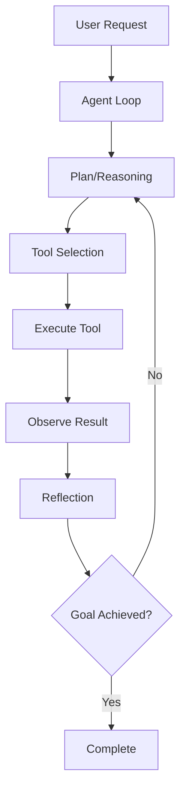
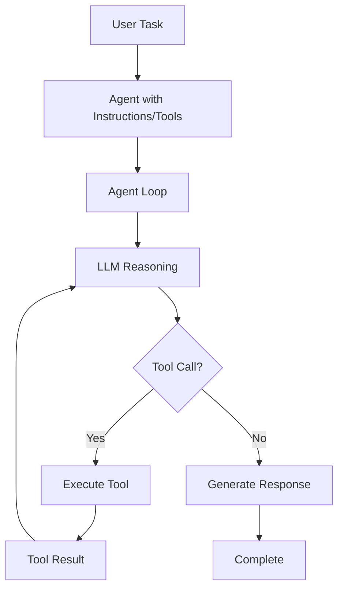
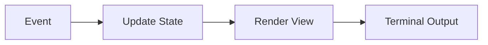
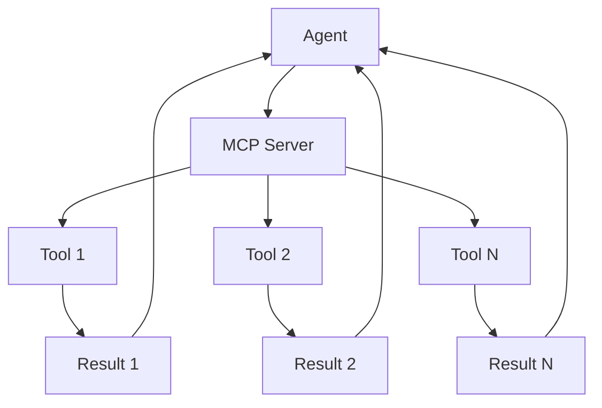
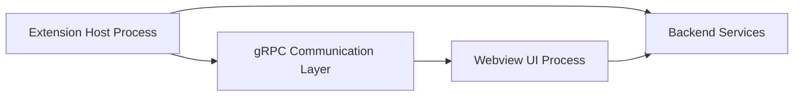
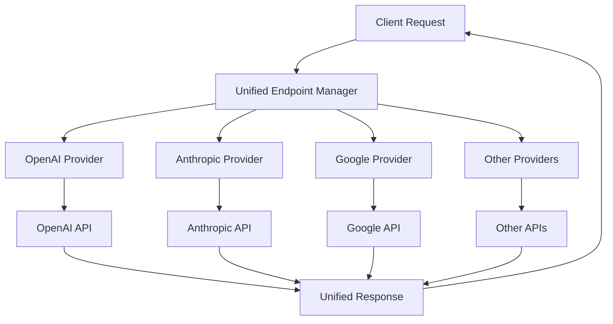

# CLI Architecture Redesign - Architecture Analysis

**Date:** 2025-01-16  
**Research Scope:** Analysis of multiple agent SDKs, frameworks, and tools to inform CLI architecture redesign

---

## Executive Summary

This document analyzes the architecture patterns and design decisions from leading AI agent frameworks and tools to guide the redesign of the KOMPLETE-KONTROL-CLI. Key findings include:

1. **Anthropic Claude Agent SDK Python** - Feedback loop architecture with hook system
2. **OpenAI Agents Python** - Agent loop with handoffs and Python-first orchestration
3. **Bubbletea Framework** - Elm-inspired TUI with message-driven state management
4. **OpenCode/Antigravity** - MCP-based tool integration with mode management
5. **Cline** - Multi-process architecture with gRPC communication and real-time streaming
6. **LibreChat** - Unified endpoint manager with multi-provider support
7. **Tavily** - Real-time search API for AI agents
8. **Base44** - No-code platform with AI integration capabilities

---

## 1. Anthropic Claude Agent SDK Python

### Technical Motivations

The Anthropic Claude Agent SDK was designed to solve key challenges in building autonomous AI agents:

- **Context Management**: Automatic summarization when approaching context limits
- **Tool Integration**: Standardized MCP (Model Context Protocol) for extending capabilities
- **Feedback Loops**: Built-in ReAct-style loop with reflection
- **Production Readiness**: Battle-tested patterns for memory management and error handling

### Key Architectural Patterns

#### Feedback Loop Architecture



**Core Components:**

1. **Hook System** - Pre/post-execution hooks for automation
   - `HookMatcher`: Matches tools by name or pattern (e.g., "Bash", "Write|Edit")
   - `HookCallback`: List of callbacks to execute
   - Timeout control per hook matcher

2. **Compact Feature** - Automatic context optimization
   - Summarizes previous messages when context limit approaches
   - Prevents agents from running out of context during long sessions

3. **Tool Calling** - MCP-based tool integration
   - Standardized tool schemas
   - Automatic tool result handling
   - Tool use tracking

### Integration Patterns with External Services

- **MCP Server Integration**: Standard protocol for tool discovery and execution
- **Local CLI Integration**: Spawns local Claude Code CLI for terminal operations
- **Subprocess Management**: Handles long-running operations and background tasks

---

## 2. OpenAI Agents Python

### Technical Motivations

OpenAI Agents SDK focuses on:

- **Python-First Design**: Uses familiar Python patterns instead of new abstractions
- **Agent Loop Abstraction**: Built-in loop handling tool calls and LLM reasoning
- **Multi-Agent Orchestration**: Handoffs for agent delegation
- **Provider Agnostic**: Supports 100+ LLMs beyond OpenAI

### Key Architectural Patterns

#### Agent Loop Pattern



**Core Primitives:**

1. **Agent Loop** - Automatically handles:
   - Tool calling and execution
   - LLM reasoning
   - Workflow control
   - Response generation

2. **Handoffs** - Specialized tool for agent delegation
   - One-way transfer between agents
   - Immediate execution on handoff
   - Enables decentralized agent patterns

3. **Tools** - Built-in and custom tools
   - Web search, file search
   - Computer use (vision/interaction)
   - Custom function calling

### Orchestration Patterns

1. **Code-Based Orchestration**: Determine flow via Python code
2. **Decentralized Pattern**: Agents can handoff to each other
3. **Routines**: Pre-defined agent workflows
4. **Parallel Execution**: Multiple agents working simultaneously

### Comparison with Anthropic Approach

| Aspect | Anthropic Agent SDK | OpenAI Agents Python |
|--------|----------------------|-----------------------|
| Language | Python | Python |
| Loop Management | Manual with hooks | Built-in agent loop |
| Tool Protocol | MCP | Custom tools + handoffs |
| Agent Delegation | Subagent spawning | Handoffs |
| Context Management | Compact feature | Manual |

---

## 3. Bubbletea Framework

### Core Architecture (Elm-Inspired TUI)

Bubbletea implements the Elm Architecture pattern for terminal UIs:



**The Elm Architecture:**
- **Event**: User input, timer, system events
- **Model**: Pure state (immutable)
- **Update**: Pure function (Model → Model)
- **View**: Render function (Model → UI)

### Component Model and Message Passing

**Message Types:**
- `Msg`: Internal messages between components
- `TickMsg`: Timer events
- `KeyMsg`: Keyboard input
- `MouseMsg`: Mouse events
- `WindowSizeMsg`: Terminal resize events

**Component Hierarchy:**
- Parent components manage child state
- Messages flow up/down the hierarchy
- Nested models for complex UIs

### State Management Patterns

1. **Pure Functions**: State updates are pure functions
2. **Immutable State**: Models cannot be mutated directly
3. **Command Pattern**: Wrap state updates in commands
4. **Init/Update/View**: Three-phase lifecycle

### Real-Time Updates and Streaming

1. **Event Loop**: Bubbletea handles the event loop
2. **Async Work**: Long-running work on separate loops
3. **Message Channels**: Send messages to start/stop work
4. **Progressive Rendering**: Update UI as data arrives

### Best Practices for CLI Applications

1. **Separate Concerns**: Business logic separate from UI rendering
2. **Declarative UI**: Describe what to show, not how to show it
3. **Type Safety**: Strong typing for models and messages
4. **Component Composition**: Build complex UIs from simple components
5. **Error Handling**: Centralized error state in model
6. **Testing**: Pure functions are easy to test

---

## 4. Google Antigravity (OpenCode) Repository

### Model Invocation Approach

**Base Models (The "Brain"):**
- Primary models selected via Model Selector (e.g., Gemini 3 Flash, Claude Sonnet)
- Central reasoning engine of the agent
- Multiple model providers supported (Gemini, Claude, GLM-4.7)

**MCP Servers (The "Plugins"):**
- Extend base model with tools
- Standardized tool discovery and execution
- Examples: Playwright, Supabase, Docker, n8n

### Tool Calling Implementation

1. **MCP Integration**: Model Context Protocol for tool standardization
2. **Tool Discovery**: Automatic tool registration from MCP servers
3. **Execution**: Tools execute and return results to LLM
4. **Artifacts**: Handle generated files, images, etc.

### MCP Server Connection Patterns



**Connection Flow:**
1. Server discovery via configuration
2. Tool schema registration
3. Tool execution with input validation
4. Result aggregation and return

### CLI Construction and Command Routing

1. **Command Parser**: Argument parsing and validation
2. **Command Registry**: Map command names to handlers
3. **Help System**: Auto-generated help from command metadata
4. **Command History**: Track and replay previous commands

### State Management and Context Handling

1. **Mode Management**: Explicit mode transitions (PLANNING → EXECUTION → VERIFICATION)
2. **User Communication**: Request approval for high-risk actions
3. **Knowledge Persistence**: Store learned patterns across sessions
4. **Artifact Handling**: Track generated files and outputs

---

## 5. Cline Architecture Analysis

### Model Management System (Flexible, Multi-Provider)

**Key Features:**
1. **Provider Abstraction**: Unified interface for different LLM providers
2. **Model Selection**: Dynamic model switching based on task requirements
3. **VS Code Language Model API**: Access to models from extensions (GitHub Copilot, etc.)
4. **Cost Tracking**: Real-time token and cost monitoring per request
5. **Fallback Chains**: Automatic model switching on errors or rate limits

### Real-Time Code Display Mechanism

**Architecture:**
- Multi-process architecture (extension host + webview processes)
- gRPC-based communication layer
- Partial message updates for streaming



**Streaming Support:**
- Token-by-token streaming for real-time feedback
- Partial message updates during task execution
- Context window tracking with visual indicators
- Output tokens logging in real-time

### Streaming Response Handling

1. **Stream Accumulator**: Buffer incoming chunks
2. **Event Processing**: Handle different stream event types
3. **UI Updates**: Push updates to webview as they arrive
4. **Error Recovery**: Handle stream interruptions gracefully

### File Opening and Navigation Patterns

1. **Auto-Open**: Automatically open files being edited
2. **Line Tracking**: Highlight current line being modified
3. **Diff Display**: Show before/after for edits
4. **Project Navigator**: Quick access to project structure

---

## 6. LibreChat Tool Calling

### Tool Calling Architecture

**Unified Endpoint Manager:**
- Abstracts different provider APIs (OpenAI, Anthropic, Google, AWS Bedrock)
- Standardized request/response format
- Model parameters: temperature, max_tokens, top_p

**MCP Integration:**
- Quick access to MCP tools without creating an agent
- Multiple servers can be used at once
- Tools automatically available to LLM alongside built-in tools
- Internal tools (chatMenu: false) for agent-only access

### Local Model Support Patterns

1. **Provider Implementations**: Separate modules for each provider
2. **Model Specs**: URL-based model selection (e.g., ?spec=meeting-notes-gpt4)
3. **Configuration**: Dynamic model/provider switching without disrupting chat flow

### Multi-Provider Model Management



**Features:**
- Dynamic configuration changes on-the-fly
- Message flexibility (edit and resubmit)
- Conversation branching for parallel exploration
- Advanced context management (split threads)

---

## 7. Tavily API Capabilities

### API Capabilities

**Core Features:**
1. **Real-Time Search**: Live web data retrieval
2. **Content Extraction**: Structured and chunked results for models
3. **Web Crawling**: Deep content extraction from URLs
4. **Research**: Multi-layered query processing

### Integration Patterns

1. **LangChain Integration**: Native LangChain support
2. **LlamaIndex Integration**: Direct integration with RAG workflows
3. **MCP Support**: Model Context Protocol server available
4. **Python Wrapper**: Full API access from Python programs

### Use Cases for AI Agents

1. **Current Information**: Answer questions about breaking news, current events, live data
2. **Multi-Layered Queries**: Handle complex filtering and pattern analysis
3. **RAG Workflows**: Enhance retrieval-augmented generation
4. **Meeting Preparation**: Research attendees and companies

**Integration Example:**
```python
import os
from tavily import TavilyClient

client = TavilyClient(api_key=os.environ['TAVILY_API_KEY'])
result = client.search(query="latest AI news", max_results=10)
# Returns structured results for agent reasoning
```

---

## 8. Base44 Integration Patterns

### Capabilities and Integration Patterns

**Platform Features:**
1. **No-Code App Builder**: Generate apps from natural language prompts
2. **Integrated Backend**: Database, authentication, file storage, APIs
3. **AI Integrations**: OpenAI, Claude, Groq, Mistral, and any API key
4. **Code Export**: GitHub integration for custom deployment

### Integration Capabilities

**LLM Integration:**
- Chatbots and predictive insights
- Automation features
- Text-to-speech capabilities
- BrightData web scraping for competitive intelligence

**Data Management:**
- Built-in database
- Authentication system
- File storage
- API generation

### Use Cases

1. **Personal Productivity Apps**: Task management, notes, automation
2. **Back-Office Tools**: Internal systems and workflows
3. **Customer Portals**: User-facing applications
4. **Business Process Automation**: Workflow optimization

---

## 9. Current KOMPLETE-KONTROL-CLI Architecture Analysis

### Current Architecture Overview

**Project Structure:**
```
komplete-kontrol-cli/
├── src/
│   ├── cli/              # CLI commands and interfaces
│   │   ├── BaseCommand.ts
│   │   ├── commands/      # Command implementations
│   │   └── types.ts
│   ├── core/
│   │   ├── llm/           # LLM provider abstraction
│   │   │   ├── providers/    # Anthropic, MCP
│   │   │   ├── types.ts
│   │   │   ├── Router.ts
│   │   │   ├── Streaming.ts
│   │   │   └── bridge/        # Bash, TypeScript bridges
│   │   ├── agents/        # Agent orchestration
│   │   │   ├── AgentOrchestrationBridge.ts
│   │   │   ├── swarm/
│   │   │   └── reflexion/
│   │   ├── debug/
│   │   ├── safety/
│   │   └── workflows/
│   └── vision/
├── commands/              # Command documentation
├── hooks/                # Shell hooks
├── personalities/          # Agent personalities
└── plans/               # Architecture plans
```

### LLM Integration Layer

**Current Implementation:**
- [`AnthropicProvider`](src/core/llm/providers/AnthropicProvider.ts:1) - Official Claude API integration
- [`MCPProvider`](src/core/llm/providers/MCPProvider.ts:1) - Multi-model delegation via MCP server
- [`LLMRouter`](src/core/llm/Router.ts:1) - Smart routing based on task type
- [`Streaming`](src/core/llm/Streaming.ts:1) - Stream handlers and accumulators

**Capabilities:**
- Streaming support (Anthropic only, MCP not yet)
- Tool use support
- Vision capabilities (Anthropic only)
- Multi-modal support (Anthropic only)
- System prompt support

### Agent Orchestration

**Current Implementation:**
- [`AgentOrchestrationBridge`](src/core/agents/AgentOrchestrationBridge.ts:1) - Multi-agent coordination
- [`SwarmOrchestrator`](src/core/agents/swarm/index.ts:1) - Parallel agent spawning
- [`ReflexionAgent`](src/core/agents/reflexion/index.ts:1) - ReAct + reflection loop
- Specialist agents: code_writer, test_engineer, security_auditor, etc.

**Features:**
- Task analysis and routing
- Multi-agent workflow orchestration
- Swarm spawning for parallel execution
- Phase 3 integration (vision, debug, quality, safety)

### CLI Commands

**Current Implementation:**
- [`AutoCommand`](src/cli/commands/AutoCommand.ts:1) - Autonomous mode with ReAct + Reflexion
- [`BuildCommand`](src/cli/commands/BuildCommand.ts:1) - Build orchestration
- [`CheckpointCommand`](src/cli/commands/CheckpointCommand.ts:1) - Checkpoint management
- [`MultiRepoCommand`](src/cli/commands/MultiRepoCommand.ts:1) - Multi-repository operations

**BaseCommand Pattern:**
- Abstract base class with common functionality
- Spinner management (ora)
- Colored logging (chalk)
- Success/failure result creation

### Current Limitations

1. **No TUI Framework**: Uses ora spinners and console output
2. **Limited Real-Time Feedback**: No streaming UI updates during execution
3. **Static Model Selection**: No dynamic model switching during execution
4. **No MCP Server Support**: CLI doesn't act as MCP server
5. **Limited Tool Discovery**: Tools are manually registered
6. **No Visual Progress Tracking**: No real-time progress indicators

---

## 10. Comparison Summary

### Architecture Pattern Comparison

| Pattern | Anthropic SDK | OpenAI SDK | Bubbletea | OpenCode | Cline | LibreChat | KOMPLETE-KONTROL |
|---------|--------------|-------------|-----------|----------|-------|-----------|-------------------|
| **Architecture** | Hook-based | Agent Loop | Elm/TUI | MCP + Mode | Multi-process | Unified Manager | Provider Abstraction |
| **State Management** | Manual | Built-in | Pure/Immutable | Mode-based | gRPC State | Dynamic | Router-based |
| **Streaming** | Yes | Yes | Event-driven | Via MCP | gRPC | Via gRPC | Partial |
| **Tool Protocol** | MCP | Custom + Handoffs | N/A | MCP | XML-based | MCP | MCP |
| **Agent Orchestration** | Subagents | Handoffs | N/A | Mode-based | N/A | Swarm + Reflexion |
| **Multi-Provider** | No | Yes (100+) | N/A | Yes | VS Code API | Yes | Yes (Anthropic + MCP) |
| **Real-Time UI** | No | No | Yes | No | Yes (Webview) | No | No |
| **Context Management** | Compact | Manual | Manual | Knowledge Base | Token Tracking | Split Threads | ContextManager |

### Key Insights

1. **Bubbletea's Elm Architecture** provides excellent foundation for CLI TUI with:
   - Predictable state management
   - Testable pure functions
   - Component composition
   - Event-driven updates

2. **Cline's Multi-Process Architecture** demonstrates:
   - Separation of business logic from UI rendering
   - Robust communication layer (gRPC)
   - Real-time streaming with partial updates
   - Token/cost tracking

3. **OpenCode's MCP Integration** shows:
   - Standardized tool discovery
   - Mode-based agent behavior (PLANNING/EXECUTION/VERIFICATION)
   - Knowledge persistence across sessions
   - Artifact handling

4. **LibreChat's Unified Endpoint** provides:
   - Provider abstraction for seamless switching
   - Dynamic configuration without flow disruption
   - Advanced context management

5. **Anthropic SDK's Hook System** enables:
   - Pre/post-execution automation
   - Tool pattern matching
   - Timeout control per operation

---

## 11. Identified Gaps and Improvement Opportunities

### Gaps in Current KOMPLETE-KONTROL-CLI

1. **No Real-Time UI Framework**
   - Current: ora spinners + console output
   - Impact: Limited visual feedback during long operations
   - Opportunity: Integrate Bubbletea for rich TUI

2. **Limited Streaming Feedback**
   - Current: No real-time progress during LLM responses
   - Impact: Users can't see progress until completion
   - Opportunity: Implement token-by-token streaming with progress bars

3. **Static Model Selection**
   - Current: Model selected at command start
   - Impact: Can't switch models mid-execution
   - Opportunity: Dynamic model routing like Cline

4. **No MCP Server Mode**
   - Current: CLI is a client, not a server
   - Impact: Can't be used as tool by other agents
   - Opportunity: Implement MCP server mode for external integration

5. **Limited Tool Discovery**
   - Current: Tools manually registered in code
   - Impact: Adding new tools requires code changes
   - Opportunity: Dynamic tool discovery via MCP or configuration

6. **No Visual Progress Tracking**
   - Current: Text-based progress updates
   - Impact: Hard to track long-running operations
   - Opportunity: Rich TUI with progress indicators, spinners, status bars

### Improvement Opportunities

1. **Bubbletea Integration**
   - Replace ora with Bubbletea for rich TUI
   - Implement Elm architecture for state management
   - Add component library for reusable UI elements

2. **Real-Time Streaming**
   - Implement token-by-token streaming display
   - Add progress bars for long operations
   - Show tool execution status in real-time

3. **Flexible Model Management**
   - Add VS Code Language Model API integration
   - Support dynamic model switching during execution
   - Add cost tracking like Cline

4. **MCP Server Mode**
   - Implement CLI as MCP server
   - Allow external agents to use CLI commands as tools
   - Enable tool discovery and registration

5. **Enhanced Tool Calling**
   - Integrate Tavily for web search capabilities
   - Add Base44 integration for no-code workflows
   - Support custom MCP servers

6. **Verification and Repair**
   - Add automatic verification after changes
   - Implement repair loop for failed operations
   - Add regression detection like Cline's debug orchestrator

---

## 12. Conclusion

The analysis reveals several key architectural patterns that can significantly enhance KOMPLETE-KONTROL-CLI:

1. **Bubbletea** provides the foundation for a modern, reactive TUI
2. **Cline's architecture** demonstrates best practices for real-time streaming and multi-provider support
3. **OpenCode's MCP integration** shows the value of standardized tool protocols
4. **LibreChat's unified endpoint** provides a pattern for flexible provider management

The next phase (RECOMMENDATIONS.md) will provide specific implementation guidance for incorporating these patterns into the CLI redesign.
