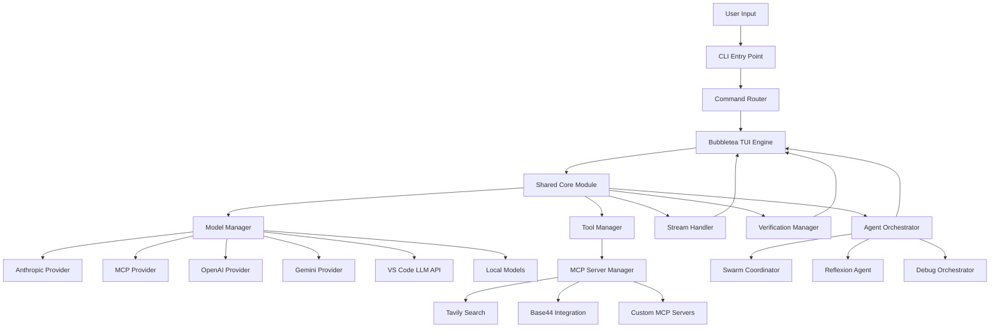
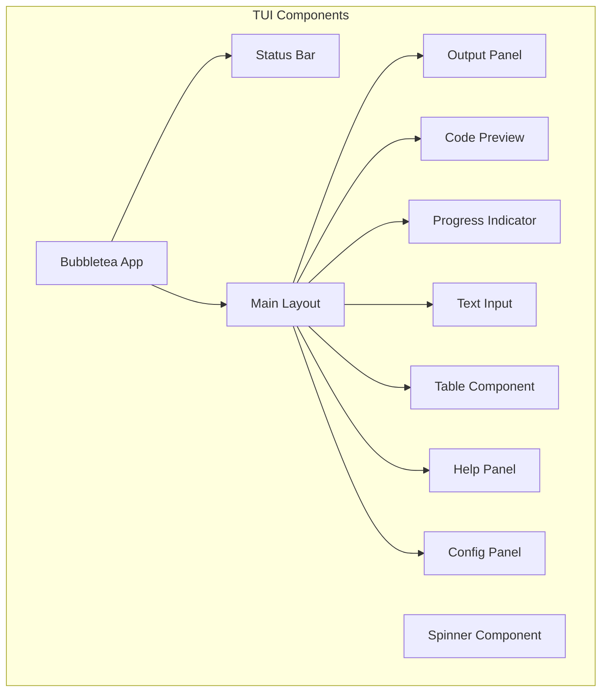
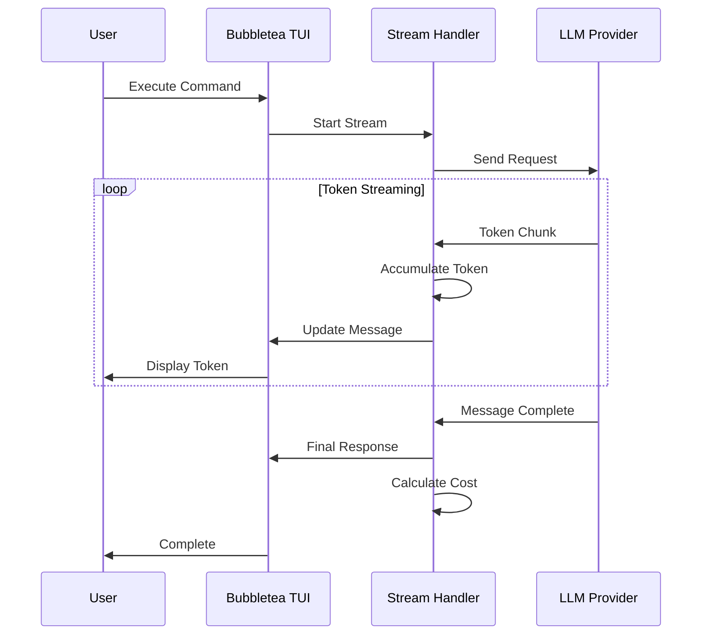
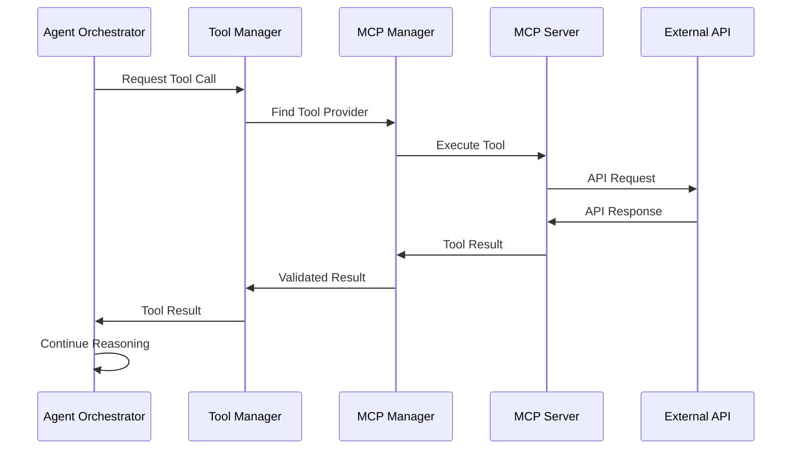
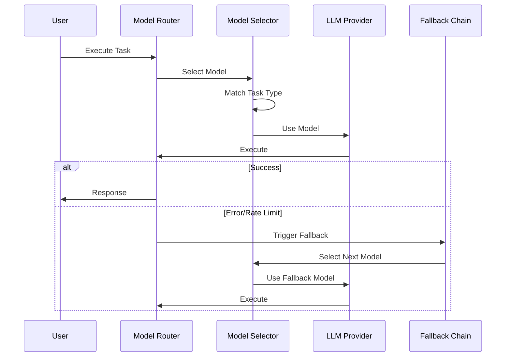
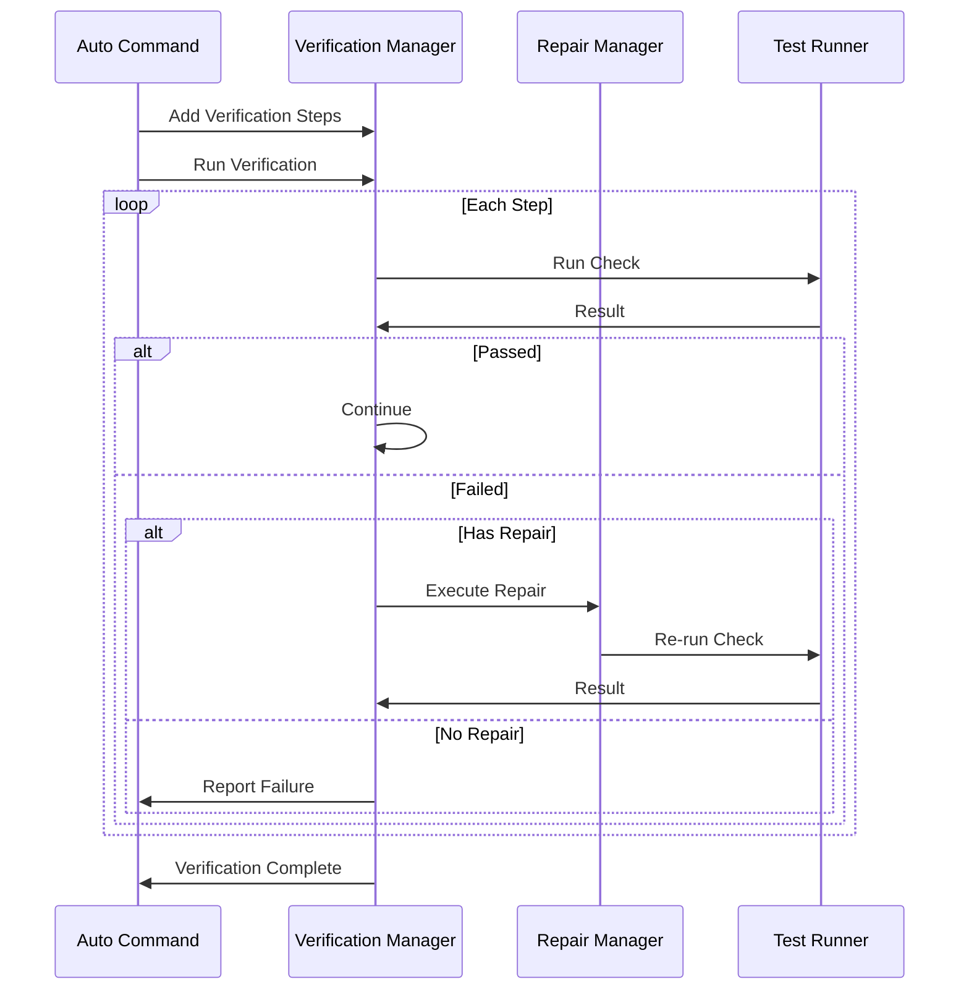

# KOMPLETE-KONTROL-CLI - New Architecture Design

**Version:** 2.0
**Date:** 2025-01-16
**Based on:** ARCHITECTURE-ANALYSIS.md and RECOMMENDATIONS.md

---

## Executive Summary

This document defines the new architecture for KOMPLETE-KONTROL-CLI, incorporating best practices from leading AI agent frameworks, TUI patterns, and integration tools. The architecture is built on Bubbletea's Elm-inspired reactive TUI framework, with flexible multi-provider model management, MCP-based tool integration, and real-time streaming capabilities.

**Key Design Principles:**
- **Reactive State Management**: Pure functions for state updates, immutable models
- **Component Composition**: Reusable UI components built from simple primitives
- **Multi-Provider Support**: Unified interface for Anthropic, OpenAI, Gemini, VS Code LLM API, and local models
- **MCP-Based Tools**: Standardized tool discovery and execution via Model Context Protocol
- **Real-Time Feedback**: Token-by-token streaming with progress tracking
- **Verification & Repair**: Automatic testing and regression detection for /auto command

---

## 1. High-Level System Architecture



### Architecture Layers

| Layer | Responsibility | Key Components |
|--------|---------------|----------------|
| **Presentation Layer** | User interface, command parsing, TUI rendering | Bubbletea TUI, Command Router, Component Library |
| **Shared Core Layer** | Business logic shared between CLI and VS Code extension | Model Manager, Tool Manager, Stream Handler, Verification Manager |
| **Provider Layer** | LLM provider abstraction and routing | Anthropic, OpenAI, Gemini, VS Code LLM API, MCP, Local |
| **Tool Layer** | External service integration | MCP Server Manager, Tavily, Base44, Custom Tools |
| **Agent Layer** | Autonomous execution and orchestration | Swarm Coordinator, Reflexion Agent, Debug Orchestrator |
| **Data Layer** | Configuration, state persistence, logging | Config Manager, State Store, Logger |

---

## 2. Component Architecture



### Component Hierarchy

```
App (Root)
├── StatusBar
│   ├── ModelInfo
│   ├── TokenCount
│   └── CostDisplay
├── MainLayout
│   ├── Sidebar
│   │   ├── CommandList
│   │   └── ToolList
│   └── ContentArea
│       ├── OutputPanel
│       │   ├── MessageList
│       │   └── ToolExecution
│       ├── CodePreview
│       │   ├── SyntaxHighlighter
│       │   └── LineTracker
│       └── ProgressIndicator
│           ├── ProgressBar
│           └── StatusText
└── TextInput
    ├── PromptInput
    └── CommandInput
```

---

## 3. Module Breakdown and Responsibilities

### 3.1 Presentation Layer (`src/tui/`)

| Module | File | Responsibilities |
|---------|-------|----------------|
| **TUI Engine** | `App.ts` | Bubbletea program entry point, message routing, event subscriptions |
| **Command Router** | `CommandRouter.ts` | Parse commands, route to handlers, generate help |
| **Components** | `components/` | Reusable UI components (StatusBar, ProgressIndicator, etc.) |
| **Theme System** | `theme.ts` | Color schemes, styling, terminal capability detection |

### 3.2 Shared Core Layer (`src/shared/core/`)

| Module | File | Responsibilities |
|---------|-------|----------------|
| **Model Manager** | `ModelManager.ts` | Model configuration, provider routing, cost tracking, fallback chains |
| **Tool Manager** | `ToolManager.ts` | MCP server management, tool discovery, tool execution, result caching |
| **Stream Handler** | `StreamHandler.ts` | Token accumulation, progress calculation, cost tracking, UI updates |
| **Verification Manager** | `VerificationManager.ts` | Verification steps, repair strategies, regression detection |
| **Config Manager** | `ConfigManager.ts` | Configuration loading/saving, schema validation, migration |

### 3.3 Provider Layer (`src/core/llm/providers/`)

| Module | File | Responsibilities |
|---------|-------|----------------|
| **Provider Interface** | `types.ts` | Common interface for all LLM providers |
| **Anthropic Provider** | `AnthropicProvider.ts` | Claude API integration, streaming, tool calling |
| **OpenAI Provider** | `OpenAIProvider.ts` | GPT models integration, streaming, tool calling |
| **Gemini Provider** | `GeminiProvider.ts` | Google Gemini integration, streaming |
| **VS Code Provider** | `VSCodeLLMProvider.ts` | VS Code Language Model API integration |
| **MCP Provider** | `MCPProvider.ts` | MCP server proxy for model delegation |
| **Local Provider** | `LocalProvider.ts` | Local LLM support (Ollama, etc.) |
| **Provider Factory** | `ProviderFactory.ts` | Provider instantiation, capability matching |

### 3.4 Tool Layer (`src/core/tools/`)

| Module | File | Responsibilities |
|---------|-------|----------------|
| **MCP Manager** | `MCPManager.ts` | MCP server connection, tool registration, execution |
| **Tavily Tool** | `TavilyTool.ts` | Web search, content extraction, research queries |
| **Base44 Tool** | `Base44Tool.ts` | No-code app building, database operations |
| **Tool Registry** | `ToolRegistry.ts` | Tool discovery, schema validation, caching |
| **Tool Executor** | `ToolExecutor.ts` | Async execution, timeout handling, error recovery |

### 3.5 Agent Layer (`src/core/agents/`)

| Module | File | Responsibilities |
|---------|-------|----------------|
| **Agent Orchestrator** | `AgentOrchestrator.ts` | Agent selection, task delegation, lifecycle management |
| **Swarm Coordinator** | `swarm/Coordinator.ts` | Parallel agent spawning, result aggregation |
| **Reflexion Agent** | `reflexion/index.ts` | ReAct + reflection loop, self-correction |
| **Debug Orchestrator** | `debug/orchestrator/` | Memory analysis, pattern mining, recommendations |

### 3.6 Data Layer (`src/core/data/`)

| Module | File | Responsibilities |
|---------|-------|----------------|
| **Config Store** | `ConfigStore.ts` | Configuration persistence, schema validation |
| **State Store** | `StateStore.ts` | Runtime state management, history tracking |
| **Logger** | `Logger.ts` | Structured logging, log rotation, formatters |

---

## 4. Data Flow Diagrams

### 4.1 Streaming Data Flow



### 4.2 Tool Calling Data Flow



### 4.3 Model Management Data Flow



### 4.4 Verification and Repair Data Flow



---

## 5. Technology Choices and Rationale

### 5.1 Core Framework

| Technology | Choice | Rationale |
|-------------|--------|-----------|
| **TUI Framework** | Bubbletea | Elm architecture, pure functions, excellent TypeScript support, battle-tested |
| **CLI Parser** | Commander | Familiar API, subcommand support, auto-help generation |
| **Terminal Output** | Chalk | Color support, cross-platform, minimal overhead |

### 5.2 LLM Integration

| Technology | Choice | Rationale |
|-------------|--------|-----------|
| **Primary Provider** | Anthropic SDK | Official SDK, excellent tool support, streaming, vision |
| **Multi-Provider** | Custom abstraction | Flexibility, cost optimization, fallback capability |
| **VS Code Integration** | Language Model API | Extension compatibility, model discovery, unified config |

### 5.3 Tool Integration

| Technology | Choice | Rationale |
|-------------|--------|-----------|
| **Tool Protocol** | MCP (Model Context Protocol) | Industry standard, automatic discovery, wide ecosystem |
| **Search** | Tavily API | Real-time data, structured results, AI-optimized |
| **No-Code** | Base44 | App generation, database, API integration |

### 5.4 State Management

| Technology | Choice | Rationale |
|-------------|--------|-----------|
| **State Pattern** | Elm Architecture | Predictable updates, easy testing, time-travel debugging |
| **Persistence** | JSON Config | Human-readable, easy migration, version control friendly |

### 5.5 Streaming and Real-Time

| Technology | Choice | Rationale |
|-------------|--------|-----------|
| **Stream Handler** | Async Iterable | Native streaming, backpressure handling, cancellation support |
| **Progress Tracking** | Token Counting | Accurate cost calculation, user feedback, progress estimation |

---

## 6. Key Design Patterns

### 6.1 Elm Architecture (Bubbletea)

```typescript
interface Model {
  // Pure state - no mutations
}

type Msg = 
  | { type: 'StartCommand', command: string }
  | { type: 'AddOutput', text: string }
  | { type: 'UpdateProgress', progress: number };

const init = (): Init<Model> => {
  return { model: initialState };
};

const update = (msg: Msg, model: Model): Update<Model> => {
  // Pure function - returns new state
  return { model: { ...model, ...newState } };
};

const view = (model: Model): string => {
  // Render function - returns UI string
  return renderUI(model);
};
```

### 6.2 Provider Abstraction

```typescript
interface ILLMProvider {
  name: string;
  capabilities: ProviderCapabilities;
  complete(request: LLMRequest): Promise<LLMResponse>;
  streamComplete(request: LLMRequest, handler: StreamHandler): Promise<LLMResponse>;
  listModels(): Promise<ModelInfo[]>;
}

// Each provider implements this interface
class AnthropicProvider implements ILLMProvider { }
class OpenAIProvider implements ILLMProvider { }
```

### 6.3 MCP Tool Pattern

```typescript
interface MCPTool {
  name: string;
  description: string;
  inputSchema: JSONSchema;
  execute(input: unknown): Promise<ToolResult>;
}

interface MCPServer {
  id: string;
  name: string;
  connect(): Promise<void>;
  listTools(): Promise<MCPTool[]>;
  callTool(name: string, input: unknown): Promise<ToolResult>;
}
```

### 6.4 Verification Step Pattern

```typescript
interface VerificationStep {
  name: string;
  check: () => Promise<boolean>;
  repair?: () => Promise<void>;
  critical: boolean;
}

// Verification Manager runs steps in sequence
// Non-critical steps can attempt repair
// Critical steps stop verification on failure
```

---

## 7. Configuration Schema

```typescript
interface CLIConfig {
  version: string;
  models: {
    default: string;
    providers: {
      anthropic: { apiKey: string; baseUrl?: string };
      openai: { apiKey: string; baseUrl?: string };
      gemini: { apiKey: string };
      vscode: { enabled: boolean };
      local: { enabled: boolean; baseUrl: string };
    };
    fallbackChain: string[];
  };
  tools: {
    tavily: { enabled: boolean; apiKey: string; maxResults: number };
    base44: { enabled: boolean; apiKey: string; workspaceId: string };
    mcpServers: Array<{ id: string; name: string; url: string }>;
  };
  ui: {
    theme: 'dark' | 'light' | 'auto';
    streaming: boolean;
    showCost: boolean;
    showTokens: boolean;
  };
  verification: {
    autoVerify: boolean;
    autoRepair: boolean;
    maxRetries: number;
  };
}
```

---

## 8. Error Handling Strategy

### 8.1 Error Classification

| Error Type | Handling Strategy |
|-------------|------------------|
| **Network Error** | Retry with exponential backoff, fallback model |
| **Rate Limit** | Switch to fallback model, queue request |
| **Authentication** | Clear credentials, prompt user, stop execution |
| **Tool Failure** | Log error, try alternative tool, continue if non-critical |
| **Validation Error** | Show user-friendly message, suggest fix |
| **Stream Interrupt** | Save partial result, offer resume option |

### 8.2 Fallback Chain

```
Primary Model (Claude Sonnet 4.5)
    ↓ [Rate Limit / Error]
Fallback 1 (Claude Haiku 4)
    ↓ [Rate Limit / Error]
Fallback 2 (GPT-4o-mini)
    ↓ [Rate Limit / Error]
Fallback 3 (Gemini 1.5 Flash)
    ↓ [Rate Limit / Error]
Stop: All models unavailable
```

---

## 9. Migration from Current Architecture

### 9.1 Current vs New

| Aspect | Current | New |
|---------|----------|-------|
| **TUI** | ora spinners + console | Bubbletea reactive TUI |
| **Model Selection** | Static at command start | Dynamic routing with fallback |
| **Tool Discovery** | Manual registration | MCP-based automatic discovery |
| **Streaming** | Partial (Anthropic only) | Full token-by-token streaming |
| **Verification** | Manual | Automatic with repair |
| **State Management** | Ad-hoc | Elm architecture (pure functions) |

### 9.2 Preserved Components

The following components will be preserved and refactored:
- [`BaseCommand`](src/cli/BaseCommand.ts:1) → Adapted for Bubbletea
- [`AgentOrchestrationBridge`](src/core/agents/AgentOrchestrationBridge.ts:1) → Integrated with shared core
- [`ContextManager`](src/core/llm/ContextManager.ts:1) → Enhanced for streaming
- [`Router`](src/core/llm/Router.ts:1) → Extended for multi-provider
- [`Streaming`](src/core/llm/Streaming.ts:1) → Refactored for TUI integration

---

## 10. Security Considerations

### 10.1 API Key Management

- Store keys in environment variables or encrypted config
- Never log API keys
- Support key rotation without restart
- Mask keys in UI display

### 10.2 Tool Execution Safety

- Require user approval for destructive operations
- Sandbox tool execution when possible
- Validate tool inputs before execution
- Log all tool executions for audit

### 10.3 MCP Server Security

- Validate server certificates
- Limit server permissions
- Rate limit tool calls
- Timeout long-running operations

---

## 11. Performance Considerations

### 11.1 Streaming Optimization

- Buffer tokens before UI update (batch rendering)
- Debounce progress updates
- Use terminal escape sequences efficiently
- Limit history display size

### 11.2 Model Selection

- Cache model capabilities
- Pre-connect to providers
- Reuse connections when possible
- Warm up fallback models

### 11.3 Tool Execution

- Parallel independent tool calls
- Cache tool results
- Implement request coalescing
- Timeout aggressive tools

---

## 12. Testing Strategy

### 12.1 Unit Tests

- Pure functions (update, view) are easily testable
- Provider interfaces with mock implementations
- Tool execution with fake servers
- Verification steps with controlled outcomes

### 12.2 Integration Tests

- End-to-end command execution
- MCP server connection flows
- Streaming with real providers (test keys)
- Multi-provider fallback chains

### 12.3 E2E Tests

- Full CLI workflows
- VS Code extension integration
- Configuration migration
- Error recovery scenarios

---

## 13. Future Extensibility

### 13.1 New Providers

Implement `ILLMProvider` interface and register with `ProviderFactory`:
```typescript
class CustomProvider implements ILLMProvider {
  name = 'custom';
  capabilities = { streaming: true, tools: true, ... };
  async complete(request: LLMRequest): Promise<LLMResponse> { }
  async streamComplete(request: LLMRequest, handler: StreamHandler): Promise<LLMResponse> { }
  async listModels(): Promise<ModelInfo[]> { }
}

ProviderFactory.register('custom', CustomProvider);
```

### 13.2 New Tools

Implement MCP server and register with `MCPManager`:
```typescript
const server: MCPServer = {
  id: 'custom-tool',
  name: 'Custom Tool Server',
  async connect() { },
  async listTools() { return [/* tools */]; },
  async callTool(name, input) { return /* result */; }
};

MCPManager.registerServer(server);
```

### 13.3 New UI Components

Implement `View` interface and compose into layouts:
```typescript
class CustomComponent implements View {
  render(): string {
    return 'Custom UI';
  }
}

MainLayout.addComponent('custom', new CustomComponent());
```

---

## 14. Dependencies and Phasing

See [`IMPLEMENTATION-PHASES.md`](IMPLEMENTATION-PHASES.md:1) for detailed implementation roadmap with dependencies between phases.

---

## Conclusion

This architecture provides a solid foundation for the next generation of KOMPLETE-KONTROL-CLI, incorporating:

1. **Modern TUI** with Bubbletea's reactive architecture
2. **Flexible model management** with multi-provider support and fallback chains
3. **Standardized tool integration** via MCP protocol
4. **Real-time streaming** with progress tracking and cost awareness
5. **Automatic verification** and repair for reliable autonomous operation
6. **Shared core** for CLI/VS Code extension alignment

The architecture prioritizes user experience, reliability, and extensibility while maintaining backward compatibility where possible.
