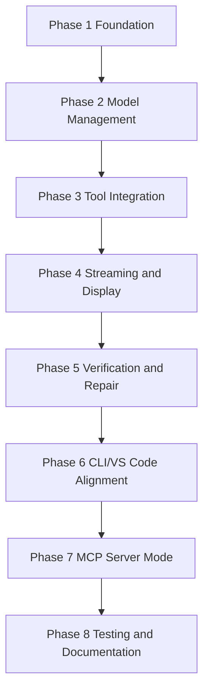

# KOMPLETE-KONTROL-CLI - Implementation Phases

**Version:** 2.0
**Date:** 2025-01-16
**Based on:** RECOMMENDATIONS.md and ARCHITECTURE.md

---

## Overview

This document outlines the 8-phase implementation roadmap for migrating KOMPLETE-KONTROL-CLI to the new Bubbletea-based architecture. Each phase builds on the previous one, with clear dependencies and verification criteria.

---

## Phase 1: Foundation

**Goal:** Establish Bubbletea TUI framework and shared core module

### Tasks

1. Create Bubbletea TUI structure
   - Create `src/tui/App.ts` with program entry point
   - Implement `init`, `update`, `view` functions
   - Set up message subscriptions
   - Create basic layout structure

2. Implement shared core module
   - Create `src/shared/core/SharedCore.ts` singleton
   - Implement `ModelManager` stub
   - Implement `ToolManager` stub
   - Implement `StreamHandler` stub

3. Create component library foundation
   - Create `src/tui/components/` directory
   - Implement `StatusBar` component
   - Implement `ProgressIndicator` component
   - Implement `OutputPanel` component
   - Implement `Spinner` component

4. Implement command router with Bubbletea
   - Create `src/tui/CommandRouter.ts`
   - Adapt existing command registration
   - Route commands to TUI messages
   - Generate help from command metadata

5. Set up theme system
   - Create `src/tui/theme.ts`
   - Implement dark and light themes
   - Add auto-detection logic
   - Create `ThemeManager` class

### Dependencies

- None (foundation phase)

### Deliverables

- [ ] TUI framework with Elm architecture
- [ ] Shared core module stubs
- [ ] Basic component library (4 components)
- [ ] Theme system with 2 themes
- [ ] Command router integration

### Verification Criteria

- [ ] TUI program starts and displays initial screen
- [ ] Theme switching works between dark/light
- [ ] Commands can be routed and executed
- [ ] Components render correctly in terminal
- [ ] Keyboard input is captured and processed
- [ ] Messages flow between components correctly

### Exit Criteria

Phase 1 is complete when all verification criteria pass and unit tests pass.

---

## Phase 2: Model Management

**Goal:** Implement flexible multi-provider model management with fallback chains

### Tasks

1. Implement ModelManager
   - Create `src/shared/core/ModelManager.ts`
   - Define `ModelConfig` interface
   - Implement model configuration loading
   - Implement model selection logic
   - Add task type matching

2. Create provider interface
   - Define `ILLMProvider` interface in `src/shared/core/llm/types.ts`
   - Specify required methods (complete, streamComplete, listModels)
   - Define `ProviderCapabilities` type
   - Define `LLMRequest` and `LLMResponse` types

3. Implement Anthropic provider
   - Refactor existing `AnthropicProvider` to new interface
   - Add streaming support via `StreamHandler`
   - Update to use new types
   - Maintain existing functionality

4. Implement OpenAI provider
   - Create `src/shared/core/llm/providers/OpenAIProvider.ts`
   - Implement GPT model support
   - Add streaming and tool calling
   - Handle rate limiting

5. Implement VS Code LLM API provider
   - Create `src/shared/core/llm/providers/VSCodeLLMProvider.ts`
   - Integrate with VS Code Language Model API
   - Discover available models from extensions
   - Handle model selection

6. Implement fallback chain
   - Create `src/shared/core/llm/FallbackChain.ts`
   - Implement model priority scoring
   - Add automatic fallback on errors
   - Configure default fallback chain

7. Create configuration UI
   - Add `ConfigPanel` component for model settings
   - Implement provider configuration forms
   - Add fallback chain editor
   - Save configuration to config file

### Dependencies

- Phase 1 must be complete
- Bubbletea TUI framework
- Shared core module

### Deliverables

- [ ] Complete ModelManager with multi-provider support
- [ ] Provider interface with all required methods
- [ ] Anthropic provider refactored
- [ ] OpenAI provider implemented
- [ ] VS Code LLM API provider
- [ ] Fallback chain with automatic switching
- [ ] Model configuration UI component

### Verification Criteria

- [ ] Models can be listed from all configured providers
- [ ] Model selection works based on task type
- [ ] Fallback chain activates on errors
- [ ] Configuration can be saved and loaded
- [ ] VS Code models are discovered and available
- [ ] Cost tracking works for each provider

### Exit Criteria

Phase 2 is complete when all providers work, fallback chain functions, and model configuration UI is usable.

---

## Phase 3: Tool Integration

**Goal:** Implement MCP-based tool discovery and execution

### Tasks

1. Implement MCP Manager
   - Create `src/shared/core/tools/MCPManager.ts`
   - Define `MCPServer` interface
   - Implement server connection logic
   - Implement tool discovery
   - Add tool execution with validation

2. Implement Tavily integration
   - Create `src/shared/core/tools/TavilyTool.ts`
   - Define tool schema for web search
   - Implement API integration
   - Add result formatting
   - Register with MCP Manager

3. Implement Base44 integration
   - Create `src/shared/core/tools/Base44Tool.ts`
   - Define tool schema for app building
   - Implement API integration
   - Add workspace management
   - Register with MCP Manager

4. Create tool registry
   - Create `src/shared/core/tools/ToolRegistry.ts`
   - Implement tool discovery
   - Add schema validation
   - Implement caching layer

5. Implement tool executor
   - Create `src/shared/core/tools/ToolExecutor.ts`
   - Add async execution
   - Implement timeout handling
   - Add error recovery
   - Support parallel execution

6. Create tool list UI
   - Add `ToolList` component
   - Display tool status indicators
   - Implement tool filtering
   - Add tool selection

### Dependencies

- Phase 2 must be complete
- MCP Manager stub from Phase 1

### Deliverables

- [ ] MCP Manager with server connection
- [ ] Tavily search tool implemented
- [ ] Base44 app builder tool implemented
- [ ] Tool registry with discovery
- [ ] Tool executor with error handling
- [ ] Tool list UI component

### Verification Criteria

- [ ] MCP servers can be connected and disconnected
- [ ] Tools are discovered and listed
- [ ] Tool execution works with validation
- [ ] Tavily search returns results
- [ ] Base44 API integration works
- [ ] Tool results are cached properly
- [ ] Parallel tool execution works

### Exit Criteria

Phase 3 is complete when MCP Manager works, Tavily and Base44 tools function, and tool UI displays correctly.

---

## Phase 4: Streaming and Display

**Goal:** Implement real-time streaming with code preview and progress tracking

### Tasks

1. Implement StreamHandler
   - Create `src/shared/core/streaming/StreamHandler.ts`
   - Implement token accumulation
   - Add progress calculation
   - Implement cost tracking
   - Add UI update callbacks

2. Create code preview component
   - Implement `CodePreview` component
   - Add syntax highlighting
   - Implement line tracking
   - Add file opening mechanism
   - Support multiple languages

3. Implement streaming integration
   - Connect StreamHandler to TUI
   - Update OutputPanel with streaming
   - Update StatusBar with token count
   - Update ProgressIndicator with progress

4. Add progress tracking
   - Implement context window tracking
   - Add visual progress indicators
   - Add cost display updates
   - Implement stream completion handling

5. Implement auto-scroll
   - Auto-scroll OutputPanel to latest
   - Keep cursor at end of output
   - Handle terminal resize

### Dependencies

- Phase 3 must be complete
- StreamHandler stub from Phase 1
- OutputPanel component from Phase 1

### Deliverables

- [ ] StreamHandler with token tracking
- [ ] CodePreview component with syntax highlighting
- [ ] Streaming integration with TUI
- [ ] Progress tracking for long operations
- [ ] Auto-scroll functionality
- [ ] Cost display updates in real-time

### Verification Criteria

- [ ] Tokens stream token-by-token
- [ ] Progress bar updates during streaming
- [ ] Code preview updates in real-time
- [ ] Cost is calculated and displayed
- [ ] Auto-scroll keeps latest content visible
- [ ] Stream completion is handled correctly
- [ ] Context window is tracked

### Exit Criteria

Phase 4 is complete when streaming works end-to-end, code preview updates in real-time, and progress tracking is accurate.

---

## Phase 5: Verification and Repair

**Goal:** Implement automatic verification and repair for /auto command

### Tasks

1. Implement VerificationManager
   - Create `src/shared/core/verification/VerificationManager.ts`
   - Define `VerificationStep` interface
   - Implement step execution logic
   - Add repair strategy support
   - Implement critical step handling

2. Implement RegressionDetector
   - Create `src/shared/core/verification/RegressionDetector.ts`
   - Define `RegressionTest` interface
   - Implement test execution
   - Add failure tracking
   - Implement result reporting

3. Implement repair strategies
   - Create `src/shared/core/verification/RepairManager.ts`
   - Implement retry logic
   - Add fallback strategies
   - Implement alternative approaches
   - Add rollback mechanism

4. Integrate verification into AutoCommand
   - Refactor `src/cli/commands/AutoCommand.ts`
   - Add verification steps
   - Implement repair flow
   - Add regression detection
   - Update status display

5. Create verification UI
   - Add verification status component
   - Implement repair approval dialog
   - Add regression report display
   - Add verification history

### Dependencies

- Phase 4 must be complete
- StreamHandler from Phase 4
- AutoCommand exists (needs refactoring)

### Deliverables

- [ ] VerificationManager with step execution
- [ ] RegressionDetector with test tracking
- [ ] RepairManager with strategies
- [ ] AutoCommand with verification integrated
- [ ] Verification UI components

### Verification Criteria

- [ ] Verification steps execute in sequence
- [ ] Non-critical steps attempt repair
- [ ] Critical steps stop on failure
- [ ] Repair strategies are applied correctly
- [ ] Regression tests run and report
- [ ] Verification history is tracked
- [ ] User approval flow works for repairs

### Exit Criteria

Phase 5 is complete when verification manager works, regression detection functions, and AutoCommand uses verification.

---

## Phase 6: CLI/VS Code Alignment

**Goal:** Create shared core for CLI and VS Code extension

### Tasks

1. Refactor shared core
   - Move `ModelManager` to `src/shared/core/`
   - Move `ToolManager` to `src/shared/core/`
   - Move `StreamHandler` to `src/shared/core/`
   - Move `VerificationManager` to `src/shared/core/`
   - Ensure no CLI-specific dependencies

2. Create VS Code extension state
   - Create `src/vscode/ExtensionState.ts`
   - Implement singleton pattern
   - Integrate with shared core
   - Add webview setup

3. Implement webview communication
   - Create `src/vscode/WebviewCommunicator.ts`
   - Define message protocol
   - Implement message serialization
   - Add event handling

4. Create shared configuration
   - Implement `src/shared/core/ConfigManager.ts`
   - Support CLI and VS Code config
   - Add synchronization logic
   - Implement config migration

5. Refactor CLI to use shared core
   - Update `src/cli/CLIApp.ts`
   - Use `SharedCore.getInstance()`
   - Remove duplicated code
   - Maintain CLI-specific features

### Dependencies

- Phase 5 must be complete
- All shared core modules from previous phases

### Deliverables

- [ ] Shared core module refactored
- [ ] VS Code extension state created
- [ ] Webview communication protocol
- [ ] Shared configuration manager
- [ ] CLI refactored to use shared core

### Verification Criteria

- [ ] CLI and VS Code use same ModelManager
- [ ] CLI and VS Code use same ToolManager
- [ ] Configuration is synchronized between both
- [ ] Webview messages are handled correctly
- [ ] Shared core has no CLI-specific code
- [ ] State is properly isolated

### Exit Criteria

Phase 6 is complete when shared core works for both CLI and VS Code, and configuration is synchronized.

---

## Phase 7: MCP Server Mode

**Goal:** Implement CLI as MCP server for external agent integration

### Tasks

1. Implement MCP server
   - Create `src/mcp/server.ts`
   - Implement server lifecycle
   - Add tool registration endpoint
   - Implement tool execution endpoint
   - Add server discovery

2. Implement tool registration
   - Create `src/mcp/ToolRegistry.ts`
   - Register CLI commands as tools
   - Generate tool schemas
   - Add tool metadata

3. Implement tool execution
   - Create `src/mcp/ToolExecutor.ts`
   - Execute CLI commands
   - Handle command context
   - Return formatted results
   - Add error handling

4. Implement server discovery
   - Create `src/mcp/discovery.ts`
   - Implement server info endpoint
   - Add tool listing
   - Implement capability reporting

5. Add MCP server CLI commands
   - Implement `mcp start` command
   - Implement `mcp stop` command
   - Implement `mcp status` command
   - Add configuration options

### Dependencies

- Phase 6 must be complete
- All shared core modules
- Existing CLI commands

### Deliverables

- [ ] MCP server implementation
- [ ] Tool registration for CLI commands
- [ ] Tool execution with context
- [ ] Server discovery endpoint
- [ ] MCP server CLI commands

### Verification Criteria

- [ ] MCP server starts and listens on port
- [ ] Tools are registered and discoverable
- [ ] Tool execution works with context
- [ ] Server discovery responds correctly
- [ ] CLI commands can start/stop server
- [ ] Server status is reported accurately

### Exit Criteria

Phase 7 is complete when MCP server runs, CLI commands are exposed as tools, and discovery works.

---

## Phase 8: Testing and Documentation

**Goal:** Comprehensive testing, documentation, and release preparation

### Tasks

1. Write unit tests
   - Test all TUI components
   - Test provider implementations
   - Test shared core modules
   - Test MCP Manager
   - Test verification system

2. Write integration tests
   - Test command execution end-to-end
   - Test model fallback chains
   - Test tool integration
   - Test streaming functionality
   - Test MCP server mode

3. Write E2E tests
   - Test complete CLI workflows
   - Test configuration migration
   - Test error recovery
   - Test VS Code extension integration

4. Create architecture documentation
   - Update [`ARCHITECTURE.md`](ARCHITECTURE.md:1)
   - Add component diagrams
   - Add data flow diagrams
   - Document technology choices

5. Create component library documentation
   - Update [`COMPONENT-LIBRARY.md`](COMPONENT-LIBRARY.md:1)
   - Document all components
   - Add usage examples
   - Document theme system

6. Create migration guide
   - Update [`MIGRATION-GUIDE.md`](MIGRATION-GUIDE.md:1)
   - Add step-by-step process
   - Document breaking changes
   - Add testing checklist

7. Update user documentation
   - Update README with new features
   - Update command documentation
   - Add migration instructions
   - Update examples and tutorials

8. Prepare release
   - Update version to 2.0.0
   - Create release notes
   - Tag release commit
   - Prepare changelog

### Dependencies

- All previous phases must be complete
- All documentation from this phase

### Deliverables

- [ ] Unit tests for all modules
- [ ] Integration tests for workflows
- [ ] E2E tests for complete scenarios
- [ ] Updated architecture documentation
- [ ] Updated component library docs
- [ ] Updated migration guide
- [ ] Updated user documentation
- [ ] Release preparation complete

### Verification Criteria

- [ ] All unit tests pass
- [ ] All integration tests pass
- [ ] All E2E tests pass
- [ ] Code coverage meets threshold (80%+)
- [ ] Documentation is complete
- [ ] Migration guide is tested
- [ ] Release notes are prepared

### Exit Criteria

Phase 8 is complete when all tests pass, documentation is complete, and release is ready.

---

## Phase Dependencies

### Dependency Matrix

| Phase | Depends On | Can Start After |
|--------|------------|----------------|
| **Phase 1** | None | Immediately |
| **Phase 2** | Phase 1 | Foundation complete |
| **Phase 3** | Phase 2 | Model Management complete |
| **Phase 4** | Phase 3 | Tool Integration complete |
| **Phase 5** | Phase 4 | Streaming and Display complete |
| **Phase 6** | Phase 5 | Verification and Repair complete |
| **Phase 7** | Phase 6 | CLI/VS Code Alignment complete |
| **Phase 8** | Phase 7 | MCP Server Mode complete |

### Parallel Opportunities

The following tasks can be done in parallel within phases:

- **Phase 2:** OpenAI provider and VS Code provider can be developed simultaneously
- **Phase 3:** Tavily and Base44 tools can be developed in parallel
- **Phase 4:** Code preview and progress tracking can be done in parallel
- **Phase 8:** Documentation can be written while tests are developed

---

## Risk Mitigation

### Technical Risks

| Risk | Impact | Mitigation |
|-------|---------|-------------|
| **Bubbletea learning curve** | Slower initial development | Use existing component library patterns |
| **Provider API changes** | Breaking changes to providers | Implement adapter pattern for compatibility |
| **MCP server complexity** | New protocol to implement | Start with simple tool registration |
| **Shared core coupling** | Tight coupling between CLI/VS Code | Use dependency injection and interfaces |
| **Streaming performance** | High token rate may slow UI | Implement batching and throttling |

### Schedule Risks

| Risk | Impact | Mitigation |
|-------|---------|-------------|
| **Phase dependencies** | Delay if phase fails | Implement stubs to allow parallel work |
| **Testing time** | May extend timeline | Start testing early in each phase |
| **Documentation debt** | Outdated docs during dev | Update docs continuously |
| **User adoption** | Resistance to new TUI | Provide migration guide and training |

---

## Success Criteria

Overall implementation is successful when:

- [ ] All 8 phases are complete
- [ ] All verification criteria pass
- [ ] All tests pass (unit, integration, E2E)
- [ ] Documentation is complete and accurate
- [ ] Migration guide is tested
- [ ] Release is prepared
- [ ] User acceptance testing passes

---

## Conclusion

This 8-phase implementation roadmap provides:

1. **Clear progression** from foundation to release
2. **Defined dependencies** between phases
3. **Specific tasks** for each phase
4. **Verification criteria** to ensure quality
5. **Risk mitigation** for common issues
6. **Parallel opportunities** to accelerate development
7. **Success criteria** for overall completion

Follow this roadmap incrementally, ensuring each phase is complete before starting the next. Regular checkpoints and testing will ensure a successful migration to the new architecture.

See also:
- [Architecture Overview](ARCHITECTURE.md)
- [Component Library](COMPONENT-LIBRARY.md)
- [Migration Guide](MIGRATION-GUIDE.md)
- [Research Findings](ARCHITECTURE-ANALYSIS.md)
- [Recommendations](RECOMMENDATIONS.md)
