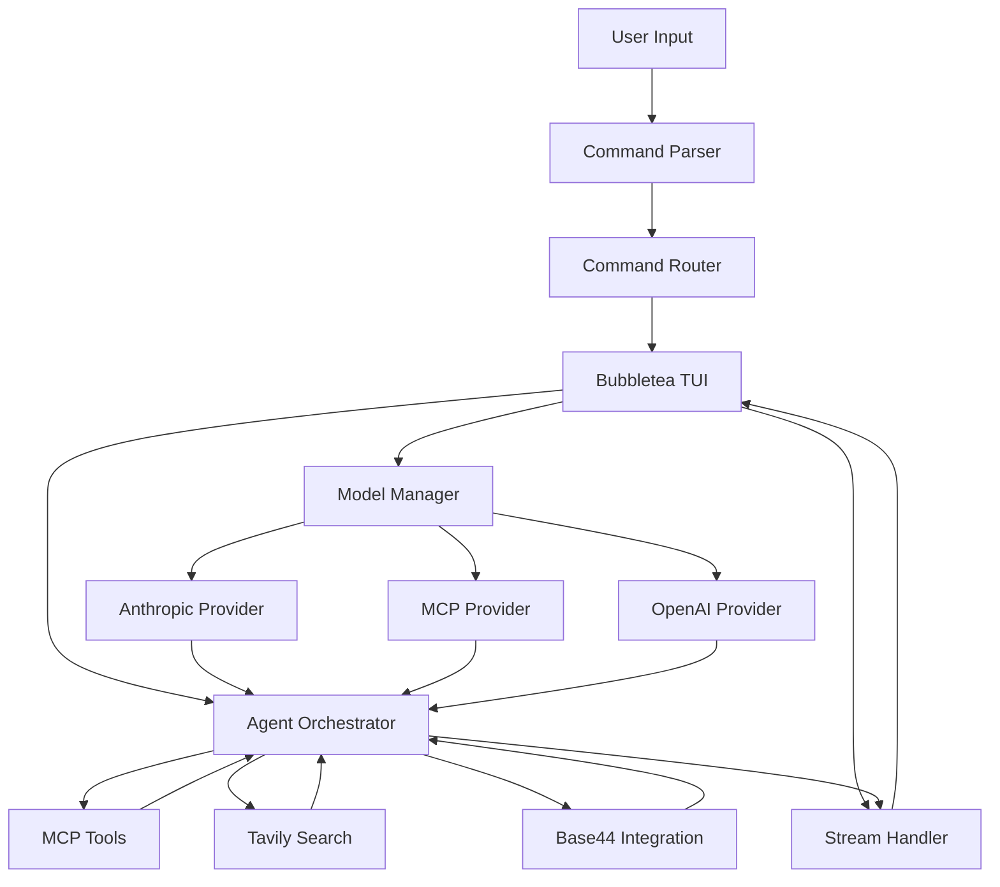
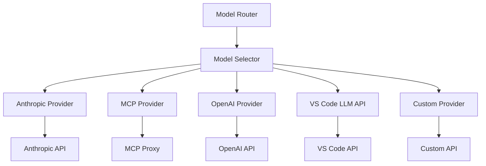
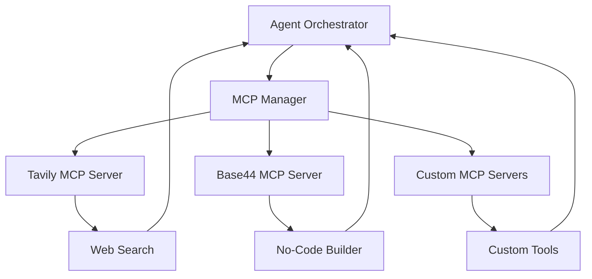
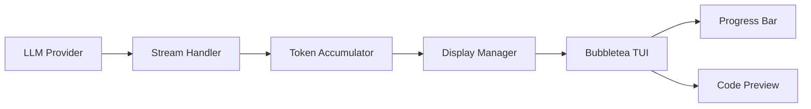
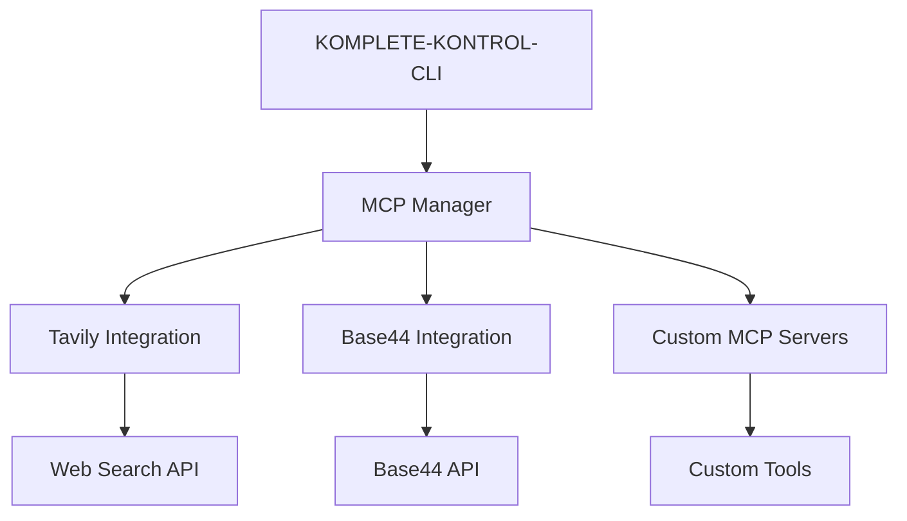
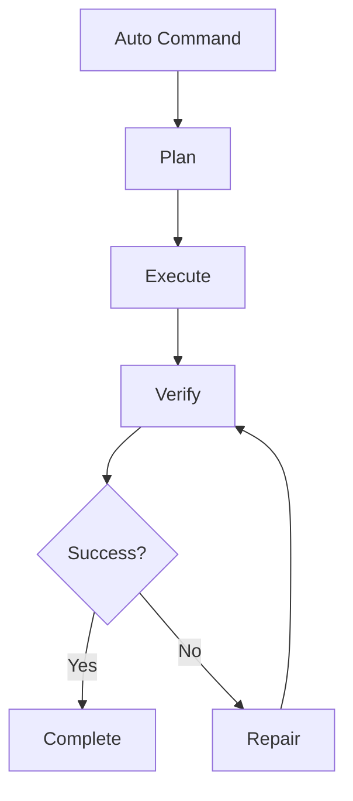
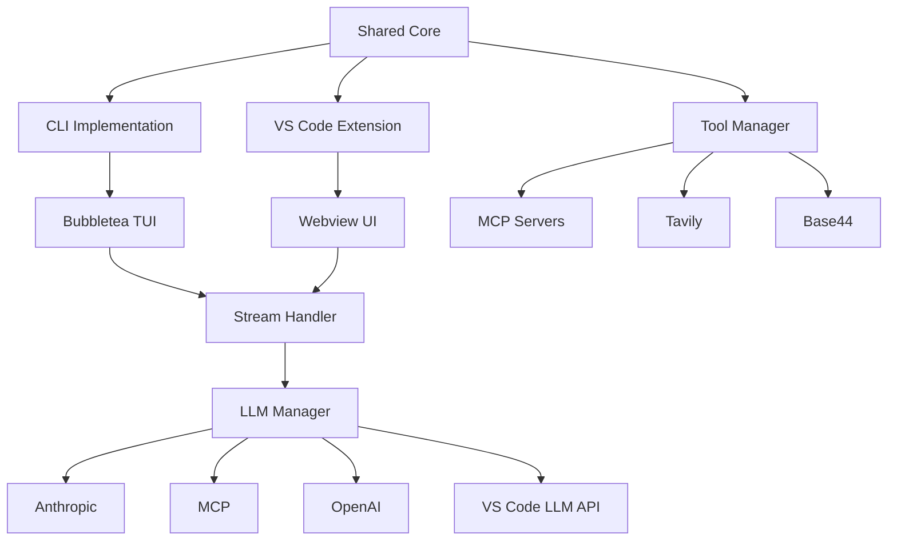

# CLI Architecture Redesign - Recommendations

**Date:** 2025-01-16  
**Based on:** ARCHITECTURE-ANALYSIS.md

---

## Executive Summary

This document provides specific recommendations for redesigning KOMPLETE-KONTROL-CLI based on analysis of leading AI agent frameworks, TUI patterns, and integration tools. The recommendations focus on:

1. **Bubbletea Integration** - Modern TUI with reactive state management
2. **Flexible Model Management** - Multi-provider support with dynamic routing
3. **Enhanced Tool Calling** - MCP-based integration with Tavily and Base44
4. **Real-Time Streaming** - Token-by-token feedback with progress tracking
5. **Verification and Repair** - Automatic testing and regression detection
6. **MCP Server Mode** - CLI as tool provider for external agents

---

## 1. New CLI Architecture Using Bubbletea

### Proposed Architecture



### Core Components

#### 1. TUI Framework (Bubbletea)

**Implementation:**
```typescript
// src/tui/App.ts
import tea from 'bubbletea';
import { Model, Init, Update, View, Cmd } from 'bubbletea';

// State Model
interface AppModel {
  currentCommand: string;
  output: string[];
  status: 'idle' | 'running' | 'complete' | 'error';
  progress: number;
  tokensUsed: number;
  cost: number;
}

// Init function
const init = (): Init<AppModel> => {
  return {
    model: {
      currentCommand: '',
      output: [],
      status: 'idle',
      progress: 0,
      tokensUsed: 0,
      cost: 0,
    },
  };
};

// Update function (pure)
const update = (msg: Msg, model: AppModel): Update<AppModel> => {
  switch (msg.type) {
    case 'startCommand':
      return {
        ...model,
        currentCommand: msg.command,
        status: 'running',
      };
    case 'addOutput':
      return {
        ...model,
        output: [...model.output, msg.text],
      };
    case 'updateProgress':
      return {
        ...model,
        progress: msg.progress,
      };
    case 'addToken':
      return {
        ...model,
        tokensUsed: model.tokensUsed + msg.tokens,
        cost: model.cost + msg.cost,
      };
    default:
      return model;
  }
};

// View function
const view = (model: AppModel): string => {
  const statusColor = {
    idle: 'blue',
    running: 'yellow',
    complete: 'green',
    error: 'red',
  }[model.status];

  return `
${statusColor[model.status].bold('●')} ${model.currentCommand}
${'─'.repeat(50)}

Progress: ${'█'.repeat(Math.floor(model.progress / 2))}${'░'.repeat(50 - Math.floor(model.progress / 2))} ${model.progress}%

${model.output.map(line => `  ${line}`).join('\n')}

Tokens: ${model.tokensUsed.toLocaleString()} | Cost: $${model.cost.toFixed(4)}

${model.status === 'running' ? 'Press q to quit' : ''}
`;
};

// Subscriptions
const subscriptions = (model: AppModel) => {
  return [
    tea.Subscribe('tick', () => {
      // Handle timer ticks
    }),
    tea.Subscribe('key', (msg) => {
      // Handle keyboard input
    }),
  ];
};

// Program
export const program = tea.program(init, update, view, subscriptions);
```

**Key Features:**
- Reactive state management with pure functions
- Real-time progress bars
- Colored status indicators
- Token and cost tracking
- Keyboard-driven navigation

#### 2. Command Router

```typescript
// src/tui/CommandRouter.ts
import { BaseCommand } from '../cli/commands';

export class CommandRouter {
  private commands: Map<string, BaseCommand>;

  constructor() {
    this.registerCommands();
  }

  private registerCommands() {
    this.commands = new Map([
      ['auto', new AutoCommand()],
      ['build', new BuildCommand()],
      ['checkpoint', new CheckpointCommand()],
      // ... other commands
    ]);
  }

  async execute(command: string, args: string[]): Promise<void> {
    const cmd = this.commands.get(command);
    if (!cmd) {
      throw new Error(`Unknown command: ${command}`);
    }
    await cmd.execute(args);
  }

  getHelp(): string {
    return Array.from(this.commands.entries())
      .map(([name, cmd]) => `${name.padEnd(20)} - ${cmd.description}`)
      .join('\n');
  }
}
```

#### 3. Component Library

```typescript
// src/tui/components/StatusBar.ts
import { View } from 'bubbletea';

export class StatusBar implements View {
  render(): string {
    return this.getStatusLine();
  }

  private getStatusLine(): string {
    // Render status bar with model, tokens, cost
  }
}

// src/tui/components/ProgressIndicator.ts
export class ProgressIndicator implements View {
  private progress: number;
  private message: string;

  render(): string {
    const filled = Math.floor(this.progress / 2);
    const empty = 50 - filled;
    return `[${'█'.repeat(filled)}${'░'.repeat(empty)}] ${this.message}`;
  }
}

// src/tui/components/OutputPanel.ts
export class OutputPanel implements View {
  private lines: string[];

  render(): string {
    return this.lines.join('\n');
  }

  addLine(line: string): void {
    this.lines.push(line);
    this.lines = this.lines.slice(-100); // Keep last 100 lines
  }
}
```

---

## 2. Model Management System Design

### Flexible, Multi-Provider Architecture



### Model Configuration

```typescript
// src/core/llm/ModelManager.ts
import type { LLMRequest, LLMResponse } from './types';

export interface ModelConfig {
  id: string;
  name: string;
  provider: 'anthropic' | 'mcp' | 'openai' | 'vscode' | 'custom';
  capabilities: {
    streaming: boolean;
    vision: boolean;
    tools: boolean;
    maxTokens: number;
    costPer1kTokens: number;
  };
  taskTypes: TaskType[];
  priority: 'speed' | 'quality' | 'cost' | 'balanced';
}

export class ModelManager {
  private configs: Map<string, ModelConfig>;
  private currentModel: ModelConfig;

  constructor() {
    this.loadConfigs();
  }

  private loadConfigs() {
    // Built-in models
    this.configs = new Map([
      ['claude-sonnet-4.5', {
        id: 'claude-sonnet-4.5-20250929',
        name: 'Claude Sonnet 4.5',
        provider: 'anthropic',
        capabilities: { streaming: true, vision: true, tools: true, maxTokens: 200000, costPer1kTokens: 0.003 },
        taskTypes: ['coding', 'reasoning', 'debugging'],
        priority: 'quality',
      }],
      ['claude-opus-4', {
        id: 'claude-opus-4.5-20251101',
        name: 'Claude Opus 4',
        provider: 'anthropic',
        capabilities: { streaming: true, vision: true, tools: true, maxTokens: 200000, costPer1kTokens: 0.015 },
        taskTypes: ['coding', 'reasoning', 'security'],
        priority: 'quality',
      }],
      ['glm-4.7', {
        id: 'glm/glm-4.7',
        name: 'GLM-4.7',
        provider: 'mcp',
        capabilities: { streaming: false, vision: false, tools: false, maxTokens: 128000, costPer1kTokens: 0.001 },
        taskTypes: ['reasoning', 'coding', 'chinese'],
        priority: 'balanced',
      }],
      // ... more models
    ]);

    // Load from VS Code Language Model API
    this.loadVSCodeModels();
  }

  async loadVSCodeModels() {
    // Discover models from VS Code extensions
    const models = await vscodeLanguageModelAPI.getAvailableModels();
    for (const model of models) {
      this.configs.set(model.id, {
        id: model.id,
        name: model.name,
        provider: 'vscode',
        capabilities: model.capabilities,
        taskTypes: model.taskTypes || ['general'],
        priority: 'balanced',
      });
    }
  }

  selectModel(taskType: TaskType, priority: RoutingPriority): ModelConfig {
    const candidates = Array.from(this.configs.values())
      .filter(config => config.taskTypes.includes(taskType));

    // Sort by priority
    candidates.sort((a, b) => {
      const priorityScore = {
        speed: { speed: 3, quality: 1, cost: 2, balanced: 2 },
        quality: { speed: 1, quality: 3, cost: 2, balanced: 2 },
        cost: { speed: 1, quality: 1, cost: 3, balanced: 2 },
      };
      return priorityScore[priority][b.priority] - priorityScore[priority][a.priority];
    });

    return candidates[0] || this.configs.get('claude-sonnet-4.5');
  }

  getCurrentModel(): ModelConfig {
    return this.currentModel;
  }

  setCurrentModel(modelId: string): void {
    this.currentModel = this.configs.get(modelId);
  }
}
```

### VS Code Language Model API Integration

```typescript
// src/core/llm/VSCodeLLMProvider.ts
import type { ILLMProvider, LLMRequest, LLMResponse } from './types';

export class VSCodeLLMProvider implements ILLMProvider {
  public readonly name = 'vscode';
  public readonly capabilities = {
    streaming: true,
    vision: true,
    tools: true,
    systemPrompt: true,
    multiModal: true,
  };

  async complete(request: LLMRequest): Promise<LLMResponse> {
    // Use VS Code Language Model API
    const response = await vscodeLanguageModelAPI.complete({
      model: request.model || 'default',
      messages: request.messages,
      system: request.system,
      tools: request.tools,
    });

    return this.convertResponse(response);
  }

  async streamComplete(request: LLMRequest, handler: StreamHandler): Promise<LLMResponse> {
    // Use VS Code Language Model API streaming
    const stream = await vscodeLanguageModelAPI.stream({
      model: request.model || 'default',
      messages: request.messages,
      system: request.system,
      tools: request.tools,
    });

    for await (const chunk of stream) {
      handler({
        type: 'content_block_delta',
        delta: { text: chunk.text },
      });
    }

    return stream.finalResponse;
  }

  async listModels(): Promise<string[]> {
    const models = await vscodeLanguageModelAPI.getAvailableModels();
    return models.map(m => m.id);
  }
}
```

---

## 3. Tool Calling Integration Approach

### MCP-Based Tool Architecture



### MCP Manager Implementation

```typescript
// src/core/tools/MCPManager.ts
import type { Tool, ToolResult } from '../llm/types';

export interface MCPServer {
  id: string;
  name: string;
  url: string;
  capabilities: string[];
  status: 'connected' | 'disconnected' | 'error';
}

export class MCPManager {
  private servers: Map<string, MCPServer>;
  private tools: Map<string, Tool>;

  constructor() {
    this.loadServers();
  }

  private loadServers() {
    // Built-in MCP servers
    this.servers = new Map([
      ['tavily', {
        id: 'tavily',
        name: 'Tavily Search',
        url: 'mcp://tavily',
        capabilities: ['search', 'extract', 'crawl'],
        status: 'disconnected',
      }],
      ['base44', {
        id: 'base44',
        name: 'Base44 Integration',
        url: 'mcp://base44',
        capabilities: ['app-builder', 'database', 'api'],
        status: 'disconnected',
      }],
    ]);

    // Load custom MCP servers from config
    this.loadCustomServers();
  }

  async connectServer(serverId: string): Promise<void> {
    const server = this.servers.get(serverId);
    if (!server) return;

    try {
      // Connect to MCP server
      const client = await createMCPClient(server.url);
      const tools = await client.listTools();

      // Register tools
      for (const tool of tools) {
        this.tools.set(tool.name, {
          name: tool.name,
          description: tool.description,
          input_schema: tool.inputSchema,
        });
      }

      server.status = 'connected';
    } catch (error) {
      server.status = 'error';
      console.error(`Failed to connect MCP server ${serverId}:`, error);
    }
  }

  async executeTool(toolName: string, input: Record<string, any>): Promise<ToolResult> {
    const tool = this.tools.get(toolName);
    if (!tool) {
      throw new Error(`Tool not found: ${toolName}`);
    }

    // Find which MCP server provides this tool
    const server = Array.from(this.servers.values())
      .find(s => s.capabilities.includes(toolName.split('_')[0]));

    if (!server || server.status !== 'connected') {
      throw new Error(`MCP server not available for tool: ${toolName}`);
    }

    // Execute tool via MCP
    const client = await getMCPClient(server.url);
    const result = await client.callTool(toolName, input);

    return {
      tool_use_id: result.id,
      content: result.output,
      is_error: result.error ? true : false,
    };
  }

  getAvailableTools(): Tool[] {
    return Array.from(this.tools.values());
  }
}
```

### Tavily Integration

```typescript
// src/core/tools/TavilyTool.ts
import { MCPManager } from './MCPManager';

export class TavilyTool {
  private static readonly TOOL_NAME = 'tavily_search';
  private static readonly TOOL_SCHEMA = {
    type: 'object',
    properties: {
      query: {
        type: 'string',
        description: 'Search query',
      },
      max_results: {
        type: 'number',
        description: 'Maximum number of results',
        default: 10,
      },
      search_depth: {
        type: 'string',
        enum: ['basic', 'advanced', 'deep'],
        description: 'Search depth',
      },
    },
    required: ['query'],
  };

  static register(mcpManager: MCPManager): void {
    mcpManager.registerTool({
      name: TavilyTool.TOOL_NAME,
      description: 'Search the web for current information',
      input_schema: TavilyTool.TOOL_SCHEMA,
    });
  }

  static async execute(query: string, options: any): Promise<any> {
    const apiKey = process.env.TAVILY_API_KEY;
    const response = await fetch('https://api.tavily.com/search', {
      method: 'POST',
      headers: {
        'Content-Type': 'application/json',
        'Authorization': `Bearer ${apiKey}`,
      },
      body: JSON.stringify({
        api_key: apiKey,
        query,
        max_results: options.max_results || 10,
        search_depth: options.search_depth || 'basic',
        include_domains: ['github.com', 'stackoverflow.com'],
        include_answer: true,
        include_raw_content: false,
      }),
    });

    const data = await response.json();
    return {
      results: data.results || [],
      answer: data.answer || null,
    };
  }
}
```

### Base44 Integration

```typescript
// src/core/tools/Base44Tool.ts
import { MCPManager } from './MCPManager';

export class Base44Tool {
  private static readonly TOOL_NAME = 'base44_app';
  private static readonly TOOL_SCHEMA = {
    type: 'object',
    properties: {
      action: {
        type: 'string',
        enum: ['create', 'update', 'delete', 'query'],
        description: 'Action to perform',
      },
      app_id: {
        type: 'string',
        description: 'App ID (for update/delete/query)',
      },
      prompt: {
        type: 'string',
        description: 'App generation prompt',
      },
      config: {
        type: 'object',
        description: 'App configuration',
      },
    },
    required: ['action', 'prompt'],
  };

  static register(mcpManager: MCPManager): void {
    mcpManager.registerTool({
      name: Base44Tool.TOOL_NAME,
      description: 'Create, update, or query Base44 applications',
      input_schema: Base44Tool.TOOL_SCHEMA,
    });
  }

  static async execute(action: string, options: any): Promise<any> {
    const apiKey = process.env.BASE44_API_KEY;
    const response = await fetch('https://api.base44.com/v1/apps', {
      method: action === 'query' ? 'GET' : 'POST',
      headers: {
        'Content-Type': 'application/json',
        'Authorization': `Bearer ${apiKey}`,
      },
      body: action === 'query' ? undefined : JSON.stringify({
        action,
        prompt: options.prompt,
        config: options.config,
      }),
    });

    const data = await response.json();
    return data;
  }
}
```

---

## 4. Real-Time Code Display Mechanism Design

### Streaming Architecture



### Stream Handler Implementation

```typescript
// src/core/streaming/StreamHandler.ts
import type { StreamEvent, StreamHandler as StreamHandlerCallback } from '../llm/types';

export interface StreamDisplayConfig {
  showProgress: boolean;
  showTokens: boolean;
  showCost: boolean;
  codePreview: boolean;
}

export class StreamHandler {
  private accumulator: string[] = [];
  private tokenCount: number = 0;
  private cost: number = 0;
  private config: StreamDisplayConfig;

  constructor(config: StreamDisplayConfig) {
    this.config = config;
  }

  async handleStream(
    stream: AsyncIterable<StreamEvent>,
    onUpdate: (text: string) => void,
    onComplete: (final: string) => void
  ): Promise<void> {
    for await (const event of stream) {
      switch (event.type) {
        case 'content_block_delta':
          if (event.delta.type === 'text_delta' && event.delta.text) {
            const text = event.delta.text;
            this.accumulator.push(text);
            onUpdate(text);

            // Update progress
            if (this.config.showProgress) {
              this.updateProgress();
            }
          }
          break;

        case 'message_delta':
          if (event.delta.usage) {
            this.tokenCount = event.delta.usage.output_tokens || 0;
            this.cost = this.calculateCost(this.tokenCount);
          }
          break;

        case 'message_stop':
          const finalText = this.accumulator.join('');
          onComplete(finalText);
          break;
      }
    }
  }

  private updateProgress(): void {
    // Calculate progress based on token count
    const maxTokens = 200000; // Example max
    const progress = Math.min((this.tokenCount / maxTokens) * 100, 100);
    // Send progress update to TUI
  }

  private calculateCost(tokens: number): number {
    // Cost calculation based on current model
    const costPer1k = 0.003; // Claude Sonnet 4.5
    return (tokens / 1000) * costPer1k;
  }

  getTokenCount(): number {
    return this.tokenCount;
  }

  getCost(): number {
    return this.cost;
  }
}
```

### Code Preview Component

```typescript
// src/tui/components/CodePreview.ts
import { View } from 'bubbletea';

export class CodePreview implements View {
  private code: string;
  private language: string;
  private currentLine: number = 0;

  render(): string {
    const lines = this.code.split('\n');
    return lines
      .map((line, i) => {
        const prefix = i === this.currentLine ? '▶ ' : '  ';
        return `${prefix}${this.highlightSyntax(line)}`;
      })
      .join('\n');
  }

  private highlightSyntax(line: string): string {
    // Basic syntax highlighting
    return line
      .replace(/\b(const|let|var|function|class|interface)\b/g, '\x1b[1m$1\x1b[0m')
      .replace(/\b(import|export|from|return|if|else|for|while)\b/g, '\x1b[34m$1\x1b[0m')
      .replace(/('.*?|'.*?)/g, '\x1b[36m$1\x1b[0m');
  }

  updateCode(code: string): void {
    this.code = code;
  }

  setCurrentLine(line: number): void {
    this.currentLine = line;
  }
}
```

---

## 5. Tavily and Base44 Integration Strategy

### Integration Architecture



### Configuration Management

```typescript
// src/config/IntegrationConfig.ts
export interface IntegrationConfig {
  tavily: {
    enabled: boolean;
    apiKey: string;
    maxResults: number;
    searchDepth: 'basic' | 'advanced' | 'deep';
  };
  base44: {
    enabled: boolean;
    apiKey: string;
    workspaceId: string;
  };
  mcpServers: {
    enabled: boolean;
    servers: Array<{
      id: string;
      name: string;
      url: string;
      capabilities: string[];
    }>;
  };
}

export class IntegrationConfigManager {
  private config: IntegrationConfig;

  constructor() {
    this.loadConfig();
  }

  private loadConfig(): void {
    const configPath = process.env.KOMPLETE_CONFIG || '~/.komplete/config.json';
    try {
      const data = await fs.readFile(configPath, 'utf-8');
      this.config = JSON.parse(data);
    } catch {
      // Use defaults
      this.config = {
        tavily: { enabled: false, apiKey: '', maxResults: 10, searchDepth: 'basic' },
        base44: { enabled: false, apiKey: '', workspaceId: '' },
        mcpServers: { enabled: false, servers: [] },
      };
    }
  }

  getTavilyConfig(): IntegrationConfig['tavily'] {
    return this.config.tavily;
  }

  getBase44Config(): IntegrationConfig['base44'] {
    return this.config.base44;
  }

  getMCPServersConfig(): IntegrationConfig['mcpServers'] {
    return this.config.mcpServers;
  }

  async saveConfig(): Promise<void> {
    const configPath = process.env.KOMPLETE_CONFIG || '~/.komplete/config.json';
    await fs.writeFile(configPath, JSON.stringify(this.config, null, 2));
  }
}
```

---

## 6. Verification and Repair Feature Design

### Auto-Command Verification Loop



### Verification Manager

```typescript
// src/core/verification/VerificationManager.ts
export interface VerificationStep {
  name: string;
  check: () => Promise<boolean>;
  repair?: () => Promise<void>;
  critical: boolean;
}

export class VerificationManager {
  private steps: VerificationStep[] = [];

  addStep(step: VerificationStep): void {
    this.steps.push(step);
  }

  async verify(): Promise<{ passed: boolean; failedStep?: VerificationStep; errors: string[] }> {
    const errors: string[] = [];

    for (const step of this.steps) {
      try {
        const passed = await step.check();
        if (!passed) {
          if (step.critical) {
            // Critical step failed - stop verification
            return {
              passed: false,
              failedStep: step,
              errors: [...errors, `${step.name} failed (critical)`],
            };
          } else {
            // Non-critical step failed - try repair
            if (step.repair) {
              await step.repair();
              // Re-check after repair
              const repairedPassed = await step.check();
              if (!repairedPassed) {
                errors.push(`${step.name} repair failed`);
              }
            } else {
              errors.push(`${step.name} failed (no repair available)`);
            }
          }
        }
      } catch (error) {
        errors.push(`${step.name} error: ${error}`);
      }
    }

    return {
      passed: errors.length === 0,
      errors,
    };
  }
}
```

### Regression Detection

```typescript
// src/core/verification/RegressionDetector.ts
export interface RegressionTest {
  name: string;
  test: () => Promise<boolean>;
}

export class RegressionDetector {
  private tests: RegressionTest[] = [];

  addTest(test: RegressionTest): void {
    this.tests.push(test);
  }

  async detectRegressions(): Promise<{ hasRegressions: boolean; failedTests: RegressionTest[] }> {
    const failedTests: RegressionTest[] = [];

    for (const test of this.tests) {
      try {
        const passed = await test.test();
        if (!passed) {
          failedTests.push(test);
        }
      } catch (error) {
        console.error(`Regression test error: ${test.name}`, error);
      }
    }

    return {
      hasRegressions: failedTests.length > 0,
      failedTests,
    };
  }
}
```

### Auto-Command Integration

```typescript
// src/cli/commands/AutoCommand.ts (enhanced)
import { VerificationManager } from '../../core/verification/VerificationManager';
import { RegressionDetector } from '../../core/verification/RegressionDetector';

export class AutoCommand extends BaseCommand {
  private verificationManager: VerificationManager;
  private regressionDetector: RegressionDetector;

  constructor() {
    super();
    this.verificationManager = new VerificationManager();
    this.regressionDetector = new RegressionDetector();
  }

  async execute(context: CommandContext, config: AutoConfig): Promise<CommandResult> {
    // ... existing code ...

    // Add verification after each iteration
    this.verificationManager.addStep({
      name: 'Syntax Check',
      check: async () => {
        return await this.verifySyntax();
      },
      repair: async () => {
        await this.repairSyntax();
      },
      critical: true,
    });

    this.verificationManager.addStep({
      name: 'Build Success',
      check: async () => {
        return await this.verifyBuild();
      },
      critical: true,
    });

    this.verificationManager.addStep({
      name: 'Test Pass',
      check: async () => {
        return await this.verifyTests();
      },
      repair: async () => {
        await this.runTests();
      },
      critical: true,
    });

    // Run verification after each cycle
    const verificationResult = await this.verificationManager.verify();
    if (!verificationResult.passed) {
      this.warn(`Verification failed: ${verificationResult.errors.join(', ')}`);
      // Continue or stop based on configuration
    }

    // Check for regressions
    const regressionResult = await this.regressionDetector.detectRegressions();
    if (regressionResult.hasRegressions) {
      this.error(`Regressions detected: ${regressionResult.failedTests.map(t => t.name).join(', ')}`);
    }

    // ... rest of existing code
  }
}
```

---

## 7. Architectural Changes for CLI/VS Code Alignment

### Shared Architecture



### Shared Core Module

```typescript
// src/shared/core/SharedCore.ts
export class SharedCore {
  private static instance: SharedCore;

  private modelManager: ModelManager;
  private toolManager: MCPManager;
  private streamHandler: StreamHandler;

  private constructor() {
    this.modelManager = new ModelManager();
    this.toolManager = new MCPManager();
    this.streamHandler = new StreamHandler({
      showProgress: true,
      showTokens: true,
      showCost: true,
      codePreview: true,
    });
  }

  static getInstance(): SharedCore {
    if (!SharedCore.instance) {
      SharedCore.instance = new SharedCore();
    }
    return SharedCore.instance;
  }

  getModelManager(): ModelManager {
    return this.modelManager;
  }

  getToolManager(): MCPManager {
    return this.toolManager;
  }

  getStreamHandler(): StreamHandler {
    return this.streamHandler;
  }
}
```

### CLI Implementation

```typescript
// src/cli/CLIApp.ts
import tea from 'bubbletea';
import { SharedCore } from '../shared/core/SharedCore';
import { TUIApp } from '../tui/App';

export class CLIApp {
  private sharedCore: SharedCore;
  private tuiApp: TUIApp;

  constructor() {
    this.sharedCore = SharedCore.getInstance();
    this.tuiApp = new TUIApp(this.sharedCore);
  }

  async run(): Promise<void> {
    const program = tea.program(this.tuiApp.init, this.tuiApp.update, this.tuiApp.view, this.tuiApp.subscriptions);
    await program.run();
  }
}
```

### VS Code Extension Integration

```typescript
// src/vscode/ExtensionState.ts
import { SharedCore } from '../shared/core/SharedCore';

export class ExtensionState {
  private static instance: ExtensionState;
  private sharedCore: SharedCore;

  private constructor() {
    this.sharedCore = SharedCore.getInstance();
  }

  static getInstance(): ExtensionState {
    if (!ExtensionState.instance) {
      ExtensionState.instance = new ExtensionState();
    }
    return ExtensionState.instance;
  }

  getSharedCore(): SharedCore {
    return this.sharedCore;
  }

  async initialize(): Promise<void> {
    // Initialize extension with shared core
    await this.setupWebview();
    await this.setupCommands();
  }
}
```

---

## 8. Implementation Roadmap

### Phase 1: Foundation

- [ ] Create Bubbletea TUI framework structure
- [ ] Implement shared core module
- [ ] Create component library (StatusBar, ProgressIndicator, OutputPanel)
- [ ] Implement command router with Bubbletea

### Phase 2: Model Management

- [ ] Implement ModelManager with multi-provider support
- [ ] Add VS Code Language Model API integration
- [ ] Create model configuration UI
- [ ] Implement cost tracking and display

### Phase 3: Tool Integration

- [ ] Implement MCPManager
- [ ] Integrate Tavily search
- [ ] Integrate Base44 app builder
- [ ] Create tool discovery and registration system
- [ ] Implement tool execution with error handling

### Phase 4: Streaming and Display

- [ ] Implement StreamHandler with token tracking
- [ ] Create code preview component
- [ ] Add progress bars and status indicators
- [ ] Implement real-time cost display

### Phase 5: Verification and Repair

- [ ] Implement VerificationManager
- [ ] Implement RegressionDetector
- [ ] Integrate verification into AutoCommand
- [ ] Add automatic repair for common failures
- [ ] Implement rollback mechanism

### Phase 6: CLI/VS Code Alignment

- [ ] Create shared core module
- [ ] Refactor CLI to use shared core
- [ ] Create VS Code extension state
- [ ] Implement webview communication
- [ ] Add shared configuration management

### Phase 7: MCP Server Mode

- [ ] Implement CLI as MCP server
- [ ] Add tool registration endpoint
- [ ] Implement tool execution with context
- [ ] Add tool discovery for external agents
- [ ] Create MCP server documentation

### Phase 8: Testing and Documentation

- [ ] Write unit tests for new components
- [ ] Create integration tests
- [ ] Write architecture documentation
- [ ] Create migration guide from current CLI
- [ ] Update user documentation

---

## 9. Key Design Principles

### 1. Separation of Concerns

- **Business Logic**: Separate from UI rendering
- **State Management**: Centralized in shared core
- **Tool Integration**: Abstracted through MCP protocol
- **Configuration**: Unified across CLI and VS Code

### 2. Reactivity

- **Event-Driven**: Use Bubbletea's message passing
- **Pure Functions**: State updates are pure functions
- **Immutable State**: Models cannot be mutated directly
- **Streaming**: Real-time updates for all operations

### 3. Flexibility

- **Multi-Provider**: Support multiple LLM providers
- **Dynamic Routing**: Automatic model selection based on task
- **Extensible**: Easy to add new tools and providers
- **Configurable**: User-controlled behavior

### 4. Reliability

- **Error Handling**: Comprehensive error classification and recovery
- **Verification**: Automatic testing and repair
- **Regression Detection**: Prevent breaking changes
- **Rollback**: Ability to undo failed changes

### 5. User Experience

- **Real-Time Feedback**: Progress indicators and status updates
- **Cost Awareness**: Token and cost tracking
- **Rich UI**: Colored output, progress bars, code preview
- **Intuitive Navigation**: Keyboard-driven commands

---

## 10. Conclusion

The proposed architecture incorporates best practices from leading frameworks:

1. **Bubbletea** provides modern TUI with reactive state management
2. **Multi-provider model management** enables flexibility and cost optimization
3. **MCP-based tools** standardize integration with external services
4. **Real-time streaming** improves user experience with immediate feedback
5. **Verification and repair** ensures reliability and prevents regressions
6. **Shared core** enables CLI/VS Code alignment with consistent behavior

Implementation should proceed incrementally, starting with foundation (Bubbletea + shared core) before adding advanced features.
