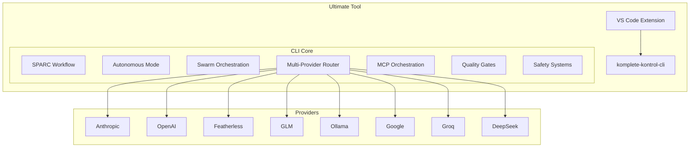

# Ultimate Tool Integration Plan

## Executive Summary

This document outlines the strategy to build the **strongest AI coding assistant available** by combining:

1. **Roo Code's** VS Code integration and SPARC methodology
2. **`/auto`'s** sophisticated autonomy, swarm orchestration, and 40+ specialized tools
3. **komplete-kontrol-cli's** multi-provider support and MCP orchestration

## Critical Discovery: /auto System is MASSIVE

After deep analysis, the `/auto` system has **far more capabilities** than initially documented:

**Additional Commands (24+ total):**
- `/research` - GitHub code search + web search for examples and error solutions
- `/rootcause` - Structured root cause analysis for bugs
- `/security-check` - Pre-production security audit
- `/visionpilot` - Vision-guided computer control (screenshot-driven automation)
- `/build` - Build automation
- `/deploy` - Deployment automation
- `/document` - Documentation generation
- `/validate` - Validation and testing
- `/crawl` - Web crawling
- `/collect` - Data collection
- `/chrome` - Browser automation
- `/checkpoint` - State checkpointing
- Model aliases: `dolphin`, `featherless`, `glm`, `gemini`, `llama8b`, `llama70b`, `qwen`, `kimi`, `opus`, `sonnet`, `whiterabbit`

**Specialized Agents (10+ total):**
- `general-purpose` - Complex multi-step research agent
- `secrets-hunter` - Find exposed credentials and secrets
- `red-teamer` - Adversarial security testing agent
- `build-researcher` - Build research agent
- `config-writer` - Configuration writer agent
- `debug-detective` - Debug detective agent
- `load-profiler` - Load profiler agent
- `qa-explorer` - QA exploration agent
- `Root-cause-analyzer` - Root cause analysis agent
- `validator` - Validator agent

**Specialized Tools:**
- **VisionPilot** - Vision-guided computer control with multi-provider support
- **KenKai Crawler** - Course crawler for Ken Kai's content
- **Web Crawler** - General web scraping tool
- **50+ hooks** - Comprehensive hook system for every aspect of autonomous operation

**This changes the analysis significantly - `/auto` is the most feature-rich system by far.**

**Target Platform**: komplete-kontrol-cli (TypeScript + Bun)

**Rationale**: Build on komplete-kontrol-cli because:
- Modern, maintainable TypeScript codebase
- Already has multi-provider support (10+ providers)
- Already has MCP orchestration (24+ tool servers)
- Designed for extensibility with Phase 2 features planned

---

## Architecture Overview



---

## Feature Matrix

### Source Systems

| Feature | Roo Code | /auto | komplete-kontrol-cli |
|---------|-----------|--------|---------------------|
| VS Code Integration | ✅ | ❌ | ❌ |
| SPARC Methodology | ✅ | ❌ | ❌ |
| ReAct+Reflexion | ❌ | ✅ | ❌ |
| LLM-as-Judge | ✅ | ✅ | ❌ |
| Constitutional AI | ❌ | ✅ | ❌ |
| Tree of Thoughts | ❌ | ✅ | ❌ |
| Bounded Autonomy | ❌ | ✅ | ❌ |
| Swarm Orchestration | ❌ | ✅ | Planned |
| Debug Orchestrator | ❌ | ✅ | ❌ |
| Auto-Checkpoint | ✅ | ✅ | ❌ |
| Multi-Provider | ✅ | Limited | ✅ |
| MCP Orchestration | ✅ | ✅ | ✅ |
| Custom Modes | ✅ | ❌ | Planned |
| Boomerang Tasks | ✅ | ❌ | ❌ |
| UI Testing | ❌ | ✅ | ❌ |
| Mac App Testing | ❌ | ✅ | ❌ |
| GitHub Research | ❌ | ✅ | ❌ |
| Reinforcement Learning | ❌ | ✅ | ❌ |
| Self-Healing Loop | ❌ | ❌ | ✅ |
| Shadow Mode | ❌ | ❌ | ✅ |
| Hook System | ❌ | ✅ | ✅ |
| /research Command | ❌ | ✅ | ❌ |
| /rootcause Command | ❌ | ✅ | ❌ |
| /security-check Command | ❌ | ✅ | ❌ |
| /visionpilot Command | ❌ | ✅ | ❌ |
| /build Command | ❌ | ✅ | ❌ |
| /deploy Command | ❌ | ✅ | ❌ |
| /document Command | ❌ | ✅ | ❌ |
| /validate Command | ❌ | ✅ | ❌ |
| /crawl Command | ❌ | ✅ | ❌ |
| /collect Command | ❌ | ✅ | ❌ |
| /chrome Command | ❌ | ✅ | ❌ |
| /checkpoint Command | ❌ | ✅ | ❌ |
| Model Aliases | ❌ | ✅ | ❌ |
| general-purpose Agent | ❌ | ✅ | ❌ |
| secrets-hunter Agent | ❌ | ✅ | ❌ |
| red-teamer Agent | ❌ | ✅ | ❌ |
| build-researcher Agent | ❌ | ✅ | ❌ |
| config-writer Agent | ❌ | ✅ | ❌ |
| debug-detective Agent | ❌ | ✅ | ❌ |
| load-profiler Agent | ❌ | ✅ | ❌ |
| qa-explorer Agent | ❌ | ✅ | ❌ |
| Root-cause-analyzer Agent | ❌ | ✅ | ❌ |
| validator Agent | ❌ | ✅ | ❌ |
| VisionPilot Tool | ❌ | ✅ | ❌ |
| KenKai Crawler | ❌ | ✅ | ❌ |
| Web Crawler | ❌ | ✅ | ❌ |
| 50+ Hooks | ❌ | ✅ | ❌ |
| Prompting Guide | ❌ | ✅ | ❌ |
| RE Toolkit 50+ Tools | ❌ | ✅ | ❌ |
| Frida Scripts | ❌ | ✅ | ❌ |
| RE Prompts Library | ❌ | ✅ | ❌ |
| RE Skill Script | ❌ | ✅ | ❌ |

---

## Integration Strategy

### Decision: Fork Features, Not Codebases

**Why fork features, not entire codebases:**

1. **Roo Code**: VS Code extension architecture doesn't match CLI needs
2. **`/auto`**: Shell script implementation is hard to maintain
3. **komplete-kontrol-cli**: TypeScript + Bun is modern and maintainable

**Approach**: Extract core algorithms and patterns, reimplement in TypeScript

---

## Phase 1: Roo Code Features (SPARC + VS Code)

### 1.1 SPARC Methodology

**Source**: Roo Code's structured workflow

**Implementation**:
```
src/core/workflows/sparc.ts
├── Specification.ts     // Define requirements
├── Pseudocode.ts       // Generate implementation plan
├── Architecture.ts      // Design system architecture
├── Refinement.ts       // Iterate and improve
└── Completion.ts       // Final implementation
```

**Key Components**:
- Specification generation from user requirements
- Pseudocode generation with step-by-step plan
- Architecture design with component breakdown
- Refinement loop with quality checks
- Completion with validation

**Integration Points**:
- Add to command system: `/sparc <task>`
- Integrate with agent orchestrator
- Use quality gates for each phase

### 1.2 VS Code Extension

**Source**: Roo Code's VS Code integration

**Implementation**:
```
vscode-extension/
├── src/
│   ├── extension.ts        // Main extension entry point
│   ├── commands/         // VS Code commands
│   ├── panels/           // Side panels, webviews
│   ├── chat/            // Chat interface
│   └── integration/      // komplete CLI integration
├── package.json
└── tsconfig.json
```

**Key Features**:
- Chat panel for interacting with komplete
- File explorer integration
- Inline code suggestions
- Diff viewer for changes
- Terminal integration
- Status bar indicators

**Integration Points**:
- Communicate with komplete CLI via IPC or HTTP
- Forward commands to komplete
- Display komplete responses in UI
- Show agent status and progress

### 1.3 Custom Modes

**Source**: Roo Code's mode system

**Implementation**:
```
src/core/modes/
├── Architect.ts        // Planning and design
├── Code.ts            // Implementation
├── Debug.ts           // Troubleshooting
├── Ask.ts             // Q&A and explanations
└── Orchestrator.ts    // Task coordination
```

**Mode Behaviors**:
- **Architect**: Focus on planning, diagrams, architecture
- **Code**: Focus on implementation, refactoring
- **Debug**: Focus on troubleshooting, error analysis
- **Ask**: Focus on explanations, documentation
- **Orchestrator**: Coordinate across modes

**Integration Points**:
- Add `/mode <name>` command
- Each mode has specialized prompts and tools
- Mode switching preserves context

### 1.4 Boomerang Tasks

**Source**: Roo Code's cross-mode workflows

**Implementation**:
```
src/core/tasks/boomerang.ts
├── TaskDefinition.ts   // Define task with mode requirements
├── ModeSwitcher.ts     // Handle mode transitions
├── ContextIsolation.ts // Isolate contexts between modes
└── ResultAggregator.ts // Combine results from modes
```

**Workflow**:
1. Start in Architect mode (plan)
2. Switch to Code mode (implement)
3. Switch to Debug mode (test)
4. Switch back to Architect (review)
5. Aggregate results

**Integration Points**:
- Add `/boomerang <task>` command
- Use with agent orchestrator
- Maintain isolated contexts per mode

---

## Phase 2: /auto Features (Autonomy + Swarm)

### 2.1 ReAct+Reflexion Pattern

**Source**: `/auto` hooks/react-reflexion.sh

**Implementation**:
```
src/core/agents/reflexion.ts
├── Think.ts            // Generate reasoning
├── Act.ts             // Execute action
├── Observe.ts         // Record outcome
└── Reflect.ts         // Learn from outcome
```

**Pattern**:
```typescript
async function reactReflexion(goal: string, context: Context) {
  // THINK
  const reasoning = await think(goal, context);
  
  // ACT
  const action = await act(reasoning);
  
  // OBSERVE
  const outcome = await observe(action);
  
  // REFLECT
  const lesson = await reflect(reasoning, action, outcome);
  
  return { action, outcome, lesson };
}
```

**Integration Points**:
- Add to agent execution loop
- Use for every agent action
- Store reflections in memory

### 2.2 LLM-as-Judge (Quality Gates)

**Source**: `/auto` hooks/auto-evaluator.sh

**Implementation**:
```
src/core/quality/judge.ts
├── Evaluator.ts        // Evaluate output quality
├── Scorer.ts          // Calculate score (0-10)
├── Reviser.ts         // Revise if score < 7.0
└── Gate.ts            // Gate based on score
```

**Evaluation Criteria**:
- Code correctness
- Best practices
- Error handling
- Testing coverage
- Documentation
- Performance

**Integration Points**:
- Run after every significant output
- Auto-revise if score < 7.0
- Use in SPARC refinement phase

### 2.3 Constitutional AI

**Source**: `/auto` hooks/constitutional-ai.sh

**Implementation**:
```
src/core/safety/constitutional.ts
├── Critique.ts         // Check against principles
├── Principles.ts       // Define safety principles
├── Reviser.ts         // Revise if violations
└── Auditor.ts          // Audit all outputs
```

**Principles**:
- Security: No vulnerabilities
- Quality: Follow best practices
- Testing: Include tests
- Error Handling: Proper error management
- Documentation: Document code

**Integration Points**:
- Run after code generation
- Auto-revise if violations found
- Use in autonomous mode

### 2.4 Tree of Thoughts

**Source**: `/auto` hooks/tree-of-thoughts.sh

**Implementation**:
```
src/core/reasoning/tree-of-thoughts.ts
├── Generator.ts        // Generate multiple approaches
├── Evaluator.ts        // Evaluate each approach
├── Ranker.ts          // Rank by score
└── Selector.ts        // Select best approach
```

**When to Use**:
- Tests failing after 2 attempts
- Multiple valid approaches exist
- High complexity/risk task
- Novel problem

**Integration Points**:
- Use when agent is stuck
- Use for complex tasks
- Use in autonomous mode

### 2.5 Bounded Autonomy

**Source**: `/auto` hooks/bounded-autonomy.sh

**Implementation**:
```
src/core/safety/bounded-autonomy.ts
├── Checker.ts          // Check action boundaries
├── Escalator.ts       // Escalate to user
├── Prohibitions.ts     // Define prohibited actions
└── Approvals.ts       // Track required approvals
```

**Prohibited Actions**:
- Force push to main/master
- Bypass security checks (--no-verify)
- Expose secrets/credentials
- Delete production data
- Deploy to production

**Integration Points**:
- Check before every action
- Escalate if approval needed
- Use in autonomous mode

### 2.6 Swarm Orchestration

**Source**: `/auto` hooks/swarm-orchestrator.sh

**Implementation**:
```
src/core/agents/swarm.ts
├── Spawner.ts          // Spawn multiple agents
├── Decomposer.ts       // Decompose task
├── Coordinator.ts      // Coordinate agents
├── Merger.ts           // Merge results
└── GitIntegration.ts    // Git merge with conflict resolution
```

**Decomposition Strategies**:
1. **Feature Implementation**: Design → Implement → Test → Integrate
2. **Testing/Validation**: Parallel independent tests
3. **Refactoring**: Sequential modules with dependencies
4. **Research/Analysis**: Parallel investigation
5. **Generic Parallel**: Equal distribution

**Git Integration**:
- Per-agent temporary branches
- Conflict detection
- Auto-resolution for safe files
- Integration report

**Integration Points**:
- Add `/swarm spawn N <task>` command
- Use for parallelizable tasks
- Auto-spawn when 3+ independent groups detected

### 2.7 Debug Orchestrator

**Source**: `/auto` hooks/debug-orchestrator.sh

**Implementation**:
```
src/core/debug/orchestrator.ts
├── Snapshotter.ts      // Create before/after snapshots
├── Memory.ts           // Bug fix memory bank
├── Searcher.ts         // Search similar bugs
├── Verifier.ts         // Verify fix, detect regressions
└── Recommender.ts      // Recommend alternative approaches
```

**Workflow**:
1. Before fix: Create snapshot, search memory
2. Apply fix
3. After fix: Create snapshot, verify, detect regressions
4. If regression: Recommend revert
5. If clean: Record to memory

**Integration Points**:
- Use for every bug fix
- Integrate with agent system
- Use in autonomous mode

### 2.8 Auto-Checkpoint

**Source**: `/auto` hooks/auto-checkpoint.sh

**Implementation**:
```
src/core/checkpoint/auto.ts
├── Trigger.ts          // Detect checkpoint triggers
├── Saver.ts           // Save state
├── Rollback.ts         // Rollback to checkpoint
└── Manager.ts          // Manage checkpoints
```

**Triggers**:
- 10 file changes
- 40% context usage
- Build section complete
- Explicit command

**Integration Points**:
- Auto-trigger in autonomous mode
- Use `/checkpoint` command
- Integrate with agent system

### 2.9 UI Testing

**Source**: `/auto` hooks/ui-test-framework.sh

**Implementation**:
```
src/core/testing/ui.ts
├── Generator.ts        // Generate tests from pages
├── Executor.ts         // Execute tests via MCP
├── Recorder.ts         // Record GIF/screenshots
└── Regression.ts       // Visual regression testing
```

**Integration Points**:
- Use Claude in Chrome MCP
- Run after UI changes
- Generate tests for new features

### 2.10 GitHub Research

**Source**: `/auto` hooks/github-research-executor.sh

**Implementation**:
```
src/core/research/github.ts
├── Detector.ts         // Detect unfamiliar libraries
├── Searcher.ts         // Search GitHub
├── Analyzer.ts         // Analyze results
└── Recommender.ts      // Recommend examples
```

**Detected Libraries**:
- stripe, oauth, firebase, graphql
- websocket, redis, jwt, postgres
- mongodb, grpc, kafka, twilio
- sendgrid, s3, lambda

**Integration Points**:
- Auto-detect in tasks
- Search before implementation
- Provide code examples

### 2.11 Reinforcement Learning

**Source**: `/auto` hooks/reinforcement-learning.sh

**Implementation**:
```
src/core/learning/reinforcement.ts
├── Tracker.ts          // Track outcomes
├── Analyzer.ts         // Analyze patterns
├── Recommender.ts      // Recommend approaches
└── Memory.ts          // Store learned patterns
```

**Integration Points**:
- Track every action outcome
- Recommend based on history
- Use in agent decision making

### 2.12 Specialized Commands

**Source**: `/auto` commands directory

#### `/research` Command

**Implementation**:
```
src/commands/research.ts
├── GitHubSearch.ts     // Search GitHub for code examples
├── WebSearch.ts        // Search web for error solutions
├── Analyzer.ts         // Analyze and recommend examples
└── PatternDetector.ts  // Detect implementation patterns
```

**Features**:
- GitHub code search using grep.app MCP
- Web search for error solutions
- Pattern detection for common implementations
- Example recommendation system

**Integration Points**:
- Add `/research <query>` command
- Auto-trigger for unfamiliar libraries
- Integrate with agent workflow

#### `/rootcause` Command

**Implementation**:
```
src/commands/rootcause.ts
├── HypothesisGenerator.ts  // Generate hypotheses
├── ExperimentDesigner.ts    // Design verification experiments
├── Verifier.ts            // Verify hypotheses
└── Reporter.ts            // Generate root cause report
```

**Features**:
- Structured root cause analysis
- Hypothesis-driven debugging
- Experiment design and verification
- Comprehensive reporting

**Integration Points**:
- Add `/rootcause <issue>` command
- Use for complex bugs
- Integrate with debug orchestrator

#### `/security-check` Command

**Implementation**:
```
src/commands/security-check.ts
├── SecretsDetector.ts     // Detect exposed secrets
├── InjectionScanner.ts    // Scan for SQL/XSS injection
├── AuthChecker.ts        // Check authentication/authorization
├── DependencyScanner.ts   // Scan for vulnerable dependencies
└── Reporter.ts           // Generate security report
```

**Features**:
- Secrets exposure detection
- SQL injection, XSS scanning
- Authentication/authorization checks
- Dependency vulnerability scanning
- Pre-production security audit

**Integration Points**:
- Add `/security-check` command
- Run before deployment
- Integrate with CI/CD pipeline

#### `/visionpilot` Command

**Implementation**:
```
src/commands/visionpilot.ts
├── VisionController.ts    // Vision-guided control
├── ScreenshotAnalyzer.ts  // Analyze screenshots
├── ActionExecutor.ts     // Execute actions based on vision
└── MultiProvider.ts      // Support multiple vision providers
```

**Features**:
- Vision-guided computer control
- Screenshot-driven automation
- Multi-provider support (Gemini, Claude, GPT-4o, Featherless)
- Adobe Premiere Pro automation

**Integration Points**:
- Add `/visionpilot <task>` command
- Integrate VisionPilot Python tool
- Use for GUI automation

#### `/build` Command

**Implementation**:
```
src/commands/build.ts
├── Builder.ts           // Execute build
├── ErrorHandler.ts      // Handle build errors
├── RetryLogic.ts       // Retry failed builds
└── Reporter.ts         // Generate build report
```

**Features**:
- Build automation
- Error handling and recovery
- Build caching
- Parallel builds

**Integration Points**:
- Add `/build` command
- Integrate with agent workflow
- Use in autonomous mode

#### `/deploy` Command

**Implementation**:
```
src/commands/deploy.ts
├── Deployer.ts          // Execute deployment
├── Rollback.ts          // Rollback if needed
├── HealthCheck.ts       // Check deployment health
└── Reporter.ts          // Generate deployment report
```

**Features**:
- Deployment automation
- Automatic rollback on failure
- Health checks
- Multi-environment support

**Integration Points**:
- Add `/deploy <env>` command
- Integrate with bounded autonomy
- Use in autonomous mode

#### `/document` Command

**Implementation**:
```
src/commands/document.ts
├── DocGenerator.ts      // Generate documentation
├── MarkdownWriter.ts    // Write markdown docs
├── DocstringWriter.ts   // Write code docstrings
└── READMEGenerator.ts   // Generate README files
```

**Features**:
- Auto-documentation generation
- Markdown support
- Docstring generation
- README generation

**Integration Points**:
- Add `/document <target>` command
- Run after code changes
- Integrate with quality gates

#### `/validate` Command

**Implementation**:
```
src/commands/validate.ts
├── Validator.ts         // Validate outputs
├── TestGenerator.ts     // Generate tests
├── TestRunner.ts       // Run tests
└── Reporter.ts         // Generate validation report
```

**Features**:
- Output validation
- Test generation
- Test execution
- Validation reporting

**Integration Points**:
- Add `/validate <target>` command
- Use in autonomous mode
- Integrate with quality gates

#### `/crawl` Command

**Implementation**:
```
src/commands/crawl.ts
├── Crawler.ts          // Web crawler
├── ContentExtractor.ts  // Extract content
├── LinkFollower.ts     // Follow links
└── DataStore.ts        // Store crawled data
```

**Features**:
- Web crawling
- Content extraction
- Link following
- Data storage

**Integration Points**:
- Add `/crawl <url>` command
- Use for research tasks
- Integrate with agent workflow

#### `/collect` Command

**Implementation**:
```
src/commands/collect.ts
├── Collector.ts        // Data collector
├── Structurer.ts       // Structure data
├── Validator.ts       // Validate data
└── Exporter.ts        // Export data
```

**Features**:
- Data collection
- Data structuring
- Data validation
- Data export

**Integration Points**:
- Add `/collect <source>` command
- Use for data gathering
- Integrate with agent workflow

#### `/chrome` Command

**Implementation**:
```
src/commands/chrome.ts
├── Browser.ts          // Chrome browser control
├── PageLoader.ts       // Load pages
├── Interactor.ts       // Interact with pages
└── Screenshotter.ts    // Take screenshots
```

**Features**:
- Chrome DevTools Protocol
- Headless browser support
- Page interaction
- Screenshot capture

**Integration Points**:
- Add `/chrome <url>` command
- Use for browser automation
- Integrate with UI testing

#### `/checkpoint` Command

**Implementation**:
```
src/commands/checkpoint.ts
├── Checkpointer.ts     // Create checkpoint
├── Restorer.ts         // Restore from checkpoint
├── Lister.ts           // List checkpoints
└── Deleter.ts          // Delete checkpoints
```

**Features**:
- Manual checkpoint creation
- Checkpoint restoration
- Checkpoint listing
- Checkpoint deletion

**Integration Points**:
- Add `/checkpoint` command
- Integrate with auto-checkpoint
- Use for state management

#### Model Aliases

**Implementation**:
```
src/models/aliases.ts
├── AliasRegistry.ts    // Registry of model aliases
├── Resolver.ts         // Resolve aliases to models
├── Router.ts           // Route to correct provider
└── Config.ts           // Alias configuration
```

**Features**:
- Quick model switching
- Alias: `dolphin` → Featherless dolphin-2.9.2-llama3-70b
- Alias: `featherless` → Featherless default
- Alias: `glm` → GLM-4
- Alias: `gemini` → Google Gemini
- Alias: `llama8b` → Featherless llama-3-8b
- Alias: `llama70b` → Featherless llama-3-70b
- Alias: `qwen` → Qwen
- Alias: `kimi` → Kimi
- Alias: `opus` → Claude Opus
- Alias: `sonnet` → Claude Sonnet
- Alias: `whiterabbit` → White Rabbit

**Integration Points**:
- Add model alias support to CLI
- Use in commands: `/dolphin <task>`
- Integrate with provider router

### 2.13 Specialized Agents

**Source**: `/auto` agents directory

#### `general-purpose` Agent

**Implementation**:
```
src/agents/general-purpose.ts
├── Searcher.ts         // Search for information
├── Reader.ts           // Read and understand
├── Executor.ts         // Execute tasks
└── Verifier.ts        // Verify results
```

**Features**:
- Complex multi-step research
- Search, read, execute, verify workflow
- Task decomposition
- Result aggregation

**Integration Points**:
- Add `/agent general-purpose <task>` command
- Use for research tasks
- Integrate with swarm orchestration

#### `secrets-hunter` Agent

**Implementation**:
```
src/agents/secrets-hunter.ts
├── GitScanner.ts       // Scan git history
├── PatternMatcher.ts   // Match secret patterns
├── FileScanner.ts      // Scan current files
└── Reporter.ts         // Generate report
```

**Features**:
- Find exposed credentials and secrets
- Git history analysis
- Pattern matching for API keys, tokens, passwords
- Comprehensive reporting

**Integration Points**:
- Add `/agent secrets-hunter` command
- Use in security checks
- Integrate with security-check command

#### `red-teamer` Agent

**Implementation**:
```
src/agents/red-teamer.ts
├── Attacker.ts         // Execute attacks
├── InjectionTester.ts  // Test for injection vulnerabilities
├── AuthTester.ts       // Test authentication
├── AuthzTester.ts      // Test authorization
└── BusinessLogicTester.ts // Test business logic
```

**Features**:
- Adversarial security testing
- SQL injection, XSS attacks
- Authentication/authorization testing
- Business logic vulnerability testing

**Integration Points**:
- Add `/agent red-teamer` command
- Use in security audits
- Integrate with security-check command

#### `build-researcher` Agent

**Implementation**:
```
src/agents/build-researcher.ts
├── BuildAnalyzer.ts    // Analyze build system
├── ErrorResolver.ts    // Resolve build errors
├── DependencyResolver.ts // Resolve dependencies
└── Optimizer.ts        // Optimize build
```

**Features**:
- Build system research
- Build error resolution
- Dependency analysis
- Build optimization

**Integration Points**:
- Add `/agent build-researcher` command
- Use for build issues
- Integrate with build command

#### `config-writer` Agent

**Implementation**:
```
src/agents/config-writer.ts
├── ConfigGenerator.ts  // Generate config files
├── Validator.ts        // Validate configs
├── Templater.ts        // Use config templates
└── Writer.ts           // Write config files
```

**Features**:
- Configuration file generation
- Config validation
- Config templates
- Multi-format support

**Integration Points**:
- Add `/agent config-writer` command
- Use for config tasks
- Integrate with agent workflow

#### `debug-detective` Agent

**Implementation**:
```
src/agents/debug-detective.ts
├── BugFinder.ts        // Find bugs
├── PatternRecognizer.ts // Recognize bug patterns
├── HypothesisGenerator.ts // Generate hypotheses
└── FixRecommender.ts   // Recommend fixes
```

**Features**:
- Systematic debugging
- Bug pattern recognition
- Hypothesis generation
- Fix recommendation

**Integration Points**:
- Add `/agent debug-detective` command
- Use for debugging tasks
- Integrate with debug orchestrator

#### `load-profiler` Agent

**Implementation**:
```
src/agents/load-profiler.ts
├── Profiler.ts         // Profile performance
├── BottleneckFinder.ts // Find bottlenecks
├── Optimizer.ts        // Optimize performance
└── Reporter.ts         // Generate report
```

**Features**:
- Load profiling
- Bottleneck detection
- Performance optimization
- Comprehensive reporting

**Integration Points**:
- Add `/agent load-profiler` command
- Use for performance tasks
- Integrate with agent workflow

#### `qa-explorer` Agent

**Implementation**:
```
src/agents/qa-explorer.ts
├── TestDiscoverer.ts   // Discover tests
├── TestGenerator.ts    // Generate tests
├── TestRunner.ts       // Run tests
└── CoverageAnalyzer.ts  // Analyze coverage
```

**Features**:
- QA exploration
- Test discovery
- Test generation
- Coverage analysis

**Integration Points**:
- Add `/agent qa-explorer` command
- Use for QA tasks
- Integrate with validate command

#### `Root-cause-analyzer` Agent

**Implementation**:
```
src/agents/root-cause-analyzer.ts
├── Analyzer.ts         // Analyze issues
├── HypothesisGenerator.ts // Generate hypotheses
├── ExperimentDesigner.ts // Design experiments
└── Verifier.ts         // Verify root cause
```

**Features**:
- Root cause analysis
- Hypothesis-driven analysis
- Experiment design
- Root cause verification

**Integration Points**:
- Add `/agent root-cause-analyzer` command
- Use for complex issues
- Integrate with rootcause command

#### `validator` Agent

**Implementation**:
```
src/agents/validator.ts
├── Validator.ts        // Validate outputs
├── Checker.ts          // Check against requirements
├── Reporter.ts         // Generate report
└── Reviser.ts          // Revise if needed
```

**Features**:
- Output validation
- Requirement checking
- Validation reporting
- Auto-revision

**Integration Points**:
- Add `/agent validator` command
- Use for validation tasks
- Integrate with quality gates

### 2.14 Specialized Tools

**Source**: `/auto` tools directory

#### VisionPilot

**Implementation**:
```
src/tools/visionpilot/
├── controller.ts       // Vision controller
├── analyzer.ts        // Screenshot analyzer
├── executor.ts        // Action executor
├── providers/         // Multi-provider support
│   ├── gemini.ts
│   ├── claude.ts
│   ├── gpt4o.ts
│   └── featherless.ts
└── python/            // Python VisionPilot integration
    ├── visionpilot.py
    └── requirements.txt
```

**Features**:
- Vision-guided computer control
- Screenshot-driven automation
- Multi-provider support
- Adobe Premiere Pro automation
- Python virtual environment

**Integration Points**:
- Integrate with visionpilot command
- Use for GUI automation
- Support multiple vision providers

#### KenKai Crawler

**Implementation**:
```
src/tools/kenkai/
├── crawler.ts         // Course crawler
├── parser.ts          // Parse course content
├── downloader.ts      // Download content
└── organizer.ts       // Organize content
```

**Features**:
- Course crawler for Ken Kai's content
- Content parsing
- Content downloading
- Content organization

**Integration Points**:
- Add `/kenkai crawl` command
- Use for course content
- Integrate with agent workflow

#### Web Crawler

**Implementation**:
```
src/tools/crawler/
├── crawler.ts         // Web crawler
├── parser.ts          // Parse web content
├── extractor.ts       // Extract data
└── storage.ts        // Store data
```

**Features**:
- General web scraping
- Content parsing
- Data extraction
- Data storage

**Integration Points**:
- Integrate with crawl command
- Use for web scraping
- Support multiple formats

#### Hook System (50+ Hooks)

**Implementation**:
```
src/hooks/
├── pre-execution/     // Before execution
├── post-execution/    // After execution
├── error-handling/    // Error handling
├── state-management/  // State management
├── quality-control/   // Quality control
├── safety-checks/     // Safety checks
├── memory-management/ // Memory management
├── context-management/ // Context management
├── agent-lifecycle/   // Agent lifecycle
└── tool-execution/    // Tool execution
```

**Features**:
- 50+ hooks for every aspect of operation
- Pre/post execution hooks
- Error handling hooks
- State management hooks
- Quality control hooks
- Safety check hooks
- Memory management hooks
- Context management hooks
- Agent lifecycle hooks
- Tool execution hooks

**Integration Points**:
- Integrate with all components
- Use for extensibility
- Support custom hooks

### 2.15 Prompting Guide

**Source**: `/auto` docs/prompting-guide.md

**Implementation**:
```
src/core/prompting/
├── Principles.ts       // Core prompting principles
├── DesignSpeak.ts     // Design terminology
├── CodeSpeak.ts       // Code terminology
├── Patterns.ts        // Effective prompt patterns
└── Context.ts        // Context management strategies
```

**Features**:
- Core principles: Short > Long, Don't Dump, Manage Context, Focused Sets
- Design Speak: layout, spacing, colors, typography, components, hierarchy
- Code Speak: data, actions, flow, structure, errors, functions, variables
- Effective prompt patterns
- Feedback patterns for troubleshooting
- Context management strategies

**Integration Points**:
- Use in agent system prompts
- Use in command generation
- Use in quality evaluation
- Train models on effective patterns

### 2.16 Reverse Engineering Toolkit

**Source**: `/auto` docs/reverse-engineering-toolkit.md

**Implementation**:
```
src/core/reverse/
├── toolkit/
│   ├── Network/
│   │   ├── mitmproxy.ts
│   │   ├── burp-suite.ts
│   │   ├── charles-proxy.ts
│   │   ├── wireshark.ts
│   │   └── ja3-fingerprint.ts
│   ├── API/
│   │   ├── kiterunner.ts
│   │   ├── restler.ts
│   │   └── schemathesis.ts
│   ├── Protocol/
│   │   ├── protobuf.ts
│   │   ├── grpc.ts
│   │   └── graphql.ts
│   ├── Mobile/
│   │   ├── jadx.ts
│   │   ├── frida.ts
│   │   └── objection.ts
│   ├── Binary/
│   │   ├── ghidra.ts
│   │   ├── radare2.ts
│   │   ├── dnspy.ts
│   │   ├── ilspy.ts
│   │   └── wabt.ts
│   ├── OS/
│   │   ├── volatility.ts
│   │   ├── binwalk.ts
│   │   ├── qemu.ts
│   │   ├── gdb.ts
│   │   ├── windbg.ts
│   │   ├── scyllahide.ts
│   │   ├── cheat-engine.ts
│   │   └── saleae.ts
│   ├── Web/
│   │   ├── devtools.ts
│   │   ├── ast-explorer.ts
│   │   ├── screenshot-to-code.ts
│   │   ├── v0-dev.ts
│   │   └── puppeteer-stealth.ts
│   └── Workflows/
│       ├── mobile-app-re.ts
│       ├── api-re.ts
│       ├── firmware-re.ts
│       └── binary-protocol-re.ts
```

**Features**:
- **Network & API Interception**: mitmproxy, Burp Suite, Charles Proxy, Wireshark, JA3 Fingerprint Analysis
- **API Discovery & Fuzzing**: Kiterunner, RESTler, Schemathesis
- **Protocol Analysis**: Protobuf (pbtk), gRPC (mitmproxy-grpc, BloomRPC), GraphQL (InQL, Clairvoyance, Apollo DevTools)
- **Mobile App Analysis**: JADX, Frida, Objection
- **Binary Analysis**: Ghidra, Radare2, dnSpy, ILSpy, WABT
- **OS & Kernel Analysis**: Volatility 3, Binwalk, QEMU, GDB, WinDbg, ScyllaHide, Cheat Engine, Saleae Logic
- **Web Frontend & AI Tools**: Chrome DevTools, AST Explorer, screenshot-to-code, v0.dev, puppeteer-stealth
- **Sequential Workflows**: Tool chaining for complex RE tasks
- **Advanced Patterns**: Ghidra headless, mitmproxy Docker, JADX advanced, Protobuf schema recovery

**Integration Points**:
- Add MCP servers for each tool
- Integrate with agent system
- Use for reverse engineering tasks
- Support tool chaining workflows

### 2.17 Frida Scripts

**Source**: `/auto` docs/frida-scripts.md

**Implementation**:
```
src/core/reverse/frida/
├── scripts/
│   ├── android/
│   │   ├── ssl-pinning-bypass.ts
│   │   ├── root-detection-bypass.ts
│   │   ├── debugger-detection-bypass.ts
│   │   ├── enumerate-classes.ts
│   │   └── hook-http-requests.ts
│   ├── ios/
│   │   ├── ssl-pinning-bypass.ts
│   │   ├── jailbreak-detection-bypass.ts
│   │   └── crypto-interception.ts
│   ├── native/
│   │   ├── hook-native-functions.ts
│   │   ├── memory-search-and-patch.ts
│   │   └── hex-dump-helper.ts
│   └── utility/
│       ├── stack-trace-helper.ts
│       └── access-stat-bypass.ts
└── templates/
    ├── ios-access-stat-bypass.ts
    ├── android-crypto-key-interception.ts
    ├── ios-keychain-interception.ts
    └── dynamic-library-loading-bypass.ts
```

**Features**:
- **Android Scripts**: SSL Pinning Bypass, Root Detection Bypass, Debugger Detection Bypass, Enumerate All Classes, Hook HTTP Requests
- **iOS Scripts**: SSL Pinning Bypass, Jailbreak Detection Bypass, Crypto Interception (CCCrypt)
- **Native Hooks**: Hook Native Functions, Memory Search and Patch
- **Utility Functions**: Hex Dump Helper, Stack Trace Helper
- **Advanced Patterns**: iOS Access/Stat Bypass, Android Crypto Key Interception, iOS Keychain Interception, Dynamic Library Loading Bypass

**Integration Points**:
- Add MCP server for Frida
- Integrate with mobile RE workflows
- Use for dynamic analysis
- Support script templates

### 2.18 Reverse Engineering Prompts

**Source**: `/auto` docs/re-prompts.md

**Implementation**:
```
src/core/reverse/prompts/
├── chrome-extensions/
│   ├── extract-extension.md
│   ├── analyze-extension.md
│   └── find-extension-id.md
├── electron-apps/
│   ├── extract-app.md
│   ├── analyze-source.md
│   └── find-main-entry.md
├── javascript/
│   ├── beautify-code.md
│   ├── deep-analysis.md
│   ├── find-hidden-functionality.md
│   └── reconstruct-logic.md
├── macos-apps/
│   ├── explore-bundle.md
│   ├── extract-resources.md
│   └── analyze-info-plist.md
├── re-tools/
│   ├── setup-ghidra.md
│   ├── frida-hook-script.md
│   └── ssl-bypass.md
├── automation/
│   ├── dns-benchmark.md
│   ├── network-diagnostics.md
│   ├── system-info-script.md
│   └── file-automation.md
├── web-scraping/
│   ├── simple-scraper.md
│   ├── authenticated-scraper.md
│   ├── dynamic-content.md
│   └── anti-detection-scraper.md
├── api-reverse-engineering/
│   ├── traffic-capture.md
│   ├── analyze-captured-traffic.md
│   ├── build-api-client.md
│   └── decode-binary-protocol.md
├── browser-automation/
│   ├── generic-automation.md
│   ├── login-action.md
│   ├── monitoring-script.md
│   ├── form-automation.md
│   └── pdf-download.md
├── quick-commands.md
├── troubleshooting.md
├── professional-tools.md
├── tool-combinations.md
└── sequential-workflows.md
```

**Features**:
- **Chrome Extensions**: Extract, analyze, find extension ID
- **Electron Apps**: Extract, analyze source, find main entry
- **JavaScript Deobfuscation**: Beautify, deep analysis, find hidden functionality, reconstruct logic
- **macOS Apps**: Explore bundle, extract resources, analyze Info.plist
- **RE Tools**: Setup Ghidra, Frida hook scripts, SSL bypass
- **Automation**: DNS benchmark, network diagnostics, system info, file automation
- **Web Scraping**: Simple, authenticated, dynamic content, anti-detection
- **API Reverse Engineering**: Traffic capture, analyze captured traffic, build API client, decode binary protocol
- **Browser Automation**: Generic, login+action, monitoring, form automation, PDF/download
- **50+ Professional RE Tools**: Detailed prompts for each tool
- **Tool Combinations**: Workflows combining multiple tools
- **Sequential Workflows**: Tool chaining for complex tasks

**Integration Points**:
- Use in agent system for RE tasks
- Provide copy-paste prompts for users
- Integrate with RE toolkit
- Support workflow automation

### 2.19 Reverse Engineering Skill Script

**Source**: `/auto` skills/re.sh

**Implementation**:
```
src/core/reverse/skill/
├── re-skill.ts
├── chrome-extension/
│   ├── extractor.ts
│   ├── crx-parser.ts
│   └── analyzer.ts
├── electron-app/
│   ├── extractor.ts
│   ├── asar-parser.ts
│   └── analyzer.ts
├── javascript/
│   ├── deobfuscator.ts
│   └── analyzer.ts
├── macos-app/
│   ├── explorer.ts
│   ├── plist-parser.ts
│   └── analyzer.ts
├── api-research/
│   ├── starter.ts
│   ├── template-generator.ts
│   └── config-generator.ts
└── auto-detect/
    ├── detector.ts
    └── analyzer.ts
```

**Features**:
- `re.sh chrome <path>` - Extract and analyze Chrome extensions
  - CRX file handling (CRX2/CRX3 formats)
  - Extension ID lookup
  - Manifest analysis
  - Suspicious pattern detection
- `re.sh electron <app>` - Extract Electron app source
  - ASAR extraction
  - package.json parsing
  - Dependency analysis
  - IPC/preload detection
- `re.sh deobfuscate <file>` - Beautify/deobfuscate JavaScript
  - js-beautify integration
  - Pattern detection (eval, Function, URLs, API endpoints)
  - Analysis JSON output
- `re.sh macos <app>` - Explore macOS app bundle
  - Info.plist parsing
  - Resource enumeration
  - Framework detection
  - URL schemes
- `re.sh api <url>` - Start API reverse engineering
  - Research template creation
  - Config generation
- `re.sh analyze <path>` - Auto-detect target type and analyze
  - Automatic target type detection
  - Appropriate extraction method selection

**Integration Points**:
- Add `/re chrome <path>` command
- Add `/re electron <app>` command
- Add `/re deobfuscate <file>` command
- Add `/re macos <app>` command
- Add `/re api <url>` command
- Add `/re analyze <path>` command
- Integrate with agent system
- Output to `~/Desktop/re-output/`
- Log to `~/.claude/logs/re-skill.log`

---

## Phase 3: komplete-kontrol-cli Enhancements

### 3.1 Multi-Agent System (Phase 2)

**Status**: Planned, not implemented

**Implementation**:
```
src/core/agents/
├── Swarm.ts            // Swarm orchestration
├── LangGraph.ts        // LangGraph integration
├── Communication.ts     // Agent communication
└── Coordination.ts     // Task coordination
```

**Integration Points**:
- Use swarm orchestration from Phase 2.6
- Add LangGraph for complex workflows
- Integrate with agent system

### 3.2 Reverse Engineering Suite (Phase 2)

**Status**: Planned, not implemented

**Implementation**:
```
src/core/reverse/
├── Frida.ts            // Frida integration
├── Mitmproxy.ts        // mitmproxy integration
├── JADX.ts             // JADX integration
└── Analyzer.ts         // Binary analysis
```

**Integration Points**:
- Add MCP servers for each tool
- Integrate with agent system
- Use for reverse engineering tasks

### 3.3 Deep Research (Phase 2)

**Status**: Planned, not implemented

**Implementation**:
```
src/core/research/
├── Perplexity.ts       // Perplexity integration
├── Tavily.ts           // Tavily integration
├── Arxiv.ts            // arXiv integration
└── Aggregator.ts       // Aggregate results
```

**Integration Points**:
- Add MCP servers for each service
- Integrate with agent system
- Use for research tasks

---

## Implementation Roadmap

```mermaid
graph TB
    subgraph Phase 1
        P1A[SPARC Methodology]
        P1B[VS Code Extension]
        P1C[Custom Modes]
        P1D[Boomerang Tasks]
    end
    
    subgraph Phase 2 Core Autonomy
        P2A[ReAct+Reflexion]
        P2B[LLM-as-Judge]
        P2C[Constitutional AI]
        P2D[Tree of Thoughts]
        P2E[Bounded Autonomy]
        P2F[Swarm Orchestration]
        P2G[Debug Orchestrator]
        P2H[Auto-Checkpoint]
        P2I[UI Testing]
        P2J[GitHub Research]
        P2K[Reinforcement Learning]
    end
    
    subgraph Phase 2 Specialized Commands
        P2L[/research Command]
        P2M[/rootcause Command]
        P2N[/security-check Command]
        P2O[/visionpilot Command]
        P2P[/build Command]
        P2Q[/deploy Command]
        P2R[/document Command]
        P2S[/validate Command]
        P2T[/crawl Command]
        P2U[/collect Command]
        P2V[/chrome Command]
        P2W[/checkpoint Command]
        P2X[Model Aliases]
    end
    
    subgraph Phase 2 Specialized Agents
        P2Y[general-purpose Agent]
        P2Z[secrets-hunter Agent]
        P2AA[red-teamer Agent]
        P2AB[build-researcher Agent]
        P2AC[config-writer Agent]
        P2AD[debug-detective Agent]
        P2AE[load-profiler Agent]
        P2AF[qa-explorer Agent]
        P2AG[Root-cause-analyzer Agent]
        P2AH[validator Agent]
    end
    
    subgraph Phase 2 Specialized Tools
        P2AI[VisionPilot]
        P2AJ[KenKai Crawler]
        P2AK[Web Crawler]
        P2AL[50+ Hooks]
    end
    
    subgraph Phase 2 Reverse Engineering
        P2AM[Prompting Guide]
        P2AN[RE Toolkit 50+ Tools]
        P2AO[Frida Scripts]
        P2AP[RE Prompts Library]
        P2AQ[RE Skill Script]
    end
    
    subgraph Phase 3
        P3A[Multi-Agent System]
        P3B[Reverse Engineering]
        P3C[Deep Research]
    end
    
    P1A --> P2A
    P1B --> P2F
    P1C --> P2B
    P1D --> P2K
    
    P2A --> P2L
    P2B --> P2M
    P2C --> P2N
    P2D --> P2O
    P2E --> P2P
    P2F --> P2Q
    P2G --> P2R
    P2H --> P2S
    P2I --> P2T
    P2J --> P2U
    P2K --> P2V
    P2L --> P2W
    P2M --> P2X
    
    P2L --> P2Y
    P2M --> P2Z
    P2N --> P2AA
    P2O --> P2AB
    P2P --> P2AC
    P2Q --> P2AD
    P2R --> P2AE
    P2S --> P2AF
    P2T --> P2AG
    P2U --> P2AH
    P2V --> P2AI
    P2W --> P2AJ
    P2X --> P2AK
    
    P2Y --> P2AL
    P2Z --> P2AL
    P2AA --> P2AL
    P2AB --> P2AL
    P2AC --> P2AL
    P2AD --> P2AL
    P2AE --> P2AL
    P2AF --> P2AL
    P2AG --> P2AL
    P2AH --> P2AL
    
    P2A --> P2AM
    P2B --> P2AN
    P2C --> P2AO
    P2D --> P2AP
    P2E --> P2AQ
    
    P2AM --> P3A
    P2AN --> P3B
    P2AO --> P3B
    P2AP --> P3B
    P2AQ --> P3B
    
    P2A --> P3A
    P2F --> P3A
    P2G --> P3A
    P2Y --> P3A
    P2Z --> P3A
    P2AA --> P3A
    P2AB --> P3A
    P2AC --> P3A
    P2AD --> P3A
    P2AE --> P3A
    P2AF --> P3A
    P2AG --> P3A
    P2AH --> P3A
    
    P2L --> P3C
    P2M --> P3C
    P2U --> P3C
    P2AJ --> P3C
    P2AK --> P3C
```

---

## Detailed Implementation Steps

### Phase 1: Roo Code Features

#### Step 1.1: Implement SPARC Methodology
- Create `src/core/workflows/sparc.ts`
- Implement Specification phase
- Implement Pseudocode phase
- Implement Architecture phase
- Implement Refinement phase
- Implement Completion phase
- Add `/sparc <task>` command
- Integrate with agent orchestrator
- Add quality gates to each phase

#### Step 1.2: Build VS Code Extension
- Create `vscode-extension/` directory
- Initialize VS Code extension project
- Implement main extension entry point
- Create chat panel
- Add file explorer integration
- Add inline code suggestions
- Add diff viewer
- Add terminal integration
- Add status bar indicators
- Implement komplete CLI integration
- Test extension

#### Step 1.3: Implement Custom Modes
- Create `src/core/modes/` directory
- Implement Architect mode
- Implement Code mode
- Implement Debug mode
- Implement Ask mode
- Implement Orchestrator mode
- Add `/mode <name>` command
- Define mode-specific prompts
- Define mode-specific tools
- Implement mode switching logic

#### Step 1.4: Implement Boomerang Tasks
- Create `src/core/tasks/boomerang.ts`
- Implement task definition
- Implement mode switcher
- Implement context isolation
- Implement result aggregation
- Add `/boomerang <task>` command
- Integrate with agent orchestrator
- Test cross-mode workflows

### Phase 2: /auto Features

#### Step 2.1: Implement ReAct+Reflexion
- Create `src/core/agents/reflexion.ts`
- Implement Think phase
- Implement Act phase
- Implement Observe phase
- Implement Reflect phase
- Add to agent execution loop
- Store reflections in memory
- Test pattern

#### Step 2.2: Implement LLM-as-Judge
- Create `src/core/quality/judge.ts`
- Implement evaluator
- Implement scorer
- Implement reviser
- Implement gate
- Define evaluation criteria
- Add to agent workflow
- Test quality gates

#### Step 2.3: Implement Constitutional AI
- Create `src/core/safety/constitutional.ts`
- Implement critique
- Define principles
- Implement reviser
- Implement auditor
- Add to agent workflow
- Test safety checks

#### Step 2.4: Implement Tree of Thoughts
- Create `src/core/reasoning/tree-of-thoughts.ts`
- Implement generator
- Implement evaluator
- Implement ranker
- Implement selector
- Define when to use
- Add to agent workflow
- Test multi-path reasoning

#### Step 2.5: Implement Bounded Autonomy
- Create `src/core/safety/bounded-autonomy.ts`
- Implement checker
- Implement escalator
- Define prohibitions
- Implement approvals
- Add to agent workflow
- Test safety boundaries

#### Step 2.6: Implement Swarm Orchestration
- Create `src/core/agents/swarm.ts`
- Implement spawner
- Implement decomposer
- Implement coordinator
- Implement merger
- Implement git integration
- Define decomposition strategies
- Add `/swarm spawn N <task>` command
- Test parallel execution
- Test git merge

#### Step 2.7: Implement Debug Orchestrator
- Create `src/core/debug/orchestrator.ts`
- Implement snapshotter
- Implement memory
- Implement searcher
- Implement verifier
- Implement recommender
- Add to agent workflow
- Test regression detection

#### Step 2.8: Implement Auto-Checkpoint
- Create `src/core/checkpoint/auto.ts`
- Implement trigger
- Implement saver
- Implement rollback
- Implement manager
- Define triggers
- Add to autonomous mode
- Test checkpoint system

#### Step 2.9: Implement UI Testing
- Create `src/core/testing/ui.ts`
- Implement generator
- Implement executor
- Implement recorder
- Implement regression
- Integrate with Claude in Chrome MCP
- Add to agent workflow
- Test UI automation

#### Step 2.10: Implement GitHub Research
- Create `src/core/research/github.ts`
- Implement detector
- Implement searcher
- Implement analyzer
- Implement recommender
- Define detected libraries
- Add to agent workflow
- Test auto-research

#### Step 2.11: Implement Reinforcement Learning
- Create `src/core/learning/reinforcement.ts`
- Implement tracker
- Implement analyzer
- Implement recommender
- Implement memory
- Add to agent workflow
- Test learning system

#### Step 2.12: Implement /research Command
- Create `src/commands/research.ts`
- Implement GitHub search using grep.app MCP
- Implement web search for error solutions
- Implement pattern detection
- Implement example recommendation
- Add `/research <query>` command
- Integrate with agent workflow
- Test research capabilities

#### Step 2.13: Implement /rootcause Command
- Create `src/commands/rootcause.ts`
- Implement hypothesis generator
- Implement experiment designer
- Implement verifier
- Implement reporter
- Add `/rootcause <issue>` command
- Integrate with debug orchestrator
- Test root cause analysis

#### Step 2.14: Implement /security-check Command
- Create `src/commands/security-check.ts`
- Implement secrets detector
- Implement injection scanner
- Implement auth checker
- Implement dependency scanner
- Implement reporter
- Add `/security-check` command
- Integrate with CI/CD pipeline
- Test security checks

#### Step 2.15: Implement /visionpilot Command
- Create `src/commands/visionpilot.ts`
- Implement vision controller
- Implement screenshot analyzer
- Implement action executor
- Implement multi-provider support
- Add `/visionpilot <task>` command
- Integrate VisionPilot Python tool
- Test vision-guided automation

#### Step 2.16: Implement /build Command
- Create `src/commands/build.ts`
- Implement builder
- Implement error handler
- Implement retry logic
- Implement reporter
- Add `/build` command
- Integrate with agent workflow
- Test build automation

#### Step 2.17: Implement /deploy Command
- Create `src/commands/deploy.ts`
- Implement deployer
- Implement rollback
- Implement health check
- Implement reporter
- Add `/deploy <env>` command
- Integrate with bounded autonomy
- Test deployment automation

#### Step 2.18: Implement /document Command
- Create `src/commands/document.ts`
- Implement doc generator
- Implement markdown writer
- Implement docstring writer
- Implement README generator
- Add `/document <target>` command
- Integrate with quality gates
- Test documentation generation

#### Step 2.19: Implement /validate Command
- Create `src/commands/validate.ts`
- Implement validator
- Implement test generator
- Implement test runner
- Implement reporter
- Add `/validate <target>` command
- Integrate with quality gates
- Test validation

#### Step 2.20: Implement /crawl Command
- Create `src/commands/crawl.ts`
- Implement crawler
- Implement content extractor
- Implement link follower
- Implement data store
- Add `/crawl <url>` command
- Integrate with agent workflow
- Test web crawling

#### Step 2.21: Implement /collect Command
- Create `src/commands/collect.ts`
- Implement collector
- Implement structurer
- Implement validator
- Implement exporter
- Add `/collect <source>` command
- Integrate with agent workflow
- Test data collection

#### Step 2.22: Implement /chrome Command
- Create `src/commands/chrome.ts`
- Implement browser control
- Implement page loader
- Implement interactor
- Implement screenshotter
- Add `/chrome <url>` command
- Integrate with UI testing
- Test browser automation

#### Step 2.23: Implement /checkpoint Command
- Create `src/commands/checkpoint.ts`
- Implement checkpointer
- Implement restorer
- Implement lister
- Implement deleter
- Add `/checkpoint` command
- Integrate with auto-checkpoint
- Test state management

#### Step 2.24: Implement Model Aliases
- Create `src/models/aliases.ts`
- Implement alias registry
- Implement resolver
- Implement router
- Implement config
- Add model alias support to CLI
- Use in commands: `/dolphin <task>`
- Integrate with provider router
- Test model switching

#### Step 2.25: Implement general-purpose Agent
- Create `src/agents/general-purpose.ts`
- Implement searcher
- Implement reader
- Implement executor
- Implement verifier
- Add `/agent general-purpose <task>` command
- Integrate with swarm orchestration
- Test multi-step research

#### Step 2.26: Implement secrets-hunter Agent
- Create `src/agents/secrets-hunter.ts`
- Implement git scanner
- Implement pattern matcher
- Implement file scanner
- Implement reporter
- Add `/agent secrets-hunter` command
- Integrate with security-check command
- Test secret detection

#### Step 2.27: Implement red-teamer Agent
- Create `src/agents/red-teamer.ts`
- Implement attacker
- Implement injection tester
- Implement auth tester
- Implement authz tester
- Implement business logic tester
- Add `/agent red-teamer` command
- Integrate with security-check command
- Test adversarial security

#### Step 2.28: Implement build-researcher Agent
- Create `src/agents/build-researcher.ts`
- Implement build analyzer
- Implement error resolver
- Implement dependency resolver
- Implement optimizer
- Add `/agent build-researcher` command
- Integrate with build command
- Test build research

#### Step 2.29: Implement config-writer Agent
- Create `src/agents/config-writer.ts`
- Implement config generator
- Implement validator
- Implement templater
- Implement writer
- Add `/agent config-writer` command
- Integrate with agent workflow
- Test config generation

#### Step 2.30: Implement debug-detective Agent
- Create `src/agents/debug-detective.ts`
- Implement bug finder
- Implement pattern recognizer
- Implement hypothesis generator
- Implement fix recommender
- Add `/agent debug-detective` command
- Integrate with debug orchestrator
- Test systematic debugging

#### Step 2.31: Implement load-profiler Agent
- Create `src/agents/load-profiler.ts`
- Implement profiler
- Implement bottleneck finder
- Implement optimizer
- Implement reporter
- Add `/agent load-profiler` command
- Integrate with agent workflow
- Test performance profiling

#### Step 2.32: Implement qa-explorer Agent
- Create `src/agents/qa-explorer.ts`
- Implement test discoverer
- Implement test generator
- Implement test runner
- Implement coverage analyzer
- Add `/agent qa-explorer` command
- Integrate with validate command
- Test QA exploration

#### Step 2.33: Implement Root-cause-analyzer Agent
- Create `src/agents/root-cause-analyzer.ts`
- Implement analyzer
- Implement hypothesis generator
- Implement experiment designer
- Implement verifier
- Add `/agent root-cause-analyzer` command
- Integrate with rootcause command
- Test root cause analysis

#### Step 2.34: Implement validator Agent
- Create `src/agents/validator.ts`
- Implement validator
- Implement checker
- Implement reporter
- Implement reviser
- Add `/agent validator` command
- Integrate with quality gates
- Test validation

#### Step 2.35: Implement VisionPilot
- Create `src/tools/visionpilot/` directory
- Implement controller
- Implement analyzer
- Implement executor
- Implement multi-provider support
- Integrate Python VisionPilot
- Add virtual environment setup
- Test vision-guided automation

#### Step 2.36: Implement KenKai Crawler
- Create `src/tools/kenkai/` directory
- Implement crawler
- Implement parser
- Implement downloader
- Implement organizer
- Add `/kenkai crawl` command
- Test course crawling

#### Step 2.37: Implement Web Crawler
- Create `src/tools/crawler/` directory
- Implement crawler
- Implement parser
- Implement extractor
- Implement storage
- Integrate with crawl command
- Test web scraping

#### Step 2.38: Implement Hook System (50+ Hooks)
    - Create `src/hooks/` directory
    - Implement pre-execution hooks
    - Implement post-execution hooks
    - Implement error-handling hooks
    - Implement state-management hooks
    - Implement quality-control hooks
    - Implement safety-checks hooks
    - Implement memory-management hooks
    - Implement context-management hooks
    - Implement agent-lifecycle hooks
    - Implement tool-execution hooks
    - Integrate with all components
    - Test extensibility

#### Step 2.39: Implement Prompting Guide
    - Create `src/core/prompting/` directory
    - Implement principles (Short > Long, Don't Dump, Manage Context)
    - Implement design speak (layout, spacing, colors, typography)
    - Implement code speak (data, actions, flow, structure)
    - Implement effective prompt patterns
    - Implement feedback patterns for troubleshooting
    - Implement context management strategies
    - Use in agent system prompts
    - Use in command generation
    - Use in quality evaluation
    - Test prompting effectiveness

#### Step 2.40: Implement Reverse Engineering Toolkit
    - Create `src/core/reverse/toolkit/` directory
    - Implement Network tools (mitmproxy, Burp Suite, Charles Proxy, Wireshark)
    - Implement API tools (Kiterunner, RESTler, Schemathesis)
    - Implement Protocol tools (Protobuf, gRPC, GraphQL)
    - Implement Mobile tools (JADX, Frida, Objection)
    - Implement Binary tools (Ghidra, Radare2, dnSpy, ILSpy, WABT)
    - Implement OS tools (Volatility, Binwalk, QEMU, GDB, WinDbg, ScyllaHide)
    - Implement Web tools (DevTools, AST Explorer, screenshot-to-code, v0.dev)
    - Implement workflow templates (mobile-app-re, api-re, firmware-re, binary-protocol-re)
    - Add MCP servers for each tool
    - Integrate with agent system
    - Test tool chaining workflows

#### Step 2.41: Implement Frida Scripts
    - Create `src/core/reverse/frida/` directory
    - Implement Android scripts (SSL bypass, root bypass, debugger bypass)
    - Implement iOS scripts (SSL bypass, jailbreak bypass, crypto interception)
    - Implement native hooks (hook native functions, memory search)
    - Implement utility functions (hex dump, stack trace)
    - Implement advanced patterns (access/stat bypass, crypto key interception)
    - Add MCP server for Frida
    - Integrate with mobile RE workflows
    - Test dynamic analysis

#### Step 2.42: Implement Reverse Engineering Prompts
    - Create `src/core/reverse/prompts/` directory
    - Implement Chrome extension prompts (extract, analyze, find ID)
    - Implement Electron app prompts (extract, analyze, find entry)
    - Implement JavaScript deobfuscation prompts
    - Implement macOS app prompts (explore, extract, analyze)
    - Implement RE tool prompts (Ghidra, Frida, SSL bypass)
    - Implement automation prompts (DNS, network, system info)
    - Implement web scraping prompts
    - Implement API reverse engineering prompts
    - Implement browser automation prompts
    - Implement 50+ professional RE tool prompts
    - Implement tool combination workflows
    - Implement sequential workflows
    - Use in agent system for RE tasks
    - Test prompt effectiveness

#### Step 2.43: Implement Reverse Engineering Skill Script
    - Create `src/core/reverse/skill/` directory
    - Implement Chrome extension extractor (CRX2/CRX3 formats)
    - Implement Electron app extractor (ASAR extraction)
    - Implement JavaScript deobfuscator (js-beautify integration)
    - Implement macOS app explorer (Info.plist parsing)
    - Implement API research starter (template generation)
    - Implement auto-detect analyzer
    - Add `/re chrome <path>` command
    - Add `/re electron <app>` command
    - Add `/re deobfuscate <file>` command
    - Add `/re macos <app>` command
    - Add `/re api <url>` command
    - Add `/re analyze <path>` command
    - Integrate with agent system
    - Output to `~/Desktop/re-output/`
    - Test all RE operations

### Phase 3: komplete-kontrol-cli Enhancements

#### Step 3.1: Implement Multi-Agent System
- Create `src/core/agents/Swarm.ts`
- Implement LangGraph integration
- Implement communication
- Implement coordination
- Integrate with swarm orchestration
- Test multi-agent workflows

#### Step 3.2: Implement Reverse Engineering Suite
- Create `src/core/reverse/` directory
- Implement Frida integration
- Implement mitmproxy integration
- Implement JADX integration
- Implement analyzer
- Add MCP servers
- Integrate with agent system
- Test reverse engineering

#### Step 3.3: Implement Deep Research
- Create `src/core/research/` directory
- Implement Perplexity integration
- Implement Tavily integration
- Implement arXiv integration
- Implement aggregator
- Add MCP servers
- Integrate with agent system
- Test research capabilities

---

## File Structure After Integration

```
komplete-kontrol-cli/
├── src/
│   ├── cli/
│   │   ├── commands/
│   │   └── display/
│   ├── config/
│   ├── core/
│   │   ├── agents/
│   │   │   ├── swarm.ts              // Phase 2.6 + 3.1
│   │   │   ├── reflexion.ts          // Phase 2.1
│   │   │   └── communication.ts
│   │   ├── workflows/
│   │   │   └── sparc.ts             // Phase 1.1
│   │   ├── modes/
│   │   │   ├── Architect.ts          // Phase 1.3
│   │   │   ├── Code.ts
│   │   │   ├── Debug.ts
│   │   │   ├── Ask.ts
│   │   │   └── Orchestrator.ts
│   │   ├── tasks/
│   │   │   └── boomerang.ts         // Phase 1.4
│   │   ├── quality/
│   │   │   └── judge.ts            // Phase 2.2
│   │   ├── safety/
│   │   │   ├── constitutional.ts     // Phase 2.3
│   │   │   └── bounded-autonomy.ts   // Phase 2.5
│   │   ├── reasoning/
│   │   │   └── tree-of-thoughts.ts // Phase 2.4
│   │   ├── debug/
│   │   │   └── orchestrator.ts       // Phase 2.7
│   │   ├── checkpoint/
│   │   │   └── auto.ts             // Phase 2.8
│   │   ├── testing/
│   │   │   └── ui.ts               // Phase 2.9
│   │   ├── research/
│   │   │   └── github.ts           // Phase 2.10
│   │   ├── learning/
│   │   │   └── reinforcement.ts     // Phase 2.11
│   │   ├── reverse/
│   │   │   ├── Frida.ts            // Phase 3.2
│   │   │   ├── Mitmproxy.ts
│   │   │   ├── JADX.ts
│   │   │   └── Analyzer.ts
│   │   ├── providers/
│   │   ├── mcp/
│   │   ├── commands/
│   │   ├── context/
│   │   └── healing/
│   ├── types/
│   └── utils/
├── vscode-extension/
│   ├── src/
│   │   ├── extension.ts
│   │   ├── commands/
│   │   ├── panels/
│   │   ├── chat/
│   │   └── integration/
│   ├── package.json
│   └── tsconfig.json
├── tests/
├── docs/
├── plans/
└── package.json
```

**Note**: The File Structure section above shows the basic structure. The complete reverse engineering structure should include:

```
src/core/reverse/
├── toolkit/
│   ├── Network/        // mitmproxy, Burp Suite, Charles Proxy, Wireshark, JA3
│   ├── API/            // Kiterunner, RESTler, Schemathesis
│   ├── Protocol/        // Protobuf, gRPC, GraphQL
│   ├── Mobile/          // JADX, Frida, Objection
│   ├── Binary/          // Ghidra, Radare2, dnSpy, ILSpy, WABT
│   ├── OS/              // Volatility, Binwalk, QEMU, GDB, WinDbg, ScyllaHide
│   ├── Web/             // DevTools, AST Explorer, screenshot-to-code, v0.dev
│   └── Workflows/       // mobile-app-re, api-re, firmware-re, binary-protocol-re
├── frida/
│   ├── scripts/
│   │   ├── android/    // SSL bypass, root bypass, debugger bypass
│   │   ├── ios/        // SSL bypass, jailbreak bypass, crypto interception
│   │   ├── native/     // hook native functions, memory search
│   │   └── utility/    // hex dump, stack trace
│   └── templates/       // advanced patterns
├── prompts/
│   ├── chrome-extensions/ // extract, analyze, find ID
│   ├── electron-apps/    // extract, analyze, find entry
│   ├── javascript/        // beautify, deep analysis
│   ├── macos-apps/       // explore, extract, analyze
│   ├── re-tools/         // Ghidra, Frida, SSL bypass
│   ├── automation/        // DNS, network, system info
│   ├── web-scraping/      // simple, authenticated, dynamic
│   ├── api-reverse-engineering/ // traffic, analyze, build client
│   ├── browser-automation/ // generic, login, monitoring
│   ├── quick-commands.md
│   ├── troubleshooting.md
│   ├── professional-tools.md
│   ├── tool-combinations.md
│   └── sequential-workflows.md
└── skill/
    ├── chrome-extension/  // extractor, CRX parser, analyzer
    ├── electron-app/     // extractor, ASAR parser, analyzer
    ├── javascript/       // deobfuscator, analyzer
    ├── macos-app/        // explorer, plist parser, analyzer
    ├── api-research/      // starter, template generator
    └── auto-detect/      // detector, analyzer
```

---

## Testing Strategy

### Unit Tests
- Test each component independently
- Mock external dependencies
- Test edge cases

### Integration Tests
- Test component interactions
- Test workflows end-to-end
- Test multi-agent coordination

### E2E Tests
- Test complete SPARC workflow
- Test autonomous mode
- Test swarm orchestration
- Test VS Code extension

### Manual Tests
- Test with real projects
- Test with different providers
- Test with complex tasks

---

## Success Criteria

- ✅ SPARC workflow produces quality code
- ✅ VS Code extension works seamlessly
- ✅ Custom modes behave correctly
- ✅ Boomerang tasks complete successfully
- ✅ ReAct+Reflexion improves outcomes
- ✅ Quality gates catch issues
- ✅ Constitutional AI prevents unsafe code
- ✅ Tree of Thoughts solves complex problems
- ✅ Bounded autonomy prevents dangerous actions
- ✅ Swarm orchestration speeds up parallel tasks
- ✅ Debug orchestrator prevents regressions
- ✅ Auto-checkpoint saves progress
- ✅ UI testing catches visual issues
- ✅ GitHub research provides useful examples
- ✅ Reinforcement learning improves decisions
- ✅ Multi-agent system coordinates correctly
- ✅ Reverse engineering tools work
- ✅ Deep research provides comprehensive results
- ✅ Prompting guide improves agent prompts
- ✅ RE toolkit provides 50+ tools
- ✅ Frida scripts enable dynamic analysis
- ✅ RE prompts enable task automation
- ✅ RE skill script automates extraction
- ✅ Chrome extension extraction works
- ✅ Electron app extraction works
- ✅ JavaScript deobfuscation works
- ✅ macOS app exploration works
- ✅ API reverse engineering works
- ✅ Auto-detect analysis works

---

## Next Steps

1. Review this plan
2. Prioritize features based on needs
3. Start with Phase 1.1 (SPARC)
4. Iterate through each step
5. Test thoroughly
6. Release incrementally

---

*Document Version: 1.0*
*Last Updated: 2026-01-13*
