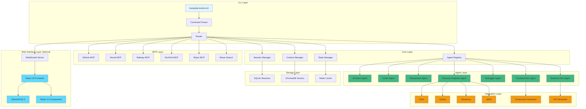

# Architectural Enhancement Analysis
## komplete-kontrol-cli - Comprehensive Analysis Report

**Date:** 2026-01-11  
**Version:** 1.0  
**Status:** Research Complete

---

## Executive Summary

This document presents a comprehensive analysis of the komplete-kontrol-cli project, evaluating architectural decisions, identifying missing components, and recommending enhancements based on extensive GitHub research and competitive analysis. The analysis covers:

1. CLI vs Web Interface evaluation
2. Agent-girl architecture assessment
3. Reverse engineering tools integration opportunities
4. Frontend/backend development tool patterns
5. Troubleshooting documentation patterns
6. Missing components and integrations

The project is currently at 0% implementation with only [`index.ts`](index.ts:1) containing a console.log. This presents an opportunity to architect the solution correctly from the ground up.

---

## 1. CLI vs Web Interface Evaluation

### Current State
The project is named "komplete-kontrol-cli" suggesting a CLI-first approach. The existing strategic plan (Version 5.0) and implementation plan both assume a CLI-only architecture.

### Analysis of Approaches

#### CLI-Only Approach

**Pros:**
- **Lower Friction for Terminal Users**: Developers already comfortable with CLI can work efficiently
- **Simpler Deployment**: Single binary/package distribution
- **Lower Resource Usage**: No browser/web server overhead
- **Better CI/CD Integration**: Easier to script and automate
- **Familiarity**: Matches the project name and user expectations

**Cons:**
- **Limited Visual Feedback**: Harder to show complex state, agent coordination, progress
- **Poor Multi-Agent Visualization**: Agent-girl's 38 agents would be difficult to track
- **Limited Interactive Features**: No drag-and-drop, visual configuration, real-time dashboards
- **Higher Learning Curve**: New users must learn CLI commands
- **Reduced Accessibility**: Not accessible to non-technical users
- **Limited Rich Media**: Cannot easily display images, diagrams, code diffs side-by-side

#### Web-Only Approach

**Pros:**
- **Rich Visual Interface**: Can display agent states, progress, coordination visually
- **Better for Complex Workflows**: Multi-step processes easier to visualize
- **Accessible to More Users**: Lower barrier to entry
- **Real-time Streaming**: WebSocket-based streaming (like agent-girl) provides live updates
- **Better Documentation Integration**: Can display docs side-by-side with code
- **Rich Media Support**: Images, diagrams, interactive elements

**Cons:**
- **Higher Deployment Complexity**: Requires web server, static assets, browser compatibility
- **Naming Mismatch**: "komplete-kontrol-cli" suggests CLI
- **Terminal Integration**: Harder to integrate with existing terminal workflows
- **Resource Overhead**: Browser/server resources required
- **Less Scriptable**: Harder to automate via scripts

#### Hybrid Approach (CLI + Web Interface)

**Pros:**
- **Best of Both Worlds**: CLI for power users, web for visual workflows
- **Flexible Usage**: Users choose their preferred interface
- **Progressive Enhancement**: Start with CLI, add web interface later
- **Localhost Architecture**: Web interface runs locally, no external dependencies
- **Terminal Integration**: CLI commands can launch web interface
- **Real-time Coordination**: Web dashboard shows agent states, CLI handles execution

**Cons:**
- **Increased Complexity**: Two codebases to maintain
- **Larger Bundle Size**: Includes both CLI and web components
- **Synchronization**: Keeping CLI and web in sync adds complexity

### Recommendation

**Adopt a Hybrid CLI + Web Interface Architecture**

**Rationale:**
1. **Matches Agent-girl Pattern**: Agent-girl uses a full-stack architecture with React 19 + TailwindCSS 4 + Radix UI for the web interface, while maintaining CLI capabilities
2. **Reduces Friction**: New users get visual interface, power users get CLI
3. **Enables Multi-Agent Visualization**: 38+ agents require visual coordination
4. **Future-Proof**: Can start CLI-first, add web interface incrementally
5. **Localhost Design**: Web interface runs locally (localhost:port), maintaining privacy and control
6. **Preserves CLI Identity**: Project name remains accurate, CLI remains primary interface

**Implementation Strategy:**
- **Phase 1**: Build robust CLI foundation (current plan)
- **Phase 2**: Add optional web interface mode (`komplete-kontrol-cli --web`)
- **Phase 3**: Enhance web interface with real-time agent coordination dashboard

---

## 2. Agent-Girl Architecture Assessment

### Overview
Agent-girl is a full-stack TypeScript + Bun application with 38 specialized agents, real-time streaming, and sophisticated coordination patterns.

### Key Architectural Patterns

#### 1. Multi-Agent System

**38 Specialized Agents** include:
- Core agents: `architect`, `coder`, `debugger`, `researcher`
- Specialist agents: `frontend-dev`, `backend-dev`, `security-analyst`, `reverse-engineer`
- Utility agents: `documentation-writer`, `test-generator`, `code-reviewer`

**Benefits for komplete-kontrol-cli:**
- **Specialization**: Each agent has deep expertise in specific domain
- **Scalability**: Can add new agents without disrupting existing ones
- **Parallel Execution**: Multiple agents work simultaneously on different aspects

#### 2. Session Isolation with SQLite Persistence

**Pattern**: Each user session gets isolated SQLite database with message caching

**Benefits:**
- **Privacy**: Sessions don't leak data between users
- **Resumability**: Can pause and resume sessions
- **Audit Trail**: Complete history of all agent interactions
- **Context Management**: Message caching reduces token usage

#### 3. Real-Time Streaming with WebSocket

**Pattern**: WebSocket-based streaming from agents to web interface

**Benefits:**
- **Live Updates**: Users see agent progress in real-time
- **Interactive Feedback**: Can interrupt or redirect agents mid-task
- **Reduced Latency**: No polling required

#### 4. Mode System

**Pattern**: Four modes for different task types:
- `general`: Standard coding tasks
- `coder`: Focused on code generation
- `intense-research`: Deep research with multiple sources
- `spark`: Quick prototyping

**Benefits:**
- **Optimized Prompts**: Each mode has specialized system prompts
- **Resource Management**: Can allocate more/less resources based on mode

#### 5. Slash Command System

**Pattern**: Markdown-based templates for common workflows

**Benefits:**
- **Consistency**: Reusable workflows with consistent patterns
- **Discoverability**: Users can list available commands
- **Customization**: Easy to add new commands

#### 6. Permission Modes

**Pattern**: `plan` vs `execute` modes for safety

**Benefits:**
- **Safety**: Plan mode only suggests, doesn't execute
- **Trust**: Users can review before applying changes

#### 7. Full-Stack TypeScript + Bun Architecture

**Pattern**:
- Backend: TypeScript + Bun (runtime)
- Frontend: React 19 + TailwindCSS 4 + Radix UI
- Database: SQLite (bun:sqlite)
- State: Redis (optional)

**Benefits:**
- **Type Safety**: Full TypeScript stack
- **Performance**: Bun runtime is fast
- **Modern UI**: React 19 + Radix UI provides excellent UX
- **Zero-Config**: SQLite requires no setup

### Recommended Patterns for komplete-kontrol-cli

#### 1. Implement Agent Registry System

```typescript
// src/core/agents/registry.ts
interface AgentDefinition {
  id: string;
  name: string;
  description: string;
  capabilities: string[];
  systemPrompt: string;
  dependencies?: string[];
}

class AgentRegistry {
  private agents: Map<string, AgentDefinition> = new Map();
  
  register(agent: AgentDefinition): void;
  get(id: string): AgentDefinition | undefined;
  list(): AgentDefinition[];
}
```

#### 2. Add Session Isolation

```typescript
// src/core/session/manager.ts
interface Session {
  id: string;
  userId: string;
  createdAt: Date;
  messages: Message[];
  state: Record<string, unknown>;
}

class SessionManager {
  createSession(userId: string): Session;
  getSession(sessionId: string): Session;
  addMessage(sessionId: string, message: Message): void;
}
```

#### 3. Implement WebSocket Streaming

```typescript
// src/core/streaming/websocket.ts
class WebSocketStreamer {
  broadcast(agentId: string, data: StreamData): void;
  subscribe(agentId: string, callback: (data: StreamData) => void): void;
}
```

#### 4. Add Mode System

```typescript
// src/core/modes/index.ts
enum AgentMode {
  GENERAL = 'general',
  CODER = 'coder',
  INTENSE_RESEARCH = 'intense-research',
  SPARK = 'spark',
  REVERSE_ENGINEER = 'reverse-engineer',
}
```

---

## 3. Reverse Engineering Tools Research

### Tools Found via GitHub Research

#### 1. Frida

**Repository**: `frida/frida`  
**Purpose**: Dynamic instrumentation toolkit for reverse engineering

**Capabilities:**
- Runtime hooking and function interception
- JavaScript-based instrumentation
- Cross-platform (Windows, Linux, macOS, iOS, Android)
- Scriptable with JavaScript

**Integration Opportunities:**
- Automated binary analysis workflows
- Function hooking for security research
- Runtime behavior analysis

#### 2. Ghidra

**Repository**: `NationalSecurityAgency/ghidra`  
**Purpose**: Software reverse engineering framework

**Capabilities:**
- Disassembly, decompilation, graph analysis
- Scriptable with Python
- Cross-platform
- Plugin architecture

**Integration Opportunities:**
- Automated decompilation workflows
- Binary analysis automation
- Cross-tool collaboration (via binsync)

#### 3. Radare2

**Repository**: `radareorg/radare2`  
**Purpose**: Reverse engineering framework and toolset

**Capabilities:**
- Binary analysis, disassembly, debugging
- Rich scripting (Python, Lua)
- Visualization tools

**Integration Opportunities:**
- Binary inspection workflows
- Pattern matching for malware analysis

#### 4. Binary Ninja

**Repository**: `Vector35/binaryninja`  
**Purpose**: Binary analysis platform

**Capabilities:**
- Modern decompiler
- API for automation
- Plugin system

**Integration Opportunities:**
- Commercial-grade decompilation
- API-driven analysis

#### 5. JADX

**Repository**: `skylot/jadx`  
**Purpose**: DEX to Java decompiler

**Capabilities:**
- Android APK analysis
- Java decompilation
- Resource extraction

**Integration Opportunities:**
- Android reverse engineering workflows
- APK analysis automation

#### 6. mitmproxy

**Repository**: `mitmproxy/mitmproxy`  
**Purpose**: Interactive HTTPS proxy

**Capabilities:**
- SSL/TLS interception
- HTTP/HTTPS manipulation
- Scriptable with Python

**Integration Opportunities:**
- Network traffic analysis
- API reverse engineering
- Mobile app analysis

### Additional Tools Identified

#### 7. angr

**Purpose**: Binary analysis framework  
**Capabilities**: Symbolic execution, constraint solving

#### 8. Capstone

**Purpose**: Lightweight disassembly framework  
**Capabilities**: Multi-architecture disassembly

#### 9. Unicorn

**Purpose**: CPU emulator framework  
**Capabilities**: Lightweight emulation for analysis

### Integration Recommendations

**Priority 1 (Immediate Integration):**
- **Frida**: Essential for dynamic analysis
- **Ghidra**: Industry standard for static analysis
- **mitmproxy**: Critical for network analysis

**Priority 2 (Phase 2 Integration):**
- **JADX**: For Android reverse engineering
- **Radare2**: Alternative to Ghidra

**Priority 3 (Future Integration):**
- **Binary Ninja**: Commercial-grade decompilation
- **angr**: Symbolic execution

### Integration Pattern

```typescript
// src/reversing/tools/frida.ts
interface FridaTool {
  name: 'frida';
  version: string;
  capabilities: string[];
  install(): Promise<void>;
  analyze(binary: string): Promise<AnalysisResult>;
}
```

---

## 4. Frontend Development Tools Research

### Tools Found

#### 1. OpenAgent

**Repository**: `RaheesAhmed/OpenAgent`  
**Description**: Open-source alternative to Claude Code

**Patterns:**
- AI-assisted coding workflows
- Plan-then-execute pattern
- Multi-agent coordination

#### 2. jangular-cli

**Repository**: `nathangtg/jangular-cli`  
**Description**: Enterprise-Grade Full-Stack Starter Kit

**Patterns:**
- CLI for quick setup
- JWT authentication built-in
- Flyway migrations
- Route protection

#### 3. MetaScreener

**Repository**: `MetaScreener/MetaScreener`  
**Description**: AI-powered tool for abstract and PDF screening

**Patterns:**
- AI-assisted document processing
- Batch processing workflows
- Result visualization

### Frontend Tool Patterns for komplete-kontrol-cli

#### 1. Component Generation Pattern

```typescript
// src/integrations/frontend/component-generator.ts
interface ComponentSpec {
  name: string;
  props: PropDefinition[];
  styling: 'tailwind' | 'css' | 'styled-components';
  framework: 'react' | 'vue' | 'svelte';
}

async function generateComponent(spec: ComponentSpec): Promise<string>;
```

#### 2. Styling Automation Pattern

```typescript
// src/integrations/frontend/styling-automation.ts
interface StyleRule {
  selector: string;
  properties: Record<string, string>;
  responsive?: {
    mobile: Record<string, string>;
    tablet: Record<string, string>;
    desktop: Record<string, string>;
  };
}
```

#### 3. Testing Pattern

```typescript
// src/integrations/frontend/test-generator.ts
interface TestSpec {
  component: string;
  scenarios: TestScenario[];
}

async function generateTests(spec: TestSpec): Promise<string>;
```

---

## 5. Backend Development Tools Research

### Tools Found

#### 1. OpenAgent

**Patterns:**
- API generation from specifications
- Database schema creation
- Authentication scaffolding

#### 2. jangular-cli

**Patterns:**
- Spring Boot backend generation
- REST API scaffolding
- Database migration generation

### Backend Tool Patterns for komplete-kontrol-cli

#### 1. Endpoint Generation Pattern

```typescript
// src/integrations/backend/api-generator.ts
interface EndpointSpec {
  path: string;
  method: 'GET' | 'POST' | 'PUT' | 'DELETE';
  auth: boolean;
  validation?: ValidationSchema;
  response: ResponseSchema;
}

async function generateEndpoint(spec: EndpointSpec): Promise<string>;
```

#### 2. Database Schema Pattern

```typescript
// src/integrations/backend/schema-generator.ts
interface TableDefinition {
  name: string;
  columns: ColumnDefinition[];
  indexes?: IndexDefinition[];
  relations?: RelationDefinition[];
}

async function generateSchema(def: TableDefinition): Promise<string>;
```

#### 3. Testing Pattern

```typescript
// src/integrations/backend/test-generator.ts
interface APITestSpec {
  endpoint: string;
  method: string;
  testCases: TestCase[];
}

async function generateAPITests(spec: APITestSpec): Promise<string>;
```

---

## 6. Troubleshooting Documentation Patterns

### Patterns from AI-Assisted-Coding Repository

#### 1. General Best Practices

- **Clear, Descriptive Prompts**: Frame comments with precise intent
- **Iterate and Refine**: Use markdown to work through problems
- **Leverage Context Blocks**: Provide related function signatures
- **Approve Carefully**: Always review generated code
- **Combine with Documentation**: Validate against real docs

#### 2. Troubleshooting Scenarios

**Scenario 1: Suggestion Drift After Refactor**
- **Issue**: AI suggests outdated patterns post-refactor
- **Resolution**: Update in-file comments, restart IDE

**Scenario 2: Performance Hangs on Large Files**
- **Issue**: Autocomplete lags in big modules
- **Resolution**: Split files, disable AI in specific file types

**Scenario 3: Incorrect Language Features**
- **Issue**: AI suggests unsupported syntax
- **Resolution**: Specify target version, add type hints

**Scenario 4: Missing Dependencies**
- **Issue**: Suggestions reference uninstalled packages
- **Resolution**: Preemptively install, add import stubs

**Scenario 5: Context Overflow**
- **Issue**: AI drifts or loses track
- **Resolution**: Reset chat, update memory status

### Recommended Troubleshooting System for komplete-kontrol-cli

```typescript
// src/core/troubleshooting/index.ts
interface TroubleshootingScenario {
  id: string;
  title: string;
  symptoms: string[];
  diagnosis: string;
  resolution: string[];
  relatedCommands?: string[];
}

class TroubleshootingGuide {
  scenarios: TroubleshootingScenario[];
  
  diagnose(issue: string): TroubleshootingScenario[];
  suggestFix(scenarioId: string): string[];
}
```

### Documentation Structure

```markdown
# docs/TROUBLESHOOTING.md

## Common Issues

### Agent Coordination Issues
- Agents not responding
- Agents stuck in loop
- Context overflow

### Integration Issues
- MCP server connection failures
- Tool installation failures
- API rate limits

### Performance Issues
- Slow response times
- High memory usage
- Token exhaustion

## Resolution Patterns

### Pattern: Reset and Reinitialize
1. Save current state
2. Clear agent memory
3. Restart session
4. Reload saved state

### Pattern: Context Optimization
1. Identify redundant context
2. Remove stale messages
3. Re-summarize key points
4. Continue with optimized context
```

---

## 7. Missing Components & Integrations

### Critical Missing Components

#### 1. Web Interface Layer

**Status**: Not planned in current strategic plan  
**Priority**: P0  
**Recommendation**: Add optional web interface mode

#### 2. Real-Time Agent Coordination Dashboard

**Status**: Not planned  
**Priority**: P1  
**Recommendation**: Visual dashboard showing all agent states

#### 3. Session Persistence

**Status**: Not planned  
**Priority**: P1  
**Recommendation**: SQLite-based session storage

#### 4. WebSocket Streaming

**Status**: Not planned  
**Priority**: P1  
**Recommendation**: Real-time agent output streaming

#### 5. Mode System

**Status**: Not planned  
**Priority**: P2  
**Recommendation**: Add specialized modes (general, coder, intense-research, reverse-engineer)

### Missing MCP Integrations

#### Currently Available MCP Servers
- GitHub (full integration available)
- Vercel (full integration available)
- Railway (full integration available)
- RunPod (full integration available)
- Stripe (full integration available)
- Brave Search (full integration available)
- grep-mcp (available but not integrated)

#### Recommended Additional MCP Integrations

**Priority 1 (Core):**
- **File System MCP**: Local file operations
- **Git MCP**: Enhanced Git operations
- **NPM MCP**: Package management

**Priority 2 (Productivity):**
- **Notion MCP**: Documentation integration
- **Slack MCP**: Notification integration
- **Jira MCP**: Issue tracking

**Priority 3 (Specialized):**
- **PostgreSQL MCP**: Database operations
- **Redis MCP**: Caching operations
- **Docker MCP**: Container management

### Missing Reverse Engineering Tools

**Status**: Current plan mentions basic tools but lacks:  
**Missing**:
- Frida (dynamic instrumentation)
- Ghidra (static analysis)
- mitmproxy (network analysis)
- JADX (Android analysis)
- Radare2 (alternative disassembler)

### Missing Workflow Features

#### 1. Git Worktree Support

**Status**: Planned but needs detailed implementation  
**Priority**: P1

#### 2. Auto-Context Condensing

**Status**: Planned at 40% threshold  
**Priority**: P1

#### 3. Prefix-Based Model Routing

**Status**: Planned (g/, oai/, fl/, or/)  
**Priority**: P1

#### 4. Slash Command System

**Status**: Not planned  
**Priority**: P2  
**Recommendation**: Markdown-based command templates

#### 5. Permission Modes

**Status**: Not planned  
**Priority**: P2  
**Recommendation**: Plan vs Execute modes

### Missing Third-Party Integrations

#### 1. GitHub Copilot Integration

**Status**: Not planned  
**Priority**: P2  
**Recommendation**: Enhanced suggestions for VS Code users

#### 2. Cursor Integration

**Status**: Not planned  
**Priority**: P2  
**Recommendation**: Cursor-specific workflows

#### 3. Vercel Deployment

**Status**: MCP available but not integrated  
**Priority**: P1  
**Recommendation**: One-click deployment

#### 4. Railway Deployment

**Status**: MCP available but not integrated  
**Priority**: P1  
**Recommendation**: Container deployment workflows

---

## 8. Recommendations Summary

### Immediate Actions (Phase 1)

1. **Adopt Hybrid Architecture**: CLI + optional web interface
2. **Implement Agent Registry**: Support 20+ specialized agents
3. **Add Session Persistence**: SQLite-based storage
4. **Integrate Core MCP Servers**: File system, Git, NPM
5. **Add Frida Integration**: Dynamic instrumentation
6. **Add Ghidra Integration**: Static analysis
7. **Implement Troubleshooting Guide**: Based on patterns found

### Phase 2 Actions

1. **Build Web Interface**: React 19 + TailwindCSS 4 + Radix UI
2. **Add WebSocket Streaming**: Real-time agent updates
3. **Implement Mode System**: general, coder, intense-research, reverse-engineer
4. **Add Slash Commands**: Markdown-based templates
5. **Integrate mitmproxy**: Network analysis
6. **Add JADX**: Android reverse engineering

### Phase 3 Actions

1. **Add Permission Modes**: Plan vs Execute
2. **Integrate Radare2**: Alternative disassembler
3. **Add Vercel/Railway Deployment**: One-click deployment
4. **Implement Agent Coordination Dashboard**: Visual state management
5. **Add Component Generation**: Frontend automation
6. **Add API Generation**: Backend automation

---

## 9. Architecture Diagram



---

## 10. Conclusion

The komplete-kontrol-cli project has significant potential to become a comprehensive, frictionless development environment. Key findings:

1. **Hybrid Architecture Recommended**: CLI + optional web interface provides best user experience
2. **Agent-girl Patterns Valuable**: Session isolation, mode system, slash commands should be adopted
3. **Reverse Engineering Tools Missing**: Frida, Ghidra, mitmproxy, JADX should be integrated
4. **Frontend/Backend Automation**: Component and API generation patterns enhance productivity
5. **Troubleshooting Documentation**: Structured scenarios and resolution patterns reduce user frustration
6. **MCP Integration**: Core MCP servers (File System, Git, NPM) should be prioritized

The updated strategic plan (Version 6.0) will incorporate these findings into a cohesive roadmap.

---

**Document End**
