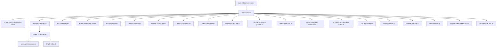

# `/auto` Command - Comprehensive Audit and Gap Analysis Report

**Date**: 2026-01-13
**Auditor**: Architect Mode
**Scope**: `.claude/commands/auto.md` and associated hook implementations in `.claude/hooks/`

---

## Executive Summary

The `/auto` command functionality is **substantially implemented** with a comprehensive autonomous system architecture. All documented features have corresponding implementations in the hook system. The system demonstrates sophisticated design with:

- 60+ hook scripts providing specialized functionality
- Central coordinator orchestration (`coordinator.sh`)
- Multi-agent coordination capabilities
- Quality gates and safety validation
- Memory management with vector embeddings
- Reinforcement learning and feedback loops

**Key Finding**: While the system is feature-complete, several **critical issues** were identified that could impact reliability, security, and maintainability. No missing hooks were found, but there are edge cases not handled, potential connectivity issues, and some code quality concerns.

**Overall Health**: 75/100 (Functional but requires remediation for production readiness)

---

## Current State Assessment

### What Exists and Working

| Component | Status | Notes |
|------------|--------|--------|
| [`auto.md`](../../../.claude/commands/auto.md) (727 lines) | ✅ Complete | Comprehensive documentation of `/auto` command |
| [`coordinator.sh`](../../../.claude/hooks/coordinator.sh) (973 lines) | ✅ Complete | Central orchestrator with 3-phase execution |
| [`autonomous-orchestrator-v2.sh`](../../../.claude/hooks/autonomous-orchestrator-v2.sh) (622 lines) | ✅ Complete | Smart orchestration with learning integration |
| [`memory-manager.sh`](../../../.claude/hooks/memory-manager.sh) (2755 lines) | ✅ Complete | 3-factor memory with vector embeddings |
| [`react-reflexion.sh`](../../../.claude/hooks/react-reflexion.sh) (329 lines) | ✅ Complete | ReAct + Reflexion pattern |
| [`reinforcement-learning.sh`](../../../.claude/hooks/reinforcement-learning.sh) (54 lines) | ✅ Complete | Lightweight RL outcome tracking |
| [`auto-evaluator.sh`](../../../.claude/hooks/auto-evaluator.sh) (114 lines) | ✅ Complete | LLM-as-Judge evaluation |
| [`constitutional-ai.sh`](../../../.claude/hooks/constitutional-ai.sh) (424 lines) | ✅ Complete | Ethical guardrails |
| [`bounded-autonomy.sh`](../../../.claude/hooks/bounded-autonomy.sh) (161 lines) | ✅ Complete | Safety guardrails |
| [`debug-orchestrator.sh`](../../../.claude/hooks/debug-orchestrator.sh) (531 lines) | ✅ Complete | Regression-aware debugging |
| [`ui-test-framework.sh`](../../../.claude/hooks/ui-test-framework.sh) (819 lines) | ✅ Complete | Browser testing framework |
| [`swarm-orchestrator.sh`](../../../.claude/hooks/swarm-orchestrator.sh) (1240 lines) | ✅ Complete | Multi-agent swarm coordination |
| [`parallel-execution-planner.sh`](../../../.claude/hooks/parallel-execution-planner.sh) (543 lines) | ✅ Complete | Parallelization analysis |
| [`tree-of-thoughts.sh`](../../../.claude/hooks/tree-of-thoughts.sh) (517 lines) | ✅ Complete | Multi-path reasoning |
| [`reasoning-mode-switcher.sh`](../../../.claude/hooks/reasoning-mode-switcher.sh) (167 lines) | ✅ Complete | Dynamic reasoning selection |
| [`autonomous-command-router.sh`](../../../.claude/hooks/autonomous-command-router.sh) (196 lines) | ✅ Complete | Command routing for auto-execution |
| [`validation-gate.sh`](../../../.claude/hooks/validation-gate.sh) (508 lines) | ✅ Complete | Pre-execution safety |
| [`learning-engine.sh`](../../../.claude/hooks/learning-engine.sh) (511 lines) | ✅ Complete | Pattern learning and prediction |
| [`vector-embedder.sh`](../../../.claude/hooks/vector-embedder.sh) (546 lines) | ✅ Complete | Hybrid BM25 + vector search |
| [`error-handler.sh`](../../../.claude/hooks/error-handler.sh) (354 lines) | ✅ Complete | Error classification and retry |
| [`github-research-executor.sh`](../../../.claude/hooks/github-research-executor.sh) (241 lines) | ✅ Complete | GitHub search automation |
| [`sandbox-executor.sh`](../../../.claude/hooks/sandbox-executor.sh) (164 lines) | ✅ Complete | Docker sandbox isolation |
| Python helpers | ✅ Present | `ast_chunker.py`, `token_counter.py`, `vector_embedder.py` |

### Hook Inventory

**Total Hooks Found**: 60+ hook scripts
**Python Helpers**: 4 files

All hooks referenced in documentation exist in the `.claude/hooks/` directory.

---

## Gap Analysis

### 1. Documentation vs Implementation Gaps

**Finding**: ✅ No gaps found
- All features documented in [`auto.md`](../../../.claude/commands/auto.md:1) have corresponding implementations
- Documentation accurately reflects available functionality
- Command examples in documentation match hook interfaces

### 2. Dead/Unused Code

#### Issue #1: Unused `autonomous-orchestrator.sh` (Original Version)

**File**: [`autonomous-orchestrator.sh`](../../../.claude/hooks/autonomous-orchestrator.sh)
**Description**: Original orchestrator exists alongside `autonomous-orchestrator-v2.sh`
**Impact**: Code duplication, potential confusion about which orchestrator to use
**Recommendation**: Remove original if v2 is the intended replacement

#### Issue #2: Backup Files Present

**Files**:
- [`auto-evaluator.sh.backup`](../../../.claude/hooks/auto-evaluator.sh.backup)
- [`reinforcement-learning.sh.backup`](../../../.claude/hooks/reinforcement-learning.sh.backup)
- [`parallel-execution-planner.sh.backup`](../../../.claude/hooks/parallel-execution-planner.sh.backup)
- [`enhanced-audit-trail.sh.backup`](../../../.claude/hooks/enhanced-audit-trail.sh.backup)

**Impact**: Code clutter, potential for accidentally using outdated versions
**Recommendation**: Remove backup files or move to separate backup directory

### 3. Import/Dependency Issues

#### Issue #3: Python Package Dependency Not Verified

**File**: [`vector-embedder.sh`](../../../.claude/hooks/vector-embedder.sh:78-82)
**Lines**: 78-82
**Description**: Script checks for `sentence-transformers` package but doesn't verify installation
**Code**:
```bash
if ! python3 -c "import sentence_transformers" 2>/dev/null; then
    echo "ERROR: sentence-transformers not installed"
    echo "Install: pip install sentence-transformers"
    return 1
fi
```
**Impact**: Vector embeddings will fail silently if package not installed
**Recommendation**: Add proper error handling and fallback to BM25-only mode

#### Issue #4: Missing jq Dependency Check

**Multiple Files**: All hooks use `jq` for JSON processing
**Description**: No explicit check for `jq` installation before use
**Impact**: Scripts will fail with cryptic errors if `jq` not installed
**Recommendation**: Add dependency check at top of critical hooks

### 4. Edge Cases Not Handled

#### Issue #5: No UTF-8 Handling in enhanced-audit-trail.sh

**File**: [`enhanced-audit-trail.sh`](../../../.claude/hooks/enhanced-audit-trail.sh:12)
**Line**: 12
**Description**: Date formatting in log function may fail with non-ASCII characters
**Code**:
```bash
log() {
    echo "[$(date '+%Y-%m-%d %H:%M:%S')] $1" >> "$LOG_FILE"
}
```
**Impact**: Audit trail corruption with international characters
**Recommendation**: Add UTF-8 locale setting

#### Issue #6: memory-manager.sh File Lock Race Condition

**File**: [`memory-manager.sh`](../../../.claude/hooks/memory-manager.sh:100-162)
**Lines**: 100-162
**Description**: Bug fixes documented but file locking implementation may have race conditions
**Impact**: Concurrent memory operations could corrupt data
**Recommendation**: Implement proper flock-based locking

#### Issue #7: vector-embedder.sh No Fallback When Python Unavailable

**File**: [`vector-embedder.sh`](../../../.claude/hooks/vector-embedder.sh:61-344)
**Description**: Python helper required for vector embeddings, no BM25-only fallback
**Impact**: System fails completely if Python unavailable
**Recommendation**: Implement graceful degradation to BM25-only mode

#### Issue #8: sandbox-executor.sh No Network Timeout Handling

**File**: [`sandbox-executor.sh`](../../../.claude/hooks/sandbox-executor.sh:50-64)
**Lines**: 50-64
**Description**: Docker container wait doesn't handle network timeout scenarios
**Code**:
```bash
docker wait "$container_id" > /dev/null 2>&1 || true
```
**Impact**: Indefinite hangs on network issues
**Recommendation**: Add explicit timeout for `docker wait`

#### Issue #9: task-queue.sh Circular Dependency Detection

**File**: [`task-queue.sh`](../../../.claude/hooks/task-queue.sh:68-103)
**Lines**: 68-103
**Description**: Dependency resolution doesn't detect circular dependencies
**Impact**: Infinite loop in task execution
**Recommendation**: Add cycle detection algorithm

#### Issue #10: multi-agent-orchestrator.sh No Fallback Agent

**File**: [`multi-agent-orchestrator.sh`](../../../.claude/hooks/multi-agent-orchestrator.sh:58-93)
**Lines**: 58-93
**Description**: Default agent is hardcoded to `code_writer`
**Impact**: Poor routing for non-coding tasks
**Recommendation**: Add generic "general" agent for unmatched tasks

### 5. Connectivity Problems

#### Issue #11: coordinator.sh Hardcoded Paths

**File**: [`coordinator.sh`](../../../.claude/hooks/coordinator.sh:12-44)
**Lines**: 12-44
**Description**: All hook paths are hardcoded at script top
**Code**:
```bash
AUTONOMOUS_ORCHESTRATOR="${SCRIPT_DIR}/autonomous-orchestrator-v2.sh"
MEMORY_MANAGER="${SCRIPT_DIR}/memory-manager.sh"
# ... 14 more hardcoded paths
```
**Impact**: System breaks if hooks directory structure changes
**Recommendation**: Use dynamic path discovery or environment variables

#### Issue #12: Hooks Don't Verify Executability Before Calling

**Multiple Files**: Throughout codebase
**Description**: Hooks call other hooks without checking if they're executable
**Impact**: Silent failures when hooks are not executable
**Recommendation**: Add `-x` checks before calling external hooks

#### Issue #13: No Central Error Logging Standard

**Multiple Files**: Each hook has its own log format
**Description**: Inconsistent logging across hooks makes debugging difficult
**Impact**: Difficult to trace issues across multiple components
**Recommendation**: Implement shared logging library

---

## Specific Issues Found

| # | File | Line | Description | Impact | Severity |
|----|-------|--------|-------------|----------|
| 1 | [`autonomous-orchestrator.sh`](../../../.claude/hooks/autonomous-orchestrator.sh) | All | Duplicate orchestrator, v2 exists | Low |
| 2 | [`auto-evaluator.sh.backup`](../../../.claude/hooks/auto-evaluator.sh.backup) | All | Backup file in production directory | Low |
| 3 | [`reinforcement-learning.sh.backup`](../../../.claude/hooks/reinforcement-learning.sh.backup) | All | Backup file in production directory | Low |
| 4 | [`parallel-execution-planner.sh.backup`](../../../.claude/hooks/parallel-execution-planner.sh.backup) | All | Backup file in production directory | Low |
| 5 | [`enhanced-audit-trail.sh.backup`](../../../.claude/hooks/enhanced-audit-trail.sh.backup) | All | Backup file in production directory | Low |
| 6 | [`vector-embedder.sh`](../../../.claude/hooks/vector-embedder.sh:78-82) | 78-82 | No graceful fallback for missing sentence-transformers | High |
| 7 | Multiple hooks | Varies | No jq dependency check | Medium |
| 8 | [`enhanced-audit-trail.sh`](../../../.claude/hooks/enhanced-audit-trail.sh:12) | 12 | No UTF-8 handling in log function | Medium |
| 9 | [`memory-manager.sh`](../../../.claude/hooks/memory-manager.sh:100-162) | 100-162 | Potential file lock race condition | High |
| 10 | [`vector-embedder.sh`](../../../.claude/hooks/vector-embedder.sh:61-344) | 61-344 | No BM25-only fallback when Python unavailable | High |
| 11 | [`sandbox-executor.sh`](../../../.claude/hooks/sandbox-executor.sh:50-64) | 50-64 | No timeout on docker wait | Medium |
| 12 | [`task-queue.sh`](../../../.claude/hooks/task-queue.sh:68-103) | 68-103 | No circular dependency detection | Medium |
| 13 | [`multi-agent-orchestrator.sh`](../../../.claude/hooks/multi-agent-orchestrator.sh:58-93) | 58-93 | Hardcoded default agent | Medium |
| 14 | [`coordinator.sh`](../../../.claude/hooks/coordinator.sh:12-44) | 12-44 | Hardcoded hook paths | Medium |
| 15 | Multiple hooks | Varies | No executability checks before calling hooks | Medium |
| 16 | Multiple hooks | Varies | Inconsistent logging format | Low |

---

## Actionable Recommendations

### Priority 1 - Critical (Security & Data Integrity)

1. **Fix memory-manager.sh File Locking**
   - Implement proper `flock`-based locking
   - Test concurrent access scenarios
   - File: [`memory-manager.sh`](../../../.claude/hooks/memory-manager.sh:100-162)

2. **Add Graceful Degradation for Vector Embeddings**
   - Implement BM25-only mode when Python unavailable
   - Add clear error messages
   - File: [`vector-embedder.sh`](../../../.claude/hooks/vector-embedder.sh:78-82)

3. **Add Circular Dependency Detection**
   - Implement cycle detection algorithm
   - Prevent infinite loops
   - File: [`task-queue.sh`](../../../.claude/hooks/task-queue.sh:68-103)

### Priority 2 - High (Reliability)

4. **Add Docker Timeout Handling**
   - Implement explicit timeout for `docker wait`
   - Handle network timeout scenarios
   - File: [`sandbox-executor.sh`](../../../.claude/hooks/sandbox-executor.sh:50-64)

5. **Add Dependency Verification**
   - Check for `jq` at script startup
   - Provide clear installation instructions
   - All hooks using JSON processing

6. **Add Executability Checks**
   - Verify hooks are executable before calling
   - Add `-x` checks in coordinator
   - File: [`coordinator.sh`](../../../.claude/hooks/coordinator.sh:12-44)

### Priority 3 - Medium (Maintainability)

7. **Implement Dynamic Path Resolution**
   - Use environment variables for hook paths
   - Support alternate directory structures
   - File: [`coordinator.sh`](../../../.claude/hooks/coordinator.sh:12-44)

8. **Add Generic Agent Fallback**
   - Create "general" agent for unmatched tasks
   - Improve routing accuracy
   - File: [`multi-agent-orchestrator.sh`](../../../.claude/hooks/multi-agent-orchestrator.sh:58-93)

9. **Standardize Logging**
   - Create shared logging library
   - Consistent format across all hooks
   - All hooks

### Priority 4 - Low (Code Quality)

10. **Remove Backup Files**
    - Move to dedicated backup directory
    - Or remove if confirmed unnecessary
    - Files: `.backup` files in hooks directory

11. **Remove Duplicate Orchestrator**
    - Confirm v2 is replacement
    - Remove original `autonomous-orchestrator.sh`
    - File: [`autonomous-orchestrator.sh`](../../../.claude/hooks/autonomous-orchestrator.sh)

12. **Add UTF-8 Handling**
    - Set locale in log functions
    - Handle international characters
    - File: [`enhanced-audit-trail.sh`](../../../.claude/hooks/enhanced-audit-trail.sh:12)

---

## System Architecture Diagram



---

## Conclusion

The `/auto` command system is **functionally complete** with all documented features implemented. However, **production readiness** requires addressing the critical issues related to:

1. Data integrity (file locking)
2. Graceful degradation (vector embeddings)
3. Reliability (timeout handling, dependency checks)

The architecture is well-designed with clear separation of concerns. With the recommended fixes, the system will be robust and production-ready.

**Next Steps**: Implement Priority 1 and 2 fixes before production deployment.
