# KOMPLETE-KONTROL CLI: Strategic Synthesis & Prioritized Action Plan

**Document Version**: 7.0
**Date**: 2026-01-11
**Status**: Enhanced TRUE Parallelism Architecture, CLI-Only Approach, and Expanded Tool Integration

---

## Executive Summary

### Opportunity Overview

The agentic AI coding platform market is experiencing explosive growth, with major players like Claude Code, Cursor, GitHub Copilot Workspace, and Replit Agent competing for dominance. KOMPLETE-KONTROL CLI has a unique opportunity to become the market leader by combining:

1. **TRUE Parallel Agent Architecture** - Unlike competitors that use sequential agent execution, our Bun-based system enables genuine parallelism with 100+ agents using worker threads, async I/O, and child processes
2. **Reverse Engineering Capabilities** - No competitor offers integrated Frida, mitmproxy, JADX, and binary analysis
3. **"God Mode" Self-Healing Loop** - REPL on steroids with Runtime Supervisor, Stderr Parsing, Linter/Type Check Integration, Dependency Auto-Resolution
4. **Advanced Context Engine** - Better than RAG using Tree-Sitter, Smart Context Stuffing, Dependency Graph Queries, .contextignore file
5. **Shadow Mode (Speculative Executor)** - Background unit tests and speculative code execution
6. **Reverse Engineering CLI Commands** - fix-binary, replay --last 5 for binary analysis
7. **Project State Persistence (.memory.md)** - Persistent memory file with learned patterns and architectural decisions
8. **Cost & Token Budgeting** - Fuel Gauge UI, max_cost_per_command setting, per-command budgeting
9. **Abliterated Models** - Uncensored AI models via Featherless.ai for unrestricted development
10. **Git Worktree Isolation** - 67% PR merge rate through conflict-free parallel execution
11. **Multi-Provider Architecture** - 10+ providers with prefix-based routing (or/, g/, oai/, ollama/, fl/, etc.)
12. **Agent-Girl Architecture Patterns** - Session isolation, mode system, slash commands, permission modes
13. **Advanced Vision & Research** - Zero-drift screenshot capture, HAR analysis, PDF research tools
14. **Dynamic Context Scaling** - Dual-accounting for 128k-2M context models
15. **Single Debug Interface** - Unified error handling, VS Code DAP support, centralized logging

### Strategic Vision

**Mission**: Build the absolute best agentic coding CLI tool that outperforms all competitors through superior TRUE parallelism, unique reverse engineering capabilities, "God Mode" self-healing infrastructure, advanced multi-provider architecture, CLI-first architecture, and seamless VS Code integration.

**Positioning**: Enterprise-grade CLI tool for developers who need:
- Massive parallel agent swarms (100+ agents with TRUE parallelism)
- Deep system analysis and reverse engineering
- Predictive failure prevention with auto-fix
- Unrestricted AI capabilities
- Multi-provider flexibility with smart fallbacks
- Advanced context management better than RAG
- Cost control with token budgeting
- CLI-first architecture for power users
- Single debug interface for all operations
- Session isolation with persistence
- Advanced vision and research capabilities
- Superior performance through Bun runtime

---

## Competitive Positioning Strategy

### Competitive Matrix

| Feature | KOMPLETE-KONTROL | Claude Code | Cursor | Cline | Roo Code | Claudish |
|----------|------------------|-------------|---------|--------|----------|-----------|
| **Core Differentiators** |
| TRUE Parallel Agents (100+ with Worker Threads) | ✅ 100+ agents | ❌ Sequential | ❌ Limited | ❌ Sequential | ❌ Sequential |
| Worker Thread Pool (Bun) | ✅ Native | ❌ No | ❌ No | ❌ No | ❌ No |
| Async Parallel I/O (Promise.all) | ✅ Native | ❌ Limited | ❌ Limited | ❌ Limited | ❌ Limited |
| Child Process Isolation | ✅ Native | ❌ No | ❌ No | ❌ No | ❌ No |
| LangGraph Python Bridge (ThreadPoolExecutor) | ✅ Native | ❌ No | ❌ No | ❌ No | ❌ No |
| MCP Server Pool (Concurrent) | ✅ 24+ servers | ✅ Yes | ✅ Yes | ✅ Yes | ✅ Yes |
| Git Worktrees | ✅ Native | ❌ No | ❌ No | ❌ No | ❌ No |
| Reverse Engineering Suite | ✅ Full Suite | ❌ No | ❌ No | ❌ No | ❌ No |
| **God Mode Features** |
| Self-Healing Loop (REPL) | ✅ Full | ❌ No | ❌ No | ❌ No | ❌ No |
| Context Engine (Dependency Graph) | ✅ Full | ❌ No | ❌ No | ❌ No | ❌ No |
| Shadow Mode (Speculative) | ✅ Full | ❌ No | ❌ No | ❌ No | ❌ No |
| RE CLI Commands (fix-binary) | ✅ Full | ❌ No | ❌ No | ❌ No | ❌ No |
| .memory.md Persistence | ✅ Full | ❌ No | ❌ No | ❌ No | ❌ No |
| Cost & Token Budgeting | ✅ Full | ❌ No | ❌ No | ❌ No | ❌ No |
| **CLI-First Architecture** |
| CLI-Only Interface | ✅ Native | ✅ Yes | ✅ Yes | ✅ Yes | ✅ Yes |
| Single Debug Interface | ✅ Unified | ❌ No | ❌ No | ❌ No | ❌ No |
| VS Code DAP Support | ✅ Native | ❌ No | ❌ No | ❌ No | ❌ No |
| Session Isolation (SQLite) | ✅ Full | ❌ No | ❌ No | ❌ No | ❌ No |
| Mode System (4+ modes) | ✅ Full | ❌ No | ❌ No | ❌ No | ❌ No |
| Slash Commands | ✅ Markdown-based | ❌ No | ❌ No | ❌ No | ❌ No |
| Permission Modes (Plan/Execute) | ✅ Full | ❌ No | ❌ No | ❌ No | ❌ No |
| **Multi-Provider Architecture** |
| Multi-Provider Routing | ✅ 10+ providers | ✅ Limited | ✅ Limited | ✅ Limited | ✅ Yes |
| Prefix-Based Routing | ✅ or/, g/, oai/, etc. | ❌ No | ❌ No | ❌ No | ✅ Yes |
| Dynamic Context Scaling | ✅ 128k-2M dual-accounting | ❌ No | ❌ No | ❌ No | ✅ Yes |
| Smart Fallback Pattern | ✅ Primary → Fallback with retries | ❌ No | ❌ No | ❌ No | ✅ Yes |
| **Vision & Analysis** |
| Zero-Drift Screenshots | ✅ DOM + pixels same frame | ❌ No | ✅ Yes | ❌ No | ❌ No |
| HAR Network Analysis | ✅ Full parsing | ❌ No | ❌ No | ❌ No | ❌ No |
| DOM Extraction | ✅ Quality scoring | ❌ No | ✅ Yes | ❌ No | ❌ No |
| **Research & Context** |
| Institutional Memory | ✅ .memory.md | ✅ Yes | ✅ Yes | ✅ Yes | ❌ No |
| Progressive Context | ✅ Smart building | ✅ Yes | ✅ Yes | ✅ Yes | ❌ No |
| Hook System | ✅ Before/After/Finally | ✅ Yes | ❌ No | ❌ No | ✅ Yes |
| Context Condensation | ✅ 40% threshold | ✅ Yes | ✅ Yes | ✅ Yes | ❌ No |
| File Context Tracking | ✅ Dependency graph | ✅ Yes | ✅ Yes | ✅ Yes | ❌ No |
| PDF Research Tools | ✅ Claim extraction | ❌ No | ❌ No | ❌ No | ❌ No |
| **Advanced Features** |
| MCP Support | ✅ 24+ servers | ✅ Yes | ✅ Yes | ✅ Yes | ✅ Yes |
| Deep Research | ✅ 4 APIs | ❌ Limited | ❌ No | ❌ No | ❌ No |
| RAG Indexing | ✅ ChromaDB | ✅ Yes | ✅ Yes | ✅ Yes | ❌ No |
| Voice-to-Code | ✅ Groq Whisper | ❌ No | ❌ No | ❌ No | ❌ No |
| Screenshot-to-Code | ✅ GPT-4V | ❌ No | ✅ Yes | ❌ No | ❌ No |
| Network Interception | ✅ Multi-tool Suite | ❌ No | ❌ No | ❌ No | ❌ No |
| API Discovery & Fuzzing | ✅ Integrated | ❌ No | ❌ No | ❌ No | ❌ No |
| Protocol Support (gRPC/GraphQL/WS) | ✅ Full Support | ❌ No | ❌ No | ❌ No | ❌ No |
| Mobile Binary Analysis | ✅ JADX + Frida + Objection | ❌ No | ❌ No | ❌ No | ❌ No |
| Deep Binary RE | ✅ Ghidra + Radare2 + Binary Ninja | ❌ No | ❌ No | ❌ No | ❌ No |
| OS/Kernel Debugging | ✅ WinDbg + QEMU + GDB | ❌ No | ❌ No | ❌ No | ❌ No |
| Web Frontend Analysis | ✅ Chrome DevTools + Stealth | ❌ No | ❌ No | ❌ No | ❌ No |
| JS De-obfuscation | ✅ AST Explorer + Source Maps | ❌ No | ❌ No | ❌ No | ❌ No |
| Generative UI Tools | ✅ Screenshot-to-Code + v0.dev | ❌ No | ❌ No | ❌ No | ❌ No |
| Browser Automation Stealth | ✅ Puppeteer-extra-stealth | ❌ No | ❌ No | ❌ No | ❌ No |
| **Claudish-Inspired Features** |
| Status Line Display | ✅ Real-time cost/context | ❌ No | ❌ No | ❌ No | ✅ Yes |
| Parallel Instance Isolation | ✅ Unique port per instance | ❌ No | ❌ No | ❌ No | ✅ Yes |
| Monitor Mode | ✅ Traffic logging for debugging | ❌ No | ❌ No | ❌ No | ✅ Yes |
| Direct Agent Selection | ✅ --agent flag | ❌ No | ❌ No | ❌ No | ✅ Yes |
| Auto-Detection | ✅ Dynamic OpenRouter metadata | ❌ No | ❌ No | ❌ No | ✅ Yes |
| Thinking Translation | ✅ Universal extended thinking | ❌ No | ❌ No | ❌ No | ✅ Yes |
| **MCP Server Features** |
| Web Scraping (Anti-Bot) | ✅ Token-optimized | ❌ No | ❌ No | ❌ No | ❌ No |
| Link Categorization | ✅ Auto-categorization | ❌ No | ❌ No | ❌ No | ❌ No |
| Performance Metrics | ✅ HAR-based metrics | ❌ No | ❌ No | ❌ No | ❌ No |
| Entity Relationships | ✅ PDF analysis | ❌ No | ❌ No | ❌ No | ❌ No |
| Literature Review | ✅ Automated | ❌ No | ❌ No | ❌ No | ❌ No |
| **Troubleshooting & Documentation** |
| Troubleshooting Guide | ✅ Scenario-based patterns | ❌ No | ❌ No | ❌ No | ❌ No |
| Error Resolution Patterns | ✅ Auto-suggestion | ❌ No | ❌ No | ❌ No | ❌ No |
| **Frontend/Backend Automation** |
| Component Generation | ✅ React/Vue/Svelte | ❌ No | ❌ No | ❌ No | ❌ No |
| API Generation | ✅ REST/GraphQL/gRPC | ❌ No | ❌ No | ❌ No | ❌ No |
| Database Schema Generation | ✅ Auto-detection | ❌ No | ❌ No | ❌ No | ❌ No |

### Winning Strategy

**Primary Differentiators** (No competitor has these):
1. TRUE Parallel Agent Swarms (100+ agents with Worker Thread Pool)
2. Reverse Engineering Suite (Frida, mitmproxy, JADX, Ghidra, Radare2, Binary Ninja)
3. **Self-Healing Loop (REPL on steroids)**
4. **Advanced Context Engine (Dependency Graph + .contextignore)**
5. **Shadow Mode (Speculative Executor)**
6. **RE CLI Commands (fix-binary, replay --last 5)**
7. **.memory.md Project State Persistence**
8. **Cost & Token Budgeting (Fuel Gauge)**
9. Abliterated Models (Unrestricted AI)
10. Git Worktree Isolation (Conflict-free parallelism)
11. Multi-Provider Architecture with Smart Fallbacks
12. **Agent-Girl Architecture Patterns** (Session isolation, mode system, slash commands)
13. Zero-Drift Vision Capture (DOM + pixels same frame)
14. HAR Network Analysis (Full parsing + performance metrics)
15. PDF Research Tools (Claim extraction, entity relationships)
16. **Single Debug Interface** (Unified error handling, VS Code DAP support)

**Secondary Differentiators** (Better than competitors):
1. Deep Research Integration (Perplexity + Tavily + arXiv)
2. Voice-to-Code (Hands-free development)
3. Prefix-Based Model Routing (10+ providers)
4. Dynamic Context Scaling (128k-2M models)
5. Status Line Display (Real-time cost/context tracking)
6. Monitor Mode (Traffic logging for debugging)
7. Direct Agent Selection (--agent flag)
8. Auto-Detection (Dynamic OpenRouter metadata)
9. **VS Code Native Integration (MCP Bridge)**
10. **Troubleshooting Documentation** (Scenario-based resolution patterns)
11. **Frontend/Backend Automation** (Component/API generation)

**Catch-Up Features** (Must implement for parity):
1. Institutional Memory (.memory.md file format)
2. Progressive Context Building (Incremental context growth)
3. Comprehensive Hook System (Before/After/Finally hooks)
4. File Context Tracking with Metadata
5. Merkle Tree Indexing (Fast diff detection)
6. Tree-sitter Semantic Parsing (Language-aware understanding)

---

## Prioritized Feature Matrix

### Scoring Framework

| Criterion | Weight | Description |
|-----------|--------|-------------|
| Competitive Differentiation | 35% | How unique is this feature compared to competitors? |
| User Demand | 25% | How much do users want this feature? |
| Implementation Complexity | 20% | How difficult is it to implement? (Lower = Better) |
| Time to Market | 20% | How quickly can this be delivered? (Faster = Better) |

**Priority Score = (Differentiation × 0.35) + (User Demand × 0.25) + (Complexity × 0.20) + (Time to Market × 0.20)**

### Feature Scores

| Feature | Diff (1-10) | Demand (1-10) | Complex (1-10) | TTM (1-10) | Score | Priority |
|---------|--------------|----------------|----------------|--------------|-------|----------|
| **Phase 1: Foundation (Core Differentiators)** |
| TRUE Parallel Agents (Worker Thread Pool) | 10 | 9 | 6 | 6 | 8.45 | P0 |
| Async Parallel I/O (Promise.all) | 10 | 9 | 4 | 7 | 8.20 | P0 |
| Child Process Isolation | 10 | 8 | 5 | 7 | 7.95 | P0 |
| LangGraph Python Bridge (ThreadPoolExecutor) | 10 | 8 | 5 | 6 | 7.80 | P0 |
| MCP Server Pool (Concurrent) | 10 | 8 | 4 | 7 | 7.80 | P0 |
| Git Worktree Isolation | 10 | 8 | 5 | 7 | 7.95 | P0 |
| Prefix-Based Model Routing (10+ providers) | 9 | 9 | 4 | 7 | 7.60 | P0 |
| Smart Fallback Pattern | 8 | 8 | 4 | 8 | 7.00 | P0 |
| Dynamic Context Scaling (128k-2M) | 9 | 8 | 5 | 6 | 7.40 | P0 |
| Auto-Context Condensing | 7 | 8 | 4 | 8 | 6.95 | P0 |
| Basic CLI Interface | 6 | 10 | 3 | 9 | 6.85 | P0 |
| Status Line Display | 8 | 7 | 3 | 8 | 6.90 | P0 |
| Cost & Token Budgeting | 9 | 9 | 4 | 8 | 7.80 | P0 |
| Single Debug Interface (Unified) | 10 | 8 | 5 | 7 | 7.95 | P0 |
| VS Code DAP Support | 10 | 7 | 6 | 6 | 7.90 | P0 |
| **Phase 2: CLI-Only Architecture & Agent-Girl Patterns** |
| Session Isolation (SQLite) | 9 | 8 | 4 | 7 | 7.40 | P0 |
| Agent Registry System | 9 | 8 | 5 | 6 | 7.40 | P0 |
| Mode System (4+ modes) | 8 | 7 | 4 | 7 | 6.70 | P1 |
| Slash Commands | 7 | 7 | 3 | 8 | 6.45 | P1 |
| Permission Modes (Plan/Execute) | 8 | 6 | 3 | 8 | 6.70 | P1 |
| **Phase 3: Multi-Provider & Advanced Routing** |
| Zero-Drift Vision Capture | 10 | 7 | 6 | 6 | 7.75 | P0 |
| HAR Network Analysis | 10 | 7 | 5 | 6 | 7.80 | P0 |
| DOM Extraction & Quality Scoring | 9 | 7 | 5 | 7 | 7.25 | P0 |
| Parallel Instance Isolation | 8 | 6 | 4 | 7 | 6.55 | P1 |
| Monitor Mode (Traffic Logging) | 7 | 6 | 3 | 8 | 6.25 | P1 |
| Direct Agent Selection (--agent) | 7 | 7 | 3 | 8 | 6.55 | P1 |
| Auto-Detection (OpenRouter metadata) | 7 | 6 | 4 | 7 | 6.15 | P1 |
| Thinking Translation Model | 8 | 6 | 5 | 6 | 6.55 | P1 |
| **Phase 4: Competitive Parity + God Mode** |
| Self-Healing Loop (REPL on steroids) | 10 | 9 | 8 | 5 | 8.40 | P0 |
| Context Engine (Dependency Graph + .contextignore) | 9 | 8 | 7 | 6 | 7.85 | P0 |
| Shadow Mode (Speculative Executor) | 10 | 8 | 7 | 5 | 8.15 | P0 |
| Institutional Memory (.memory.md) | 7 | 9 | 5 | 7 | 7.15 | P1 |
| Progressive Context Building | 5 | 9 | 5 | 7 | 6.50 | P1 |
| Hook System (Before/After/Finally) | 6 | 8 | 5 | 6 | 6.40 | P1 |
| File Context Tracking + Metadata | 5 | 8 | 4 | 7 | 6.15 | P1 |
| Context Condenser Pattern | 5 | 7 | 5 | 6 | 5.70 | P1 |
| **Phase 5: Market Leadership** |
| Reverse Engineering Suite + CLI Commands | 10 | 7 | 8 | 5 | 7.90 | P0 |
| Self-Healing Infrastructure | 10 | 8 | 8 | 4 | 7.90 | P0 |
| Abliterated Models (Featherless) | 9 | 7 | 3 | 8 | 7.15 | P0 |
| Deep Research Integration | 8 | 7 | 4 | 7 | 6.75 | P1 |
| RAG Codebase Indexing | 6 | 8 | 4 | 7 | 6.35 | P1 |
| Network Interception Suite | 10 | 8 | 7 | 5 | 8.05 | P0 |
| API Discovery & Fuzzing | 10 | 7 | 6 | 5 | 7.65 | P0 |
| Protocol Support (gRPC/GraphQL/WS) | 9 | 7 | 5 | 6 | 7.20 | P0 |
| Mobile Binary Analysis | 10 | 6 | 8 | 4 | 7.60 | P0 |
| Deep Binary RE | 10 | 5 | 9 | 3 | 7.25 | P0 |
| OS/Kernel Debugging | 9 | 5 | 8 | 4 | 6.95 | P1 |
| Web Frontend Analysis | 8 | 7 | 4 | 6 | 6.55 | P1 |
| JS De-obfuscation | 8 | 6 | 5 | 6 | 6.45 | P1 |
| Browser Automation Stealth | 9 | 7 | 4 | 6 | 6.95 | P1 |
| **Phase 6: Research & Web Intelligence** |
| Web Scraping (Anti-Bot Bypass) | 9 | 7 | 5 | 6 | 7.10 | P0 |
| Token Optimization Pattern | 8 | 8 | 4 | 7 | 6.95 | P1 |
| Link Categorization | 7 | 6 | 4 | 7 | 6.15 | P1 |
| PDF Research Tools | 9 | 7 | 6 | 5 | 7.25 | P0 |
| Claim Extraction | 8 | 6 | 5 | 6 | 6.55 | P1 |
| Entity Relationships | 8 | 6 | 6 | 5 | 6.45 | P1 |
| Literature Review | 8 | 6 | 5 | 6 | 6.45 | P1 |
| Performance Metrics (HAR-based) | 8 | 7 | 4 | 6 | 6.60 | P1 |
| **Phase 7: Ecosystem Expansion** |
| Voice-to-Code | 9 | 6 | 4 | 6 | 6.65 | P1 |
| Screenshot-to-Code | 8 | 6 | 5 | 6 | 6.40 | P1 |
| Merkle Tree Indexing | 7 | 5 | 7 | 5 | 6.10 | P2 |
| Tree-sitter Semantic Parsing | 7 | 5 | 8 | 4 | 6.15 | P2 |
| Tech Stack Detection | 5 | 6 | 3 | 8 | 5.55 | P2 |
| MCP Server Orchestration | 6 | 7 | 4 | 8 | 6.25 | P1 |
| Generative UI Tools (v0.dev) | 8 | 7 | 4 | 6 | 6.55 | P1 |
| Async Task Queue Pattern | 7 | 6 | 5 | 6 | 6.20 | P1 |
| Hybrid Sync/Async Processing | 7 | 7 | 5 | 6 | 6.40 | P1 |
| **Phase 8: Frontend/Backend Automation** |
| Component Generation | 9 | 8 | 5 | 6 | 7.40 | P0 |
| API Generation | 9 | 8 | 5 | 6 | 7.40 | P0 |
| Database Schema Generation | 8 | 7 | 4 | 7 | 6.70 | P1 |
| Test Generation | 7 | 7 | 4 | 7 | 6.30 | P1 |
| **Phase 9: Troubleshooting & Documentation** |
| Troubleshooting Guide | 8 | 8 | 3 | 8 | 7.00 | P0 |
| Error Resolution Patterns | 8 | 7 | 4 | 7 | 6.70 | P1 |
| Auto-Suggestion System | 7 | 6 | 5 | 6 | 6.15 | P1 |
| **Phase 10: VS Code Integration** |
| VS Code Extension (Hybrid) | 8 | 9 | 5 | 7 | 7.40 | P0 |
| File Picker Integration | 7 | 8 | 3 | 8 | 6.70 | P1 |
| Image Viewer Integration | 7 | 7 | 3 | 8 | 6.45 | P1 |
| Path Picker Integration | 7 | 8 | 3 | 8 | 6.70 | P1 |
| MCP Bridge (Extension-CLI) | 8 | 7 | 5 | 6 | 6.80 | P1 |
| Status Line Integration | 6 | 7 | 3 | 8 | 6.15 | P1 |

### Priority Categories

**P0 (Critical - Must Have for MVP)**:
- TRUE Parallel Agents (Worker Thread Pool)
- Async Parallel I/O (Promise.all)
- Child Process Isolation
- LangGraph Python Bridge (ThreadPoolExecutor)
- MCP Server Pool (Concurrent)
- Git Worktree Isolation
- Prefix-Based Model Routing (10+ providers)
- Smart Fallback Pattern
- Dynamic Context Scaling (128k-2M)
- Auto-Context Condensing
- Basic CLI Interface
- Status Line Display
- Cost & Token Budgeting
- Single Debug Interface (Unified)
- VS Code DAP Support
- Session Isolation (SQLite)
- Agent Registry System
- Zero-Drift Vision Capture
- HAR Network Analysis
- DOM Extraction & Quality Scoring
- Self-Healing Loop (REPL on steroids)
- Context Engine (Dependency Graph + .contextignore)
- Shadow Mode (Speculative Executor)
- Reverse Engineering Suite + CLI Commands
- Self-Healing Infrastructure
- Abliterated Models
- Network Interception Suite
- API Discovery & Fuzzing
- Protocol Support (gRPC/GraphQL/WS)
- Mobile Binary Analysis
- Deep Binary RE
- Web Scraping (Anti-Bot Bypass)
- PDF Research Tools
- Component Generation
- API Generation
- Troubleshooting Guide
- VS Code Extension (Native)

**P1 (Important - Competitive Parity & Advanced Features)**:
- Mode System (4+ modes)
- Slash Commands
- Permission Modes (Plan/Execute)
- Parallel Instance Isolation
- Monitor Mode (Traffic Logging)
- Direct Agent Selection (--agent)
- Auto-Detection (OpenRouter metadata)
- Thinking Translation Model
- Institutional Memory (.memory.md)
- Progressive Context Building
- Hook System
- File Context Tracking + Metadata
- Context Condenser Pattern
- Deep Research Integration
- RAG Codebase Indexing
- OS/Kernel Debugging
- Web Frontend Analysis
- JS De-obfuscation
- Browser Automation Stealth
- Token Optimization Pattern
- Link Categorization
- Claim Extraction
- Entity Relationships
- Literature Review
- Performance Metrics (HAR-based)
- Voice-to-Code
- Screenshot-to-Code
- MCP Server Orchestration
- Generative UI Tools (v0.dev)
- Async Task Queue Pattern
- Hybrid Sync/Async Processing
- Database Schema Generation
- Test Generation
- Error Resolution Patterns
- Auto-Suggestion System
- File Picker Integration
- Image Viewer Integration
- Path Picker Integration
- MCP Bridge (Extension-CLI)
- Status Line Integration

**P2 (Nice to Have - Ecosystem Expansion)**:
- Merkle Tree Indexing
- Tree-sitter Semantic Parsing
- Tech Stack Detection

---

## Implementation Roadmap

### Phase 1: Foundation (Weeks 1-8)
**Objective**: Build MVP with core differentiators that no competitor has

#### Primary Goals
1. Establish CLI framework with command structure
2. Implement TRUE parallel agent orchestration
3. Enable git worktree isolation for conflict-free execution
4. Deploy prefix-based model routing across 10+ providers
5. Implement auto-context condensing at 40% threshold
6. Add smart fallback pattern with retry logic
7. Implement status line display for real-time tracking
8. Add cost & token budgeting system

#### Key Features to Implement

**Week 1-2: CLI Foundation & Multi-Provider Setup**
- Project structure and TypeScript configuration
- CLI command parser (yargs-based)
- Configuration system (global + project)
- 10+ provider interfaces (or/, g/, oai/, ollama/, fl/, etc.)
- Model registry with dynamic OpenRouter metadata queries
- Auto-detection of provider capabilities
- Status line display component (cost + context tracking)
- **Cost & Token Budgeting System**
  - Fuel gauge UI component
  - max_cost_per_command setting
  - Per-command budget enforcement
  - Budget reset and tracking

**Week 3-4: TRUE Parallel Agents**
- LangGraph supervisor-worker pattern
- Agent registry with 16 specializations
- Redis state management
- Git worktree manager
- Agent monitoring dashboard
- Direct agent selection (--agent flag)
- Parallel instance isolation (unique port per instance)

**Week 5-6: Model Router & Context**
- Prefix-based routing (or/, g/, oai/, fl/, etc.)
- Smart fallback pattern (primary → fallback with retries)
- Token counting per provider with dual-accounting
- Dynamic context scaling (128k-2M models)
- Context manager with condensing
- Sliding window fallback
- Async task queue pattern (sync for small, async for large)

**Week 7-8: Testing & Polish**
- Unit tests for core components
- Integration tests for agent orchestration
- CLI UI with progress indicators
- Status line testing
- Cost budgeting validation
- Documentation for Phase 1 features

#### Technical Components Required
- `src/cli/` - Command parsing and execution
- `src/core/router/` - Model routing with prefixes
- `src/core/providers/` - 10+ provider implementations
- `src/core/context/` - Context management
- `src/core/agents/` - LangGraph orchestration
- `src/core/status/` - Status line display
- `src/core/fallback/` - Smart fallback pattern
- `src/core/queue/` - Async task queue
- `src/core/budget/` - Cost & token budgeting
- `py/langgraph_executor.py` - Python agent supervisor
- `py/agent_templates.py` - 16 agent specializations

#### Dependencies
- Bun runtime
- Python 3.11+
- Redis for state management
- Git for worktree operations
- OpenRouter API for metadata queries

#### Success Criteria
- ✅ CLI responds to all basic commands
- ✅ 3+ agents execute in parallel
- ✅ Git worktrees prevent merge conflicts
- ✅ Context auto-condenses at 40% threshold
- ✅ Model routing works with 5+ providers
- ✅ Smart fallback retries work correctly
- ✅ Status line shows real-time cost/context
- ✅ Cost budgeting enforces max_cost_per_command
- ✅ Fuel gauge displays remaining budget
- ✅ 70%+ test coverage for core components

---

### Phase 2: CLI-Only Architecture & Agent-Girl Patterns (Weeks 9-16)
**Objective**: Implement CLI-only architecture with agent-girl architecture patterns

#### Primary Goals
1. Implement session isolation with SQLite
2. Deploy agent registry system
3. Add mode system (general, coder, intense-research, reverse-engineer)
4. Implement slash commands
5. Add permission modes (plan vs execute)
6. Implement single debug interface

#### Key Features to Implement

**Week 9-10: Session Isolation**
- SQLite-based session storage (bun:sqlite)
- Session manager with message caching
- User session isolation
- Resumable sessions
- Audit trail for all interactions
- Context optimization per session

**Week 11-12: Agent Registry System**
- Agent definition interface
- Agent registry with 20+ specializations
- Agent capabilities tracking
- Agent dependencies management
- Dynamic agent loading
- Agent health monitoring

**Week 13-14: Mode System & Commands**
- Mode system (general, coder, intense-research, reverse-engineer, spark)
- Slash command system (Markdown-based templates)
- Permission modes (plan vs execute)
- Mode-specific system prompts
- Command discovery and listing

**Week 15-16: Single Debug Interface**
- Unified error handling across all agents
- Centralized logging system
- VS Code DAP (Debug Adapter Protocol) support
- Debug session management
- Breakpoint support
- Variable inspection
- Stack trace visualization

#### Technical Components Required
- `src/core/session/` - Session management
- `src/core/agents/registry.ts` - Agent registry
- `src/core/modes/` - Mode system
- `src/core/commands/slash.ts` - Slash commands
- `src/core/debug/` - Single debug interface
- `src/core/debug/dap-server.ts` - VS Code DAP server
- `src/core/debug/logger.ts` - Centralized logging
- `src/core/debug/error-handler.ts` - Unified error handling

#### Dependencies
- Bun runtime
- SQLite (bun:sqlite)
- VS Code DAP libraries
- Existing Phase 1 components

#### Success Criteria
- ✅ Sessions are isolated per user
- ✅ Sessions can be paused and resumed
- ✅ Agent registry loads 20+ agents
- ✅ Mode system switches correctly
- ✅ Slash commands execute from templates
- ✅ Permission modes enforce plan/execute
- ✅ Single debug interface handles all agent errors
- ✅ VS Code DAP connects successfully
- ✅ Centralized logging captures all events

---

### Phase 3: Multi-Provider & Advanced Routing (Weeks 17-24)
**Objective**: Implement advanced multi-provider features and vision capabilities

#### Primary Goals
1. Add zero-drift vision capture capabilities
2. Implement HAR network analysis
3. Add DOM extraction with quality scoring
4. Deploy monitor mode for traffic logging
5. Implement thinking translation model

#### Key Features to Implement

**Week 17-18: Vision Capabilities**
- Zero-drift screenshot capture (DOM + pixels same frame)
- DOM extraction with quality scoring
- Vision model integration
- Screenshot-to-Code pipeline
- Quality assessment algorithms

**Week 19-20: Network Analysis**
- HAR parsing and analysis
- Performance metrics extraction
- API discovery from HAR
- Network traffic visualization
- Request/response analysis

**Week 21-22: Advanced Routing Features**
- Monitor mode (traffic logging for debugging)
- Thinking translation model (universal extended thinking)
- Enhanced fallback strategies
- Provider health monitoring
- Auto-retry with exponential backoff

**Week 23-24: Testing & Polish**
- Vision capture testing
- HAR analysis validation
- Monitor mode testing
- Documentation for Phase 3 features

#### Technical Components Required
- `src/integrations/vision/zero-drift-capture.ts` - Vision capture
- `src/integrations/vision/dom-extractor.ts` - DOM extraction
- `src/integrations/network/har-analyzer.ts` - HAR analysis
- `src/integrations/network/performance-metrics.ts` - Performance metrics
- `src/core/monitor/` - Monitor mode
- `src/core/thinking/` - Thinking translation
- `mcp-servers/chromium-screenshots-mcp/` - Vision MCP server

#### Dependencies
- Puppeteer for browser automation
- HAR parser libraries
- Vision model APIs (GPT-4V, Claude 3.5 Sonnet)
- Existing Phase 1-2 components

#### Success Criteria
- ✅ Zero-drift screenshots capture DOM + pixels
- ✅ DOM extraction quality scores >85%
- ✅ HAR parsing completes successfully
- ✅ Performance metrics extracted accurately
- ✅ Monitor mode logs traffic correctly
- ✅ Thinking translation works across providers

---

### Phase 4: Competitive Parity + God Mode (Weeks 25-36)
**Objective**: Implement "God Mode" features and missing features to match competitor capabilities

#### Primary Goals
1. Add Self-Healing Loop (REPL on steroids)
2. Implement Context Engine (Dependency Graph + .contextignore)
3. Deploy Shadow Mode (Speculative Executor)
4. Add institutional memory with .memory.md
5. Implement progressive context building
6. Create comprehensive hook system
7. Add file context tracking with metadata

#### Key Features to Implement

**Week 25-28: Self-Healing Loop (REPL on steroids)**
- REPL interface for interactive code execution
- Runtime Supervisor for monitoring execution
- Stderr Parser for error detection and categorization
- Linter/Type Check Integration
- Dependency Auto-Resolution
- Auto-fix suggestions and application
- Error pattern learning

**Week 29-31: Context Engine (Dependency Graph + .contextignore)**
- Dependency Graph builder and queries
- Smart Context Stuffing based on dependency analysis
- .contextignore file parsing and application
- Impact scope analysis for file changes
- Circular dependency detection
- Context optimization for token limits

**Week 32-34: Shadow Mode (Speculative Executor)**
- Speculative code execution in background
- Background unit test runner
- Result comparison (original vs speculative)
- Conflict detection and resolution
- Apply/discard speculative changes
- Performance impact analysis

**Week 35-36: Institutional Memory & Hooks**
- .memory.md file format and generation
- Learned pattern storage
- Architectural decision tracking
- Before/After/Finally hook system
- Hook registry and execution
- State mutex for hook safety

#### Technical Components Required
- `src/core/healing/repl-interface.ts` - REPL interface
- `src/core/healing/runtime-supervisor.ts` - Runtime monitoring
- `src/core/healing/stderr-parser.ts` - Error parsing
- `src/core/healing/linter-integration.ts` - Linter/Type check
- `src/core/healing/dependency-resolver.ts` - Dependency resolution
- `src/core/context/dependency-graph.ts` - Dependency graph
- `src/core/context/context-stuffer.ts` - Smart context stuffing
- `src/core/context/context-ignore.ts` - .contextignore handling
- `src/core/shadow-mode/` - Shadow mode executor
- `src/core/session/memory-file.ts` - .memory.md handling
- `src/core/hooks/` - Hook system

#### Dependencies
- Linter libraries (ESLint, TSLint, etc.)
- Type checkers (tsc, mypy, etc.)
- Dependency analysis libraries
- Existing Phase 1-3 components

#### Success Criteria
- ✅ REPL executes code interactively
- ✅ Runtime Supervisor detects failures
- ✅ Stderr Parser categorizes errors accurately
- ✅ Linter integration runs automatically
- ✅ Dependencies auto-resolve correctly
- ✅ Dependency graph queries return correct results
- ✅ .contextignore excludes files properly
- ✅ Shadow mode executes speculatively
- ✅ Background tests run without blocking
- ✅ .memory.md generates and updates correctly
- ✅ Hooks execute in correct order

---

### Phase 5: Market Leadership (Weeks 37-48)
**Objective**: Deploy advanced capabilities that establish market dominance

#### Primary Goals
1. Integrate reverse engineering suite with CLI commands
2. Deploy self-healing infrastructure
3. Enable abliterated models
4. Add deep research capabilities
5. Implement RAG codebase indexing

#### Key Features to Implement

**Week 37-40: Reverse Engineering Suite + CLI Commands**
- Frida MCP server integration (dynamic instrumentation)
- mitmproxy MCP server (network interception)
- JADX MCP server (APK decompilation)
- API analyzer for GraphQL/gRPC
- Binary analysis with Ghidra
- Radare2 integration for deep binary analysis
- Binary Ninja plugin support
- **CLI Commands:**
  - `fix-binary` - Auto-fix binary issues
  - `replay --last N` - Replay execution history
  - `analyze-binary` - Binary analysis
  - `extract-secrets` - Secret extraction
  - `instrument-process` - Process instrumentation

**Week 41-44: Network & Protocol Analysis**
- Network Interception Suite (mitmproxy + Burp Suite + Charles Proxy)
- API Discovery & Fuzzing (Turbo Intruder integration)
- Protocol Support (gRPC, GraphQL, WebSocket)
- SSL Pinning Bypass (Frida + Objection)
- Traffic analysis and replay

**Week 45-46: Mobile & Binary Analysis**
- Mobile Binary Analysis (JADX + Frida + Objection)
- Deep Binary RE (Ghidra + Radare2 + Binary Ninja)
- OS/Kernel Debugging (WinDbg + QEMU + GDB)
- Binary extraction and analysis
- Dynamic instrumentation workflows

**Week 47-48: Self-Healing & Research**
- Health monitoring system
- Predictive failure detection
- Auto-recovery (restart, scale, rollback)
- Anomaly detection
- Alert system
- Featherless.ai integration (abliterated models)
- Perplexity Sonar API
- Tavily research API
- arXiv paper search
- Semantic Scholar integration
- ChromaDB RAG implementation

#### Technical Components Required
- `mcp-servers/frida-mcp/` - Frida dynamic instrumentation
- `mcp-servers/mitmproxy-mcp/` - Network interception
- `mcp-servers/jadx-mcp/` - APK decompilation
- `mcp-servers/api-analyzer-mcp/` - API introspection
- `mcp-servers/burp-mcp/` - Burp Suite integration
- `mcp-servers/charles-mcp/` - Charles Proxy integration
- `mcp-servers/turbo-intruder-mcp/` - API fuzzing
- `mcp-servers/ghidra-mcp/` - Ghidra binary analysis
- `mcp-servers/radare2-mcp/` - Radare2 deep analysis
- `mcp-servers/objection-mcp/` - Frida SSL pinning bypass
- `mcp-servers/windbg-mcp/` - WinDbg kernel debugging
- `mcp-servers/qemu-mcp/` - QEMU emulation
- `mcp-servers/gdb-mcp/` - GDB debugging
- `src/cli/commands/re/` - Reverse engineering CLI commands
- `src/core/healing/health-monitor.ts` - Self-healing
- `src/integrations/deep-research.ts` - Research APIs
- `src/integrations/rag-system.ts` - RAG implementation
- `src/core/indexing/indexer.ts` - Codebase indexing

#### Dependencies
- Frida 17.5.2+
- mitmproxy 12.2.1+
- JADX
- Ghidra 12.0
- Radare2 5.9+
- Binary Ninja 4.0+
- Burp Suite Pro
- Charles Proxy
- Turbo Intruder
- Objection (Frida toolkit)
- WinDbg Preview
- QEMU 8.0+
- GDB 14+
- ChromaDB
- Perplexity, Tavily, arXiv APIs
- Featherless.ai API

#### Success Criteria
- ✅ Frida attaches to processes successfully
- ✅ mitmproxy captures and analyzes traffic
- ✅ APK decompiles with secret detection
- ✅ Burp Suite integrates for API fuzzing
- ✅ SSL pinning bypass works on mobile apps
- ✅ Ghidra analyzes binaries with auto-analysis
- ✅ Radare2 provides deep binary insights
- ✅ WinDbg connects to kernel debugging sessions
- ✅ QEMU emulates targets for analysis
- ✅ `fix-binary` command resolves issues
- ✅ `replay --last 5` replays execution
- ✅ Self-healing predicts failures 15min ahead
- ✅ Deep research returns results in <5s
- ✅ Abliterated models work via prefix routing
- ✅ RAG queries return relevant code

---

### Phase 6: Research & Web Intelligence (Weeks 49-60)
**Objective**: Implement advanced research and web intelligence capabilities

#### Primary Goals
1. Add web scraping with anti-bot bypass
2. Implement token optimization pattern
3. Add PDF research tools
4. Deploy performance metrics analysis
5. Implement hybrid sync/async processing

#### Key Features to Implement

**Week 49-52: Web Scraping**
- Anti-bot bypass integration
- Token optimization pattern (remove base64 images, ads, etc.)
- Link categorization
- Web scraping MCP server
- Content extraction and cleaning

**Week 53-56: PDF Research Tools**
- PDF analysis MCP server
- Claim extraction algorithms
- Entity relationship extraction
- Literature review automation
- Citation management

**Week 57-58: Performance Metrics**
- HAR-based performance metrics
- API performance tracking
- Response time analysis
- Error rate monitoring
- Performance dashboard

**Week 59-60: Hybrid Processing**
- Async task queue implementation
- Hybrid sync/async processing
- Task prioritization
- Result aggregation
- Error handling and recovery

#### Technical Components Required
- `mcp-servers/webustler-mcp/` - Web scraping with anti-bot
- `mcp-servers/har-report-analyzer-mcp/` - HAR analysis
- `mcp-servers/mcp-research-toolkit-mcp/` - PDF research
- `src/core/optimization/token-optimizer.ts` - Token optimization
- `src/core/queue/async-task-queue.ts` - Async queue
- `src/core/processing/hybrid-processor.ts` - Hybrid processing

#### Dependencies
- Anti-bot bypass libraries
- PDF parsing libraries
- NLP libraries for claim extraction
- Existing Phase 1-5 components

#### Success Criteria
- ✅ Web scraping bypasses bot detection
- ✅ Token optimization reduces usage by >30%
- ✅ Link categorization accuracy >85%
- ✅ PDF analysis extracts claims correctly
- ✅ Entity relationships are identified
- ✅ Literature review generates summaries
- ✅ Performance metrics are accurate
- ✅ Hybrid processing improves throughput

---

### Phase 7: Ecosystem Expansion (Weeks 61-72)
**Objective**: Build platform features for ecosystem growth

#### Primary Goals
1. Add voice-to-code capability
2. Implement screenshot-to-code
3. Deploy Merkle tree indexing
4. Add Tree-sitter semantic parsing
5. Expand MCP server ecosystem
6. Add web frontend analysis capabilities
7. Implement generative UI tools

#### Key Features to Implement

**Week 61-64: Voice-to-Code**
- Groq Whisper integration
- Streaming audio capture
- Real-time transcription
- Context-aware code generation
- Voice command parsing

**Week 65-68: Screenshot-to-Code**
- Puppeteer screenshot capture
- GPT-4 Vision analysis
- UI component detection
- React + Tailwind generation
- Preview and export

**Week 69-70: Advanced Indexing**
- Merkle tree implementation
- Fast diff detection
- Tree-sitter integration
- Semantic parsing for 10+ languages
- Language-aware context

**Week 71-72: Platform Features**
- MCP server marketplace
- Custom server templates
- Plugin system
- Analytics dashboard
- Community integrations
- v0.dev generative UI tools

#### Technical Components Required
- `src/integrations/voice-to-code.ts` - Voice transcription
- `src/integrations/screenshot-to-code.ts` - UI cloning
- `src/integrations/v0-dev.ts` - Generative UI tools
- `src/integrations/chrome-devtools.ts` - Chrome DevTools integration
- `src/integrations/ast-explorer.ts` - JS de-obfuscation
- `src/integrations/puppeteer-stealth.ts` - Browser automation stealth
- `src/core/indexing/merkle-tree.ts` - Diff detection
- `src/core/indexing/tree-sitter.ts` - Semantic parsing
- `src/mcp/marketplace.ts` - MCP marketplace
- `src/mcp/plugin-system.ts` - Plugin framework

#### Dependencies
- Groq Whisper API
- Puppeteer
- Puppeteer-extra-plugin-stealth
- GPT-4 Vision
- v0.dev API
- Chrome DevTools Protocol
- AST Explorer
- Source Map support
- Tree-sitter parsers
- Existing Phase 1-6 components

#### Success Criteria
- ✅ Voice transcribes with >90% accuracy
- ✅ Screenshots convert to code correctly
- ✅ v0.dev generates UI components
- ✅ Chrome DevTools analyzes frontend
- ✅ AST Explorer de-obfuscates JS
- ✅ Puppeteer stealth bypasses detection
- ✅ Merkle tree detects changes in <100ms
- ✅ Tree-sitter parses 10+ languages
- ✅ MCP marketplace has 10+ servers
- ✅ Plugin system supports custom extensions

---

### Phase 8: Frontend/Backend Automation (Weeks 73-80)
**Objective**: Implement automated frontend and backend development tools

#### Primary Goals
1. Add component generation capabilities
2. Implement API generation
3. Add database schema generation
4. Deploy test generation

#### Key Features to Implement

**Week 73-76: Component Generation**
- Component specification interface
- React/Vue/Svelte component generators
- TailwindCSS styling automation
- Props and state management
- Component testing generation

**Week 77-78: API Generation**
- API specification interface
- REST/GraphQL/gRPC endpoint generators
- Request/response validation
- API documentation generation
- API testing generation

**Week 79-80: Database & Test Generation**
- Database schema detection
- Migration generation
- Test case generation
- Test data generation
- Test execution and reporting

#### Technical Components Required
- `src/integrations/frontend/component-generator.ts` - Component generation
- `src/integrations/backend/api-generator.ts` - API generation
- `src/integrations/backend/schema-generator.ts` - Schema generation
- `src/integrations/frontend/test-generator.ts` - Test generation
- `src/integrations/backend/test-generator.ts` - Test generation

#### Dependencies
- Component template libraries
- API specification libraries
- Database introspection libraries
- Testing frameworks
- Existing Phase 1-7 components

#### Success Criteria
- ✅ Components generate correctly for React/Vue/Svelte
- ✅ Styling applies TailwindCSS correctly
- ✅ API endpoints generate with validation
- ✅ API documentation is accurate
- ✅ Database schemas detect correctly
- ✅ Migrations generate properly
- ✅ Tests run successfully

---

### Phase 9: Troubleshooting & Documentation (Weeks 81-84)
**Objective**: Implement comprehensive troubleshooting and documentation system

#### Primary Goals
1. Add troubleshooting guide
2. Implement error resolution patterns
3. Deploy auto-suggestion system

#### Key Features to Implement

**Week 81-82: Troubleshooting Guide**
- Scenario-based troubleshooting documentation
- Common issue identification
- Resolution pattern library
- Error categorization
- Related command suggestions

**Week 83-84: Auto-Suggestion System**
- Error pattern matching
- Resolution suggestion engine
- Context-aware suggestions
- Learning from user resolutions
- Suggestion effectiveness tracking

#### Technical Components Required
- `src/core/troubleshooting/` - Troubleshooting system
- `src/core/troubleshooting/scenarios.ts` - Scenario library
- `src/core/troubleshooting/resolver.ts` - Resolution engine
- `src/core/troubleshooting/suggester.ts` - Suggestion engine

#### Dependencies
- Pattern matching libraries
- Machine learning for suggestion learning
- Existing Phase 1-8 components

#### Success Criteria
- ✅ Troubleshooting guide covers common scenarios
- ✅ Error patterns match correctly
- ✅ Resolution suggestions are accurate
- ✅ Auto-suggestion system improves over time
- ✅ User feedback is incorporated

---

### Phase 10: VS Code Integration (Weeks 85-92)
**Objective**: Build VS Code extension with native integration using MCP bridge

#### Primary Goals
1. Build VS Code extension from scratch
2. Implement file picker integration
3. Add image viewer integration
4. Deploy path picker integration
5. Create MCP bridge for extension-CLI communication
6. Add status line integration

#### Key Features to Implement

**Week 85-87: Extension Foundation**
- VS Code extension scaffolding
- TypeScript extension setup
- Basic command registration
- Extension manifest configuration
- MCP server in CLI for extension communication

**Week 88-89: File/Image/Path Pickers**
- File picker using `vscode.workspace.findFiles`
- Image preview panel
- Path picker using `vscode.window.showOpenDialog`
- Multi-file selection support
- Recent files history

**Week 90-91: MCP Bridge & UI**
- MCP protocol client in extension
- Direct MCP communication (stdio bridge)
- Command execution flow
- Progress indicators
- Command history panel
- Settings panel

**Week 92: Polish & Testing**
- Status line integration
- Keyboard shortcuts
- Custom themes
- Extension testing
- Documentation

#### Technical Components Required
- `vscode-extension/` - VS Code extension codebase
- `vscode-extension/src/extension.ts` - Main extension entry
- `vscode-extension/src/pickers/file-picker.ts` - File picker
- `vscode-extension/src/pickers/image-viewer.ts` - Image viewer
- `vscode-extension/src/pickers/path-picker.ts` - Path picker
- `vscode-extension/src/mcp/client.ts` - MCP client
- `vscode-extension/src/ui/status-line.ts` - Status line
- `src/mcp/extension-server.ts` - MCP server for extension

#### Dependencies
- VS Code Extension API
- MCP TypeScript SDK
- Existing Phase 1-9 components

#### Success Criteria
- ✅ Extension loads in VS Code
- ✅ File picker selects files correctly
- ✅ Image viewer displays images
- ✅ Path picker resolves paths correctly
- ✅ MCP bridge communicates with CLI
- ✅ Commands execute from extension
- ✅ Status line displays cost/context
- ✅ Extension passes VS Code validation

---

## Technical Architecture

### System Architecture Overview

```mermaid
graph TB
    subgraph VS Code Layer
        A[VS Code Extension]
        B[File Picker]
        C[Image Viewer]
        D[Path Picker]
        E[Status Line]
    end

    subgraph CLI Layer
        F[CLI Commands]
        G[Config System]
        H[Status Line Display]
        I[Monitor Mode]
        J[Cost Budgeting]
    end

    subgraph Core Layer
        P[Model Router]
        Q[Context Manager]
        R[Agent Orchestrator]
        S[Session Store]
        T[Hook System]
        U[Smart Fallback]
        V[Async Task Queue]
        W[Hybrid Processor]
        X[Dependency Graph]
        Y[Context Stuffer]
        Z[Context Ignore]
    end

    subgraph God Mode Layer
        AA[Self-Healing Loop]
        AB[REPL Interface]
        AC[Runtime Supervisor]
        AD[Stderr Parser]
        AE[Linter Integration]
        AF[Dependency Resolver]
        AG[Shadow Mode]
        AH[Speculative Executor]
        AI[Background Tests]
    end

    subgraph Intelligence Layer
        AJ[LangGraph Supervisor]
        AK[Redis State Manager]
        AL[Agent Registry]
        AM[Agent Templates]
        AN[Worktree Manager]
        AO[Thinking Translator]
    end

    subgraph Agent Girl Patterns
        AP[Mode System]
        AQ[Slash Commands]
        AR[Permission Modes]
        AT[Session Manager]
    end

    subgraph Multi-Provider Layer
        AU[Provider Registry]
        AV[OpenRouter]
        AW[Groq]
        AX[Anthropic]
        AY[OpenAI]
        AZ[Ollama]
        BA[Featherless]
        BB[Auto-Detection]
    end

    subgraph Vision Layer
        BC[Zero-Drift Capture]
        BD[DOM Extractor]
        BE[Quality Scorer]
        BF[Screenshot-to-Code]
    end

    subgraph Network Layer
        BG[HAR Analyzer]
        BH[Performance Metrics]
        BI[API Discovery]
    end

    subgraph Research Layer
        BJ[Web Scraping]
        BK[Token Optimizer]
        BL[PDF Analyzer]
        BM[Claim Extractor]
        BN[Entity Relationships]
        BO[Literature Review]
    end

    subgraph Integration Layer
        BP[Deep Research APIs]
        BQ[RAG Indexer]
        BR[Voice Transcription]
        BS[UI Cloning]
        BT[Health Monitor]
        BU[Web Frontend Analysis]
        BV[Generative UI Tools]
        BW[Component Generator]
        BX[API Generator]
        BY[Schema Generator]
        BZ[Troubleshooting System]
    end

    subgraph MCP Layer
        CA[Frida MCP]
        CB[mitmproxy MCP]
        CC[JADX MCP]
        CD[API Analyzer MCP]
        CE[Burp Suite MCP]
        CF[Charles Proxy MCP]
        CG[Turbo Intruder MCP]
        CH[Ghidra MCP]
        CI[Radare2 MCP]
        CJ[Objection MCP]
        CK[WinDbg MCP]
        CL[QEMU MCP]
        CM[GDB MCP]
        CN[Chromium Screenshots MCP]
        CO[Har Report Analyzer MCP]
        CP[Webustler MCP]
        CQ[Research Toolkit MCP]
        CR[Extension MCP Server]
        CS[Community MCPs]
    end

    subgraph Storage Layer
        CT[SQLite Sessions]
        CU[ChromaDB Vectors]
        CV[Redis State]
        CW[Git Worktrees]
        CX[.memory.md Files]
        CY[Knowledge Base]
    end

    A --> CR
    B --> CR
    C --> CR
    D --> CR
    E --> CR
    CR --> F
    F --> P
    F --> R
    G --> P
    G --> Q
    H --> P
    I --> P
    J --> P
    
    P --> AU
    P --> U
    Q --> R
    Q --> X
    Q --> Y
    Q --> Z
    R --> AJ
    S --> CT
    S --> CX
    T --> R
    U --> AU
    V --> W
    W --> R
    
    P --> AP
    AP --> AL
    AQ --> F
    AR --> F
    AT --> S
    
    P --> AU
    AU --> AV
    AU --> AW
    AU --> AX
    AU --> AY
    AU --> AZ
    AU --> BA
    BB --> AU
    
    R --> AA
    AA --> AB
    AA --> AC
    AA --> AD
    AA --> AE
    AA --> AF
    AA --> AG
    AG --> AH
    AG --> AI
    
    R --> BC
    R --> BD
    R --> BE
    R --> BF
    R --> BG
    R --> BH
    R --> BI
    R --> BJ
    R --> BK
    R --> BL
    R --> BM
    R --> BN
    R --> BO
    
    AJ --> AK
    AJ --> AL
    AJ --> AM
    AJ --> AN
    AJ --> AO
    
    Q --> BP
    Q --> BQ
    Q --> BR
    Q --> BS
    Q --> BT
    Q --> BU
    Q --> BV
    Q --> BW
    Q --> BX
    Q --> BY
    Q --> BZ
    
    BP --> CA
    BP --> CB
    BP --> CC
    BP --> CD
    BP --> CE
    BP --> CF
    BP --> CG
    BP --> CH
    BP --> CI
    BP --> CJ
    BP --> CK
    BP --> CL
    BP --> CM
    BP --> CN
    BP --> CO
    BP --> CP
    BP --> CQ
    BP --> CR
    BP --> CS
    
    BQ --> CU
    BT --> CV
    S --> CY
```



### Component Specifications

#### Model Router with Multi-Provider Support
**File**: `src/core/router/model-router.ts`

**Responsibilities**:
- Parse model prefixes (or/, g/, oai/, ollama/, fl/, etc.)
- Route to appropriate provider
- Execute smart fallback chains (primary → fallback with retries)
- Count tokens per provider with dual-accounting
- Handle streaming responses
- Dynamic provider capability detection via OpenRouter metadata

**Interfaces**:
```typescript
interface ModelRouter {
  complete(model: string, messages: Message[]): Promise<Response>;
  completeWithFallback(model: string, messages: Message[], fallback: string[]): Promise<Response>;
  stream(model: string, messages: Message[]): AsyncIterable<Response>;
  countTokens(messages: Message[], provider: string): Promise<number>;
  detectCapabilities(model: string): Promise<ProviderCapabilities>;
}

interface SmartFallbackConfig {
  primary: string;
  fallbacks: string[];
  maxRetries: number;
  retryDelay: number;
  exponentialBackoff: boolean;
}
```

#### Context Manager with Dynamic Scaling
**File**: `src/core/context/context-manager.ts`

**Responsibilities**:
- Monitor token usage with dual-accounting (128k-2M models)
- Trigger condensation at threshold
- Preserve tool_use blocks
- Manage progressive context building
- Handle file context tracking
- Dynamic context scaling based on model capabilities
- Dependency graph queries
- Smart context stuffing

**Interfaces**:
```typescript
interface ContextManager {
  manage(messages: Message[], options: ContextOptions): Promise<Message[]>;
  condense(messages: Message[]): Promise<Message[]>;
  truncate(messages: Message[], ratio: number): Message[]>;
  trackFileContext(file: string, metadata: FileMetadata): void>;
  buildProgressiveContext(base: Context, additions: Context[]): Context;
  scaleForModel(model: string, context: Context): Promise<Context>;
  queryDependencyGraph(file: string): DependencyQueryResult;
  stuffContext(query: string, budget: number): ContextSelection;
}

interface ContextOptions {
  maxTokens: number;
  modelContextLimit: number;
  condensationThreshold: number;
  preserveToolUse: boolean;
  ignorePatterns: string[];
}
```

#### Agent Registry System
**File**: `src/core/agents/registry.ts`

**Responsibilities**:
- Register and manage agent definitions
- Track agent capabilities
- Manage agent dependencies
- Dynamic agent loading
- Agent health monitoring

**Interfaces**:
```typescript
interface AgentDefinition {
  id: string;
  name: string;
  description: string;
  capabilities: string[];
  systemPrompt: string;
  dependencies?: string[];
}

class AgentRegistry {
  register(agent: AgentDefinition): void;
  get(id: string): AgentDefinition | undefined;
  list(): AgentDefinition[];
  getCapabilities(agentId: string): string[];
  checkDependencies(agentId: string): boolean;
}
```

#### Mode System
**File**: `src/core/modes/index.ts`

**Responsibilities**:
- Define available modes
- Switch between modes
- Apply mode-specific system prompts
- Track active mode

**Interfaces**:
```typescript
enum AgentMode {
  GENERAL = 'general',
  CODER = 'coder',
  INTENSE_RESEARCH = 'intense-research',
  REVERSE_ENGINEER = 'reverse-engineer',
  SPARK = 'spark',
}

interface ModeConfig {
  mode: AgentMode;
  systemPrompt: string;
  capabilities: string[];
  resourceLimits: ResourceLimits;
}

class ModeSystem {
  setMode(mode: AgentMode): void;
  getMode(): AgentMode;
  getSystemPrompt(mode: AgentMode): string;
}
```

#### Session Manager with SQLite
**File**: `src/core/session/manager.ts`

**Responsibilities**:
- Create and manage user sessions
- Session isolation
- Message caching
- Session persistence
- Resumable sessions

**Interfaces**:
```typescript
interface Session {
  id: string;
  userId: string;
  createdAt: Date;
  messages: Message[];
  state: Record<string, unknown>;
}

class SessionManager {
  createSession(userId: string): Session;
  getSession(sessionId: string): Session;
  addMessage(sessionId: string, message: Message): void;
  saveSession(sessionId: string): void;
  loadSession(sessionId: string): Session;
}
```

#### Troubleshooting System
**File**: `src/core/troubleshooting/index.ts`

**Responsibilities**:
- Match error patterns
- Suggest resolutions
- Track suggestion effectiveness
- Learn from user feedback

**Interfaces**:
```typescript
interface TroubleshootingScenario {
  id: string;
  title: string;
  symptoms: string[];
  diagnosis: string;
  resolution: string[];
  relatedCommands?: string[];
}

class TroubleshootingGuide {
  diagnose(issue: string): TroubleshootingScenario[];
  suggestFix(scenarioId: string): string[];
  trackFeedback(scenarioId: string, helpful: boolean): void;
}
```

#### Component Generator
**File**: `src/integrations/frontend/component-generator.ts`

**Responsibilities**:
- Generate React/Vue/Svelte components
- Apply TailwindCSS styling
- Generate component tests
- Handle props and state

**Interfaces**:
```typescript
interface ComponentSpec {
  name: string;
  framework: 'react' | 'vue' | 'svelte';
  props: PropDefinition[];
  styling: 'tailwind' | 'css' | 'styled-components';
}

class ComponentGenerator {
  generate(spec: ComponentSpec): Promise<string>;
  generateTests(spec: ComponentSpec): Promise<string>;
}
```

#### API Generator
**File**: `src/integrations/backend/api-generator.ts`

**Responsibilities**:
- Generate REST/GraphQL/gRPC endpoints
- Generate request/response validation
- Generate API documentation
- Generate API tests

**Interfaces**:
```typescript
interface EndpointSpec {
  path: string;
  method: 'GET' | 'POST' | 'PUT' | 'DELETE';
  auth: boolean;
  validation?: ValidationSchema;
  response: ResponseSchema;
}

class APIGenerator {
  generateEndpoint(spec: EndpointSpec): Promise<string>;
  generateTests(spec: EndpointSpec): Promise<string>;
  generateDocumentation(spec: EndpointSpec): Promise<string>;
}
```

### Technology Stack Decisions

| Component | Technology | Justification |
|-----------|-------------|---------------|
| Runtime | Bun | 3x faster than Node.js, native worker_threads for TRUE parallelism |
| Language | TypeScript | Type safety, industry standard, VS Code extension native |
| CLI Framework | yargs | Mature, feature-rich CLI parser |
| AI Orchestration | LangGraph | 2.2x faster than CrewAI, state deltas, Python ThreadPoolExecutor for parallelism |
| State Management | Redis | Distributed state, fast lookups |
| Vector DB | ChromaDB | Local, free, Python SDK |
| Session Storage | SQLite (bun:sqlite) | Built-in, no external deps |
| Multi-Provider Routing | OpenRouter API | Unified interface to 10+ providers |
| Vision Capture | Puppeteer + Chromium | Zero-drift DOM + pixel capture |
| HAR Analysis | har-parser | Comprehensive HAR parsing |
| PDF Analysis | pdf-parse + NLP libraries | Claim extraction, entity relationships |
| Web Scraping | Puppeteer-extra + anti-bot | Anti-detection scraping |
| Token Optimization | Custom algorithms | Remove base64, ads, trackers |
| Network Interception | mitmproxy, Burp Suite, Charles Proxy | Multi-tool coverage |
| API Discovery | Turbo Intruder | Fast API fuzzing |
| Protocol Analysis | gRPC, GraphQL, WebSocket tools | Full protocol support |
| Mobile RE | JADX, Frida, Objection | Complete mobile analysis |
| Binary RE | Ghidra, Radare2, Binary Ninja | Deep binary analysis |
| OS/Kernel Debug | WinDbg, QEMU, GDB | Multi-platform debugging |
| Web Analysis | Chrome DevTools, AST Explorer | Frontend analysis |
| Browser Stealth | Puppeteer-extra-plugin-stealth | Anti-detection |
| Generative UI | v0.dev, GPT-4 Vision | Rapid UI generation |
| Voice | Groq Whisper | Fast, accurate, affordable |
| MCP Protocol | Standard MCP | Extensible, growing ecosystem, stdio bridge for Python/Java servers |
| VS Code Extension | TypeScript + VS Code API | Native support, seamless integration |
| Debug Interface | VS Code DAP Protocol | Native debugging support, unified error handling |

#### TypeScript vs Rust Analysis

| Criterion | TypeScript + Bun | Rust + Ratatui | Decision |
|-----------|------------------|-----------------|-----------|
| Performance | Fast (3x Node.js) | Very Fast (native) | TypeScript sufficient |
| TRUE Parallelism | Native worker_threads + Promise.all() + child processes | tokio async runtime | TypeScript (more flexible) |
| Development Speed | Fast (mature ecosystem) | Slower (steeper learning) | TypeScript |
| Type Safety | Excellent | Excellent | Tie |
| CLI Libraries | yargs, commander, inquirer | clap, ratatui | TypeScript |
| Async I/O | Native async/await + Promise.all() | tokio async runtime | TypeScript |
| Memory Safety | Garbage collected | Compile-time guaranteed | TypeScript sufficient |
| Package Ecosystem | npm (2M+ packages) | crates.io (150k+ packages) | TypeScript |
| MCP Integration | TypeScript SDK available | No native SDK | TypeScript |
| LangGraph Integration | Python bridge required | Python bridge required | Tie |
| Cross-Platform | Excellent | Excellent | Tie |
| Build Size | Larger (runtime included) | Smaller (native binary) | Not critical |
| Hot Reload | Supported | Limited | TypeScript |
| Developer Pool | Large | Growing | TypeScript |
| VS Code Extension | Native TypeScript support | Requires WASM/bridge | TypeScript |
| Python/Java MCP Bridge | stdio bridge native | stdio bridge required | Tie |

**Decision: TypeScript + Bun** - TRUE parallelism advantage through native worker_threads, Promise.all() for concurrent I/O, and child process isolation. Combined with mature ecosystem (2M+ npm packages vs 150k+ Rust crates), native VS Code extension support, and MCP TypeScript SDK availability.

---

## Risk Assessment

### Technical Risks

| Risk | Likelihood | Impact | Mitigation Strategy |
|-------|-----------|---------|-------------------|
| **LangGraph complexity** | Medium | High | - Start with 3-agent swarms<br>- Comprehensive testing<br>- Fallback to sequential mode |
| **Redis failure** | Low | High | - Local Redis instance<br>- State checkpointing<br>- Graceful degradation |
| **Context condensation errors** | Medium | Medium | - Preserve tool_use blocks<br>- Sliding window fallback<br>- Configurable threshold |
| **Git worktree conflicts** | Low | Medium | - 3-way merge strategy<br>- Conflict detection<br>- Manual resolution flow |
| **MCP server instability** | Medium | Low | - Connection pooling<br>- Timeout handling<br>- Server health checks |
| **Token counting accuracy** | Medium | Low | - Provider-specific APIs<br>- Fallback to tiktoken<br>- Buffer percentage |
| **Multi-provider routing failures** | Medium | High | - Smart fallback pattern<br>- Health monitoring<br>- Exponential backoff retries |
| **Zero-drift capture timing issues** | Medium | Medium | - Frame synchronization<br>- Quality scoring validation<br>- Fallback to separate capture |
| **HAR parsing errors** | Low | Medium | - Multiple HAR parser libraries<br>- Schema validation<br>- Graceful error handling |
| **PDF analysis accuracy** | Medium | Medium | - Multiple NLP models<br>- Confidence scoring<br>- Manual review workflow |
| **Web scraping detection** | High | Medium | - Multiple anti-bot techniques<br>- IP rotation<br>- CAPTCHA handling |
| **Token optimization data loss** | Low | High | - Preserve critical elements<br>- Validation checks<br>- Rollback capability |
| **Async task queue deadlocks** | Low | Medium | - Timeout mechanisms<br>- Deadlock detection<br>- Task prioritization |
| **Network interception tool conflicts** | Medium | Medium | - Port conflict detection<br>- Sequential tool activation<br>- Graceful fallback |
| **SSL certificate issues** | Medium | Medium | - Auto-certificate management<br>- User prompt for trust<br>- Fallback to passive mode |
| **Mobile app anti-tampering** | High | Medium | - Multiple bypass techniques<br>- Frida injection methods<br>- Root detection masking |
| **Binary analysis performance** | Medium | Medium | - Parallel analysis engines<br>- Caching of results<br>- Incremental analysis |
| **Browser detection evasion** | High | Medium | - Regular fingerprint updates<br>- Multiple stealth techniques<br>- CAPTCHA handling |
| **API rate limiting** | Medium | Low | - Rate limit tracking<br>- Request queuing<br>- Multiple API keys |
| **Dynamic context scaling errors** | Medium | Medium | - Model capability validation<br>- Fallback to fixed limits<br>- User override options |
| **Self-healing false positives** | Medium | Medium | - Confidence thresholds<br>- Manual approval workflow<br>- Rollback capability |
| **Dependency graph construction errors** | Medium | Medium | - Incremental graph building<br>- Circular dependency detection<br>- Manual override options |
| **Agent coordination deadlocks** | Low | Medium | - Timeout mechanisms<br>- Agent priority levels<br>- Deadlock detection |
| **Worker thread overhead** | Medium | Low | - Optimize thread pool size<br>- Reuse workers<br>- Monitor thread utilization |
| **Child process coordination** | Medium | Medium | - Process pool management<br>- Message passing optimization<br>- Graceful process termination |
| **Model provider API changes** | Medium | Medium | - Versioned API contracts<br>- Graceful degradation<br>- User notification |
| **MCP server incompatibility** | Medium | Low | - Server version validation<br>- Compatibility layer<br>- Community support |

### Business Risks

| Risk | Likelihood | Impact | Mitigation Strategy |
|-------|-----------|---------|-------------------|
| **Competitive response** | High | High | - Continuous innovation<br>- Feature differentiation<br>- Community building |
| **Market saturation** | Medium | High | - Unique value proposition<br>- Open source strategy<br>- Ecosystem expansion |
| **API cost overruns** | Medium | Medium | - Cost budgeting enforcement<br>- Provider optimization<br>- User controls |
| **OpenAI/Anthropic rate limits** | Medium | Medium | - Multi-provider routing<br>- Request queuing<br>- Smart caching |
| **User adoption friction** | Medium | High | - Progressive onboarding<br>- Documentation quality<br>- Community support |
| **Regulatory changes** | Low | Medium | - Compliance monitoring<br>- Legal review<br>- Flexible architecture |

---

## Third-Party Access Constraints & Architectural Workarounds

### OpenAI/Anthropic Constraints

| Constraint | Impact | Workaround |
|------------|---------|------------|
| **Rate limits** | Throttled requests | - Multi-provider routing<br>- Request queuing<br>- Smart caching |
| **Content filtering** | Restricted outputs | - Featherless.ai abliterated models<br>- Local model options<br>- User consent system |
| **API changes** | Breaking changes | - Versioned API contracts<br>- Graceful degradation<br>- Community monitoring |
| **Cost volatility** | Budget uncertainty | - Cost budgeting enforcement<br>- Provider optimization<br>- User alerts |

### MCP Server Constraints

| Constraint | Impact | Workaround |
|------------|---------|------------|
| **Server availability** | Feature unavailability | - Connection pooling<br>- Health monitoring<br>- Graceful degradation |
| **API changes** | Breaking changes | - Versioned contracts<br>- Compatibility layer<br>- Community support |
| **Rate limits** | Throttled requests | - Request queuing<br>- Smart caching<br>- User controls |
| **Authentication** | Access restrictions | - Secure credential storage<br>- Multi-key support<br>- User prompts |

---

## Success Metrics and KPIs

### Technical Metrics

| Metric | Target | Measurement Method |
|---------|---------|-------------------|
| **Agent Parallelism** | 10+ agents simultaneously | LangGraph state monitoring |
| **Context Condensation Accuracy** | >95% preserved | Tool_use block preservation |
| **Git Worktree Success Rate** | >95% conflict-free | Merge conflict tracking |
| **Model Routing Success Rate** | >99% | Provider health monitoring |
| **Self-Healing Prediction Accuracy** | >80% correct | Runtime supervisor tracking |
| **Token Optimization Reduction** | >30% savings | Before/after comparison |
| **Shadow Mode Speedup** | >2x faster | Execution time comparison |
| **Web Scraping Success Rate** | >90% | Anti-bot bypass tracking |
| **PDF Analysis Accuracy** | >85% | Claim extraction validation |
| **Component Generation Success Rate** | >90% | Test pass rate |
| **API Generation Success Rate** | >90% | Test pass rate |

### Business Metrics

| Metric | Target | Measurement Method |
|---------|---------|-------------------|
| **User Adoption** | 1000+ active users | Analytics tracking |
| **User Retention** | >70% 30-day | Cohort analysis |
| **User Satisfaction** | >4.0/5.0 | NPS surveys |
| **Feature Usage** | >60% features used | Analytics tracking |
| **Community Engagement** | 500+ GitHub stars | GitHub metrics |
| **MCP Server Ecosystem** | 50+ community servers | Marketplace metrics |
| **VS Code Extension Downloads** | 5000+ | Marketplace stats |
| **Documentation Quality** | >90% helpful | User feedback |

---

## Strategic Recommendations

### Immediate Actions (Weeks 1-8)

1. **Build MVP Foundation**
   - Implement TRUE parallel agents with LangGraph
   - Deploy prefix-based model routing
   - Add cost & token budgeting
   - Enable git worktree isolation
   - Create status line display

2. **Establish Multi-Provider Architecture**
   - Integrate 5+ providers (OpenRouter, Groq, Anthropic, OpenAI, Featherless)
   - Implement smart fallback pattern
   - Add dynamic context scaling
   - Deploy auto-context condensing

3. **Start CLI-Only Architecture**
    - Implement session isolation with SQLite
    - Create agent registry system
    - Add mode system foundation
    - Implement single debug interface

### Short-Term Priorities (Weeks 9-24)

1. **Complete CLI-Only Architecture**
    - Implement slash commands
    - Add permission modes (plan/execute)
    - Create session manager
    - Deploy single debug interface with VS Code DAP support

2. **Deploy Agent-Girl Patterns**
    - Implement mode system (4+ modes)
    - Add direct agent selection
    - Implement monitor mode
    - Add parallel instance isolation

3. **Add Vision & Network Capabilities**
   - Implement zero-drift screenshot capture
   - Add HAR network analysis
   - Deploy DOM extraction with quality scoring
   - Add monitor mode

### Medium-Term Goals (Weeks 25-48)

1. **Implement God Mode Features**
   - Deploy self-healing loop (REPL on steroids)
   - Add context engine (dependency graph + .contextignore)
   - Enable shadow mode (speculative executor)
   - Create institutional memory (.memory.md)

2. **Deploy Reverse Engineering Suite**
   - Integrate Frida MCP server
   - Add mitmproxy MCP server
   - Deploy JADX MCP server
   - Integrate Ghidra, Radare2, Binary Ninja
   - Create RE CLI commands (fix-binary, replay --last 5)

3. **Add Network & Protocol Analysis**
   - Deploy network interception suite
   - Add API discovery & fuzzing
   - Implement protocol support (gRPC, GraphQL, WebSocket)
   - Add SSL pinning bypass

### Long-Term Vision (Weeks 49-92)

1. **Build Research & Web Intelligence**
   - Deploy web scraping with anti-bot bypass
   - Add PDF research tools
   - Implement token optimization
   - Add performance metrics analysis

2. **Expand Ecosystem**
   - Add voice-to-code capability
   - Implement screenshot-to-code
   - Deploy generative UI tools
   - Create MCP server marketplace

3. **Complete VS Code Integration**
   - Build hybrid VS Code extension
   - Implement file/image/path pickers
   - Create MCP bridge
   - Add status line integration

4. **Add Frontend/Backend Automation**
   - Deploy component generation
   - Implement API generation
   - Add database schema generation
   - Create test generation

5. **Deploy Troubleshooting System**
   - Create scenario-based troubleshooting guide
   - Implement error resolution patterns
   - Add auto-suggestion system

---

## Conclusion

KOMPLETE-KONTROL CLI has a unique opportunity to become the market leader in agentic AI coding platforms. By combining TRUE parallel agent architecture with 100+ agents, reverse engineering capabilities, "God Mode" self-healing infrastructure, advanced multi-provider architecture, CLI-first architecture, single debug interface, and agent-girl architecture patterns, we can outperform all competitors.

The strategic plan outlined in this document provides a clear roadmap for achieving market dominance through:

1. **Core Differentiators** - Features no competitor has
2. **Competitive Parity** - Matching competitor capabilities
3. **Market Leadership** - Establishing unique value proposition
4. **Ecosystem Expansion** - Building platform capabilities
5. **Community Building** - Growing user base and contributions

The 10-phase implementation roadmap prioritizes features based on competitive differentiation, user demand, implementation complexity, and time to market. By following this roadmap, KOMPLETE-KONTROL CLI can achieve market leadership and establish itself as the premier agentic AI coding platform.

---

## Appendices

### Appendix A: Agent-Girl Architecture Patterns

#### Key Patterns to Implement

1. **Session Isolation**
   - SQLite-based session storage
   - User session isolation
   - Message caching
   - Resumable sessions
   - Audit trail

2. **Mode System**
   - General mode: Balanced capabilities
   - Coder mode: Development focused
   - Intense Research mode: Deep research
   - Reverse Engineer mode: Binary analysis
   - Spark mode: Quick tasks

3. **Slash Commands**
   - Markdown-based templates
   - Command discovery
   - Parameter validation
   - Execution flow

4. **Permission Modes**
   - Plan mode: Read-only analysis
   - Execute mode: Full write access
   - User approval workflow

### Appendix B: TRUE Parallelism Architecture

#### Overview

KOMPLETE-KONTROL CLI implements TRUE parallelism through multiple complementary mechanisms, enabling 100+ agents to execute concurrently with genuine parallelism (not just concurrency). This architecture provides superior performance compared to sequential agent execution used by competitors.

#### Core Parallelism Patterns

1. **Worker Thread Pool Pattern**

**Purpose**: CPU-bound agent tasks execute in parallel using Bun's native worker_threads

**Implementation**:
```typescript
// Worker pool for CPU-bound tasks
class WorkerPool {
  private workers: Worker[];
  private taskQueue: Task[];
  private maxWorkers: number = 100;

  constructor() {
    this.workers = [];
    this.taskQueue = [];
    this.initializeWorkers();
  }

  private initializeWorkers(): void {
    for (let i = 0; i < this.maxWorkers; i++) {
      const worker = new Worker(new URL('./worker.ts', import.meta.url));
      this.workers.push(worker);
    }
  }

  async executeTask<T>(task: Task): Promise<T> {
    const availableWorker = this.getAvailableWorker();
    return new Promise((resolve, reject) => {
      availableWorker.postMessage(task);
      availableWorker.on('message', resolve);
      availableWorker.on('error', reject);
    });
  }

  async executeParallel<T>(tasks: Task[]): Promise<T[]> {
    return Promise.all(tasks.map(task => this.executeTask(task)));
  }
}
```

**Use Cases**:
- Code analysis tasks
- Dependency graph construction
- Token counting
- Context condensation

2. **Async Parallel I/O Pattern**

**Purpose**: Concurrent network/file operations using Promise.all()

**Implementation**:
```typescript
// Parallel I/O operations
class ParallelIO {
  async fetchMultiple(urls: string[]): Promise<Response[]> {
    return Promise.all(urls.map(url => fetch(url)));
  }

  async readMultipleFiles(paths: string[]): Promise<string[]> {
    return Promise.all(paths.map(path => Bun.file(path).text()));
  }

  async parallelMCPQueries(queries: MCPQuery[]): Promise<MCPResult[]> {
    return Promise.all(queries.map(query => this.executeMCPQuery(query)));
  }
}
```

**Use Cases**:
- Multi-provider API calls
- MCP server queries
- File system operations
- Network requests

3. **Child Process Isolation Pattern**

**Purpose**: Each agent runs in isolated child process for TRUE parallelism and fault isolation

**Implementation**:
```typescript
// Child process pool for agent isolation
class AgentProcessPool {
  private processes: Map<string, ChildProcess> = new Map();
  private maxProcesses: number = 100;

  async spawnAgent(agentId: string, config: AgentConfig): Promise<void> {
    const process = Bun.spawn({
      cmd: ['bun', 'src/core/agents/worker.ts'],
      env: { AGENT_ID: agentId, ...config.env },
      stdout: 'pipe',
      stderr: 'pipe',
    });

    this.processes.set(agentId, process);
  }

  async executeAgentTask(agentId: string, task: AgentTask): Promise<TaskResult> {
    const process = this.processes.get(agentId);
    return new Promise((resolve, reject) => {
      process?.stdin.write(JSON.stringify(task));
      process?.stdout.on('data', (data) => {
        resolve(JSON.parse(data.toString()));
      });
    });
  }

  async executeParallelAgentTasks(tasks: AgentTask[]): Promise<TaskResult[]> {
    const agentIds = await Promise.all(
      tasks.map(task => this.spawnAgent(task.agentId, task.config))
    );
    return Promise.all(
      tasks.map(task => this.executeAgentTask(task.agentId, task))
    );
  }
}
```

**Use Cases**:
- Agent isolation
- Fault tolerance
- Resource management
- Parallel agent execution

4. **LangGraph Python Bridge Pattern**

**Purpose**: Parallel Python-based agents using ThreadPoolExecutor

**Implementation**:
```python
# Python agent supervisor with parallel execution
from concurrent.futures import ThreadPoolExecutor
import asyncio

class PythonAgentSupervisor:
    def __init__(self, max_workers=100):
        self.executor = ThreadPoolExecutor(max_workers=max_workers)
        self.agents = {}

    async def execute_agent(self, agent_id: str, task: dict) -> dict:
        agent = self.agents[agent_id]
        return await asyncio.get_event_loop().run_in_executor(
            self.executor, agent.execute, task
        )

    async def execute_parallel_agents(self, tasks: list) -> list:
        return await asyncio.gather(*[
            self.execute_agent(task['agent_id'], task)
            for task in tasks
        ])
```

**Use Cases**:
- Python-based agents
- LangGraph orchestration
- Parallel state management
- Agent coordination

5. **MCP Server Pool Pattern**

**Purpose**: Concurrent MCP server communication

**Implementation**:
```typescript
// MCP server pool for parallel queries
class MCPServerPool {
  private servers: Map<string, MCPServer> = new Map();

  async queryServer(serverId: string, query: MCPQuery): Promise<MCPResult> {
    const server = this.servers.get(serverId);
    return server?.execute(query);
  }

  async queryParallelServers(queries: MCPQuery[]): Promise<MCPResult[]> {
    return Promise.all(
      queries.map(query => this.queryServer(query.serverId, query))
    );
  }

  async broadcastQuery(query: MCPQuery): Promise<MCPResult[]> {
    const serverIds = Array.from(this.servers.keys());
    return Promise.all(
      serverIds.map(id => this.queryServer(id, query))
    );
  }
}
```

**Use Cases**:
- Multi-server queries
- Parallel MCP operations
- Server load balancing
- Fault tolerance

6. **Agent Coordination Supervisor Pattern**

**Purpose**: Coordinate parallel agent execution with supervisor pattern

**Implementation**:
```typescript
// Supervisor for parallel agent coordination
class AgentSupervisor {
  private agents: Map<string, Agent> = new Map();
  private workerPool: WorkerPool;
  private processPool: AgentProcessPool;

  async executeParallelAgents(tasks: AgentTask[]): Promise<TaskResult[]> {
    // Distribute tasks across worker pool and process pool
    const cpuTasks = tasks.filter(t => t.type === 'cpu-bound');
    const ioTasks = tasks.filter(t => t.type === 'io-bound');
    const isolatedTasks = tasks.filter(t => t.type === 'isolated');

    const cpuResults = await this.workerPool.executeParallel(cpuTasks);
    const ioResults = await this.ioPool.executeParallel(ioTasks);
    const isolatedResults = await this.processPool.executeParallelAgentTasks(isolatedTasks);

    return [...cpuResults, ...ioResults, ...isolatedResults];
  }
}
```

**Use Cases**:
- Agent orchestration
- Task distribution
- Result aggregation
- Error handling

#### Performance Characteristics

| Pattern | Parallelism Type | Max Concurrency | Latency | Throughput |
|----------|------------------|----------------|---------|------------|
| Worker Thread Pool | CPU-bound | 100 threads | Low | High |
| Async Parallel I/O | I/O-bound | Unlimited | Very Low | Very High |
| Child Process Isolation | Isolated processes | 100 processes | Medium | High |
| LangGraph Python Bridge | Python threads | 100 threads | Medium | High |
| MCP Server Pool | Network I/O | Unlimited | Low | Very High |
| Agent Supervisor | Mixed | 100+ agents | Low | Very High |

#### Comparison with Competitors

| Platform | Agent Execution | Max Agents | TRUE Parallelism | Worker Threads | Child Processes |
|----------|----------------|------------|-----------------|---------------|-----------------|
| KOMPLETE-KONTROL | Parallel | 100+ | ✅ Yes | ✅ Yes | ✅ Yes |
| Claude Code | Sequential | 2-3 | ❌ No | ❌ No | ❌ No |
| Cursor | Sequential | 2-3 | ❌ No | ❌ No | ❌ No |
| Roo Code | Sequential | 2-3 | ❌ No | ❌ No | ❌ No |

### Appendix C: Migration Notes (Version 6.0 to 7.0)

#### Overview

Version 7.0 represents a significant architectural shift from a hybrid CLI+web interface to a CLI-only architecture with enhanced TRUE parallelism. This document outlines the changes and migration path.

#### Key Changes

1. **Removed Features**
   - Web Dashboard (--web flag)
   - React 19 frontend
   - WebSocket streaming server
   - Localhost web server
   - Agent coordination dashboard

2. **New Features**
   - TRUE Parallelism Architecture with 6 patterns
   - Worker Thread Pool (100+ threads)
   - Async Parallel I/O (Promise.all())
   - Child Process Isolation (100 processes)
   - LangGraph Python Bridge (ThreadPoolExecutor)
   - MCP Server Pool (concurrent queries)
   - Agent Coordination Supervisor (mixed parallelism)
   - Single Debug Interface (VS Code DAP support)

3. **Updated Features**
   - VS Code Extension: Changed from "Hybrid" to "Native" integration
   - MCP Bridge: Changed from WebSocket to stdio bridge
   - Architecture: Changed from "Hybrid CLI+web" to "CLI-Only"

#### Migration Path

For existing users upgrading from Version 6.0:

1. **No Breaking Changes**
   - All CLI commands remain unchanged
   - Configuration files are backward compatible
   - MCP servers work with stdio bridge

2. **Deprecated Features**
   - `--web` flag is removed (no effect)
   - Web dashboard is no longer available
   - WebSocket streaming is removed

3. **New Capabilities**
   - Enable TRUE parallelism by default
   - Use single debug interface for all operations
   - VS Code extension uses native MCP bridge

#### Build Documentation Pattern

When implementing new features, follow this pattern:

1. **Code Example Research**
   - Use `grep mcp` to search for existing code examples
   - Use `github mcp` to search GitHub repositories
   - Look for working implementations before writing from scratch

2. **Implementation Process**
   - Write code based on research findings
   - Complete unit tests for all functionality
   - Run linting (ESLint) to ensure code quality
   - Run type checking (tsc) to ensure type safety

3. **Troubleshooting**
   - If stuck on an issue, launch `brave mcp` to search for solutions
   - Look for similar issues and their resolutions
   - Apply fixes and re-test

This pattern ensures efficient development by leveraging existing solutions and maintaining code quality.

### Appendix D: Reverse Engineering Tools Integration

#### Tool Integration Strategy

| Tool | MCP Server | Integration Points |
|-------|-------------|-------------------|
| Frida | frida-mcp | Process instrumentation, hook injection |
| mitmproxy | mitmproxy-mcp | Network interception, SSL stripping |
| JADX | jadx-mcp | APK decompilation, secret detection |
| Ghidra | ghidra-mcp | Binary analysis, decompilation |
| Radare2 | radare2-mcp | Deep binary analysis, patching |
| Binary Ninja | binary-ninja-mcp | Binary analysis, scripting |
| Burp Suite | burp-mcp | API fuzzing, security testing |
| Charles Proxy | charles-mcp | Traffic analysis, debugging |
| Turbo Intruder | turbo-intruder-mcp | API fuzzing, performance testing |
| Objection | objection-mcp | Mobile bypass, SSL pinning |
| WinDbg | windbg-mcp | Kernel debugging, crash analysis |
| QEMU | qemu-mcp | Emulation, sandboxing |
| GDB | gdb-mcp | Process debugging, analysis |

### Appendix E: Frontend/Backend Automation Patterns

#### Component Generation Pattern

1. **Specification Interface**
   - Component name and type
   - Props definition
   - State management
   - Styling preferences

2. **Generation Pipeline**
   - Template selection
   - Code generation
   - Styling application
   - Test generation

3. **Validation**
   - Syntax checking
   - Type checking
   - Test execution
   - Preview generation

#### API Generation Pattern

1. **Specification Interface**
   - Endpoint path and method
   - Authentication requirements
   - Request validation schema
   - Response schema

2. **Generation Pipeline**
   - Endpoint code generation
   - Validation middleware
   - Documentation generation
   - Test generation

3. **Integration**
   - Route registration
   - Middleware setup
   - Documentation serving
   - Test execution

### Appendix F: Troubleshooting Documentation Patterns

#### Scenario-Based Troubleshooting

1. **Common Scenarios**
   - Installation issues
   - Configuration problems
   - Agent coordination failures
   - Context management errors
   - Model routing failures
   - MCP server connection issues

2. **Resolution Patterns**
   - Step-by-step instructions
   - Error code references
   - Related commands
   - Workaround options
   - Escalation paths

3. **Auto-Suggestion System**
   - Error pattern matching
   - Context-aware suggestions
   - Effectiveness tracking
   - Learning from resolutions

---

**Document End - Version 7.0**